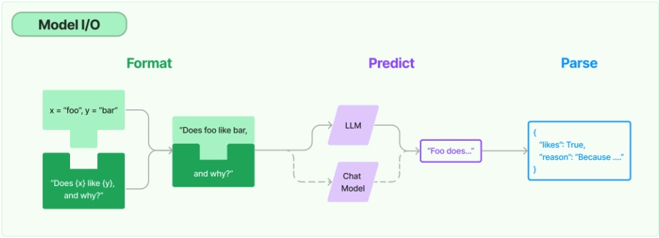
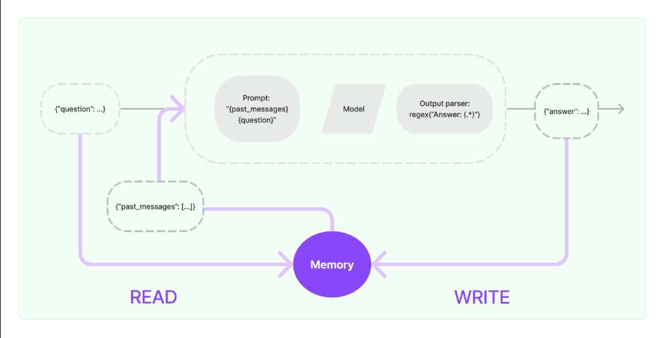
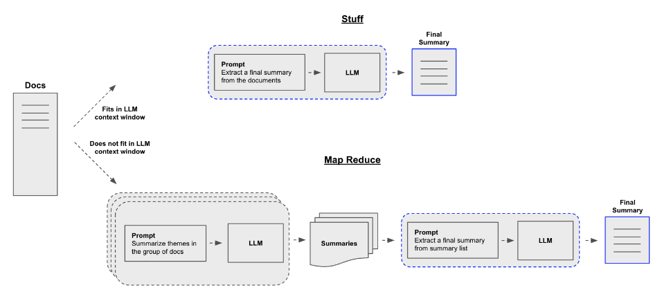
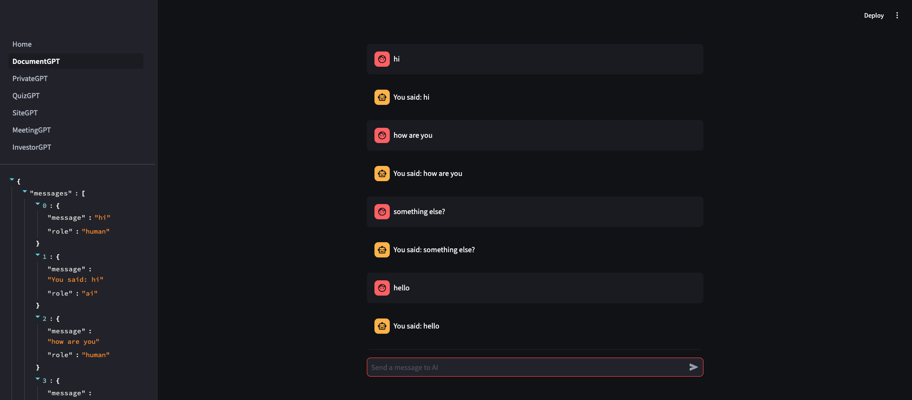
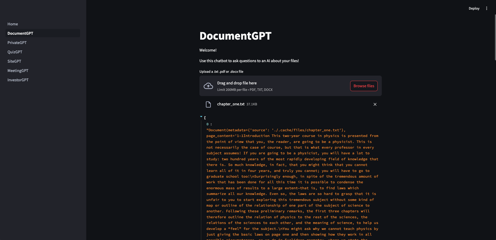
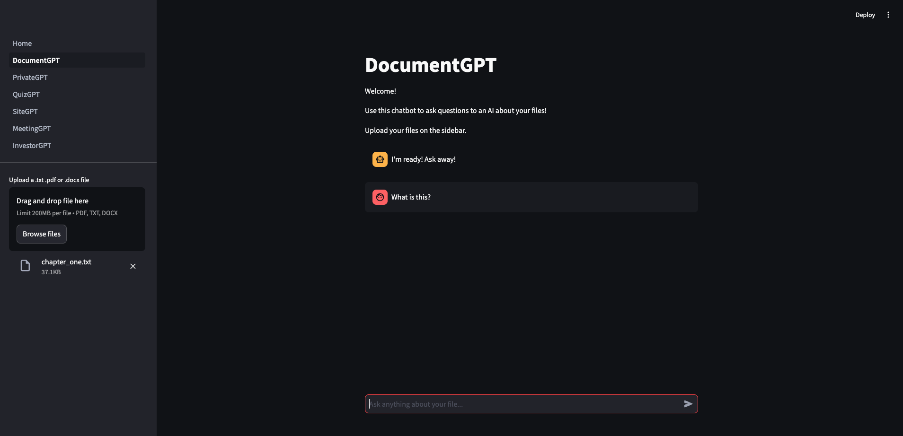

# NOTE

- 진행 중...(37%)

## Open AI를 위한 요구사항

- [x] Plus 유료 결제
- [x] API Key (유료)
- [x] 반드시 사용 한계 설정 필요

# 1. 기본 설정

VSCode 기준 필수 플러그인

- [Python language support](https://marketplace.visualstudio.com/items?itemName=ms-python.python)
- [Jupyter notebook support](https://marketplace.visualstudio.com/items?itemName=ms-toolsai.jupyter)

## 1-1. 가상환경 (Python 3.12.4)

### 정의

파이썬 가상환경(Python virtual environment)은 특정 프로젝트에서 필요한 패키지와 라이브러리들을 독립적으로 관리할 수 있게 해주는 도구입니다. 가상환경의 주요 용도는 다음과 같습니다.

- 의존성 관리: 서로 다른 프로젝트에서 서로 다른 버전의 라이브러리나 패키지가 필요할 때, 각 프로젝트가 독립적으로 해당 버전의 패키지를 사용할 수 있게 합니다. 예를 들어, 프로젝트 A에서는 Django 3.0이 필요하고, 프로젝트 B에서는 Django 4.0이 필요한 경우 가상환경을 사용하면 각 프로젝트에서 필요한 버전의 Django를 독립적으로 설치하고 사용할 수 있습니다.

- 시스템 파이썬 환경 보호: 시스템 전체에 영향을 미치지 않고, 특정 프로젝트에만 필요한 패키지들을 설치할 수 있습니다. 이를 통해 시스템 파이썬 환경을 깨끗하게 유지할 수 있습니다.

- 프로젝트 간의 충돌 방지: 여러 프로젝트가 동일한 패키지를 필요로 할 때, 각 프로젝트가 필요한 특정 버전의 패키지를 설치하고 관리할 수 있습니다. 이는 프로젝트 간의 의존성 충돌을 방지합니다.

- 재현 가능한 환경 제공: 특정 프로젝트의 개발 환경을 다른 개발자나 배포 환경에서 재현할 수 있도록 돕습니다. 가상환경을 사용하면 같은 패키지 버전을 설치하여 동일한 환경을 구축할 수 있습니다.

- 배포 환경과의 일치: 개발 환경과 배포 환경을 일치시켜, 배포 시 발생할 수 있는 문제를 줄입니다. 가상환경을 사용하면 로컬 개발 환경과 서버 환경을 쉽게 동기화할 수 있습니다. 요약하면, 파이썬 가상환경은 프로젝트별로 독립된 패키지 관리와 의존성 관리를 가능하게 하여, 개발 과정에서의 효율성과 안정성을 높이는 데 중요한 역할을 합니다.

### 가상환경 생성

여기서는 파이썬 3.3.x 이후 버전에서 표준 모듈로 제공하는 가상환경 venv 를 사용하겠습니다.

```zsh
python -m venv ./env
```

여기서 env는 가상환경의 이름입니다. 원하는 이름으로 변경할 수 있습니다.

### 가상환경 활성화

```zsh
# macOS
source env/bin/activate

# Windows
env\Scripts\activate
```

### 가상환경 비활성화

```zsh
deactivate
```

### 가상환경 삭제

가상환경을 더 이상 사용하지 않을 경우, 가상환경 디렉토리를 삭제하면 됩니다.

```zsh
rm -rf env
```

### 패키지 설치

가상환경이 활성화 된 상태에서 필요한 패키지를 설치합니다.

```zsh
pip install 패키지명
```

### 패키지 목록 정의

requirements.txt 프로젝트에서 필요한 패키지들의 목록과 해당 버전을 명시한 텍스트 파일입니다. 이 파일은 프로젝트의 의존성을 관리하고 다른 환경에서 동일한 패키지 구성을 재현하는 데 사용됩니다.

```zsh
pip install -r requirements.txt
```

### 환경변수 파일 설정

```env
OPENAI_API_KEY="sk-...n"
```

## 1-2. Jupyter Notebook

### 정의

Jupyter Notebook은 대화형 컴퓨팅 환경으로, 특히 데이터 과학, 머신러닝, 데이터 분석, 학술 연구 및 교육에서 널리 사용됩니다. Jupyter Notebook의 주요 용도는 다음과 같습니다.

- 데이터 분석 및 시각화: 데이터를 로드하고, 정제하고, 분석하고, 시각화하는 모든 과정을 한 곳에서 수행할 수 있습니다. pandas, matplotlib, seaborn 등의 라이브러리와 함께 사용하면 강력한 데이터 분석 도구로 활용할 수 있습니다.

- 데이터 과학 및 머신러닝: 데이터 전처리, 모델링, 평가, 예측 등 데이터 과학과 머신러닝의 전체 워크플로우를 처리할 수 있습니다. scikit-learn, TensorFlow, PyTorch 등과 통합하여 머신러닝 모델을 개발하고 실험할 수 있습니다.
- 대화형 코드 실행: 코드를 작성하고 즉시 실행 결과를 확인할 수 있는 대화형 환경을 제공합니다. 이는 실험적 작업이나 코드 디버깅에 매우 유용합니다.

- 교육 및 학습 자료 제작: 교육 자료, 튜토리얼, 강의 노트를 작성하는 데 유용합니다. 코드, 텍스트 설명, 수식, 이미지 등을 하나의 문서에 포함할 수 있어 이해하기 쉽고 직관적인 학습 자료를 만들 수 있습니다.

- 보고서 및 논문 작성: 데이터 분석 결과를 설명하는 보고서나 학술 논문을 작성하는 데 사용할 수 있습니다. 마크다운과 LaTeX을 지원하여 텍스트, 수식, 코드, 결과를 통합한 문서를 작성할 수 있습니다.

- 협업: Jupyter Notebook을 사용하면 다른 개발자나 연구자와 쉽게 협업할 수 있습니다. 노트북 파일(.ipynb)을 공유하여 코드와 분석 결과를 공유하고, 공동 작업할 수 있습니다.

- 데이터 시각화 및 대시보드 생성: Jupyter Notebook을 통해 데이터 시각화를 쉽게 수행할 수 있으며, 대시보드를 생성하여 실시간 데이터 모니터링 및 분석을 할 수 있습니다.

- 재현 가능한 연구: 연구 결과를 재현할 수 있는 환경을 제공하여, 연구의 신뢰성을 높입니다. Jupyter Notebook을 사용하면 코드와 결과를 함께 저장하여 언제든지 동일한 결과를 재현할 수 있습니다. Jupyter Notebook은 코드, 텍스트, 시각화를 통합하여 사용자 친화적인 환경을 제공함으로써, 데이터 과학과 관련된 다양한 작업을 효율적으로 수행할 수 있게 합니다.

### Jupyter Notebook 생성

1. notebook.ipynb 파일을 루트에 생성합니다. (파일이름은 자유롭게 설정합니다.)
2. Select Kernel을 선택하여 현재 파이썬 가상환경으로 접근하도록 경로를 설정합니다.

# 2. LANGCHAIN

- [랭체인 공식 문서](https://python.langchain.com/v0.1/docs/get_started/quickstart/)
- [OpenAI 공식 문서](https://platform.openai.com/docs/overview)

## 2-1. LLM and Chat Models

기본적으로 여러가지 모델들로 작업하기 좋은 인터페이스를 가지고 있으며 각 모델들은 서로 다른 기업에서 제공되고 또한 서로 다른 차이점을 지니고 있지만 랭체인을 사용하면 모든 모델에 호환되는 계층을 사용할 수 있습니다.

- [Open AI Models](https://platform.openai.com/docs/models)

간단하게 LLM 과 Chat Models 를 호출해보겠습니다.
이 둘은 텍스트를 Predict 할 수 있습니다.

```py
from langchain_openai import OpenAI, ChatOpenAI # LLM, Chat model

llm = OpenAI()
chat = ChatOpenAI()

a = llm.invoke("How many planets are in the solar system?")
b = chat.invoke("How many planets are in the solar system?")

a, b
```

## 2-2. Invoke (Predict Messages)

Chat model은 대화에 최적화 되어 있는데 질문을 받을 수 있을 뿐만 아니라 대화를 할 수 있습니다.
즉 메시지의 묶음이라는 의미이며, 상대로서 대화의 맥락에 맞게 대답할 수 있습니다.
Message들을 invoke 해보겠습니다.

```py
from langchain_openai import ChatOpenAI
# HumanMessage - 인간이 작성하는 메시지
# AIMessage - AI에 의해서 보내지는 메시지
# SystemMessage - LLM에 설정들을 제공하기 위한 Message
from langchain.schema import HumanMessage, AIMessage, SystemMessage

chat = ChatOpenAI(
    temperature=0.1, # 모델의 창의성을 조절하는 옵션 (높을 수록 창의적임)
)

messages = [
    SystemMessage(content="You are a geography expert. And you only reply in Italian."),
    AIMessage(content="Ciao, mi chiamo Paolo!"),
    HumanMessage(content="What is the distance between the Mexico and Thailand. Also, what is your name?"),
]

chat.invoke(messages)
```

## 2-3. Prompt Templates

prompt란 LLM 과 의사소통할 수 있는 방법입니다. prompt의 성능이 좋다면 LLM의 답변도 좋아집니다.
모든 웹사이트들이 상황에 맞는 뛰어난 성능의 prompt를 제작하는데 많은 노력을 기울입니다.
Langchain은 prompt를 공유하기 위한 커뮤니티를 만들고 있습니다. 이를 이용하여 많은 사용자들이 prompt를 공유할 수 있습니다. 많은 유틸리티 들이 prompt를 위해 존재합니다.

간단하게 문자열을 통한 predict를 실행하는 예제를 작성해 보겠습니다.

```py
from langchain_openai import ChatOpenAI
# PromptTemplate - 문자열을 이용한 template 생성
# ChatPromptTemplate - message를 이용하여 template 생성
from langchain.prompts import PromptTemplate, ChatPromptTemplate

chat = ChatOpenAI(
    temperature=0.1, # 모델의 창의성을 조절하는 옵션 (높을 수록 창의적임)
)

template = PromptTemplate.from_template("What is the distance between {country_a} and {country_b}")

prompt = template.format(country_a="Mexico", country_b="Thailand")

chat.invoke(prompt)
```

이번에는 메시지를 통한 invoke를 실행하는 예제를 작성해 보겠습니다.

```py
from langchain_openai import ChatOpenAI
# PromptTemplate - 문자열을 이용한 template 생성
# ChatPromptTemplate - message를 이용하여 template 생성
from langchain.prompts import ChatPromptTemplate, SystemMessagePromptTemplate, HumanMessagePromptTemplate, AIMessagePromptTemplate

chat = ChatOpenAI(
    temperature=0.1, # 모델의 창의성을 조절하는 옵션 (높을 수록 창의적임)
)

messages = [
    SystemMessagePromptTemplate.from_template("You are a geography expert. And you only reply in {language}."),
    AIMessagePromptTemplate.from_template("Ciao, mi chiamo {name}!"),
    HumanMessagePromptTemplate.from_template("What is the distance between the {country_a} and {country_b}. Also, what is your name?")
]

template = ChatPromptTemplate.from_messages(messages)

prompt = template.format_messages(language="Italian", name="Paolo", country_a="Mexico", country_b="Thailand")

chat.invoke(prompt)
```

## 2-4. OutputParser and LCEL

OutputParser는 LLM의 응답(Response)을 다양한 형태로 변형을 하기 위해서 사용합니다.
LCEL(langchain expression language)은 복잡할 수도 있는 코드를 간결하게 만들 수 있습니다. 그리고 다양한 template와 LLM 호출, 그리고 서로 다른 응답(Response)를 함께 사용할 수 있습니다.

첫번째로 OutputParser 예제로 간단하게 응답을 list로 변환해보겠습니다.

```py
from langchain_openai import ChatOpenAI
from langchain.schema import BaseOutputParser
# PromptTemplate - 문자열을 이용한 template 생성
# ChatPromptTemplate - message를 이용하여 template 생성
from langchain.prompts import ChatPromptTemplate, SystemMessagePromptTemplate, HumanMessagePromptTemplate, AIMessagePromptTemplate

chat = ChatOpenAI(
    temperature=0.1, # 모델의 창의성을 조절하는 옵션 (높을 수록 창의적임)
)

# 문자열 출력을 파싱하는 BaseOutputParser 확장하는 커스텀 OutputParser
class CommaOutputParser(BaseOutputParser):
    def parse(self, text: str) -> str:
        items = text.strip().split(",")
        return list(map(str.strip, items))

p = CommaOutputParser()

messages = [
    SystemMessagePromptTemplate.from_template("You are a list gernerating machine. Everything you are asked will be answered with a comma separated list of max {max_items} in lowercase. Do Not reply with else."),
    HumanMessagePromptTemplate.from_template("{question}")
]
template = ChatPromptTemplate.from_messages(messages)
prompt = template.format_messages(max_items=10, question="What are the colors?")
res = chat.invoke(prompt)
p.parse(res.content)
```

결과는 단순하지만 실행하는 코드는 너무 복잡합니다. 이것을 단순화하기 위해 Chaining 하도록 변경해 보겠습니다.

```py
from langchain_openai import ChatOpenAI
from langchain.schema import BaseOutputParser
# PromptTemplate - 문자열을 이용한 template 생성
# ChatPromptTemplate - message를 이용하여 template 생성
from langchain.prompts import ChatPromptTemplate, SystemMessagePromptTemplate, HumanMessagePromptTemplate, AIMessagePromptTemplate

chat = ChatOpenAI(
    temperature=0.1, # 모델의 창의성을 조절하는 옵션 (높을 수록 창의적임)
)

# 문자열 출력을 파싱하는 BaseOutputParser 확장하는 커스텀 OutputParser
class CommaOutputParser(BaseOutputParser):
    def parse(self, text: str) -> str:
        items = text.strip().split(",")
        return list(map(str.strip, items))

messages = [
    SystemMessagePromptTemplate.from_template("You are a list gernerating machine. Everything you are asked will be answered with a comma separated list of max {max_items} in lowercase. Do Not reply with else."),
    HumanMessagePromptTemplate.from_template("{question}")
]

# ✨Chaining✨
chain = template | chat | CommaOutputParser()
chain.invoke({
    "max_items":10,
    "question":"What are the colors?",
})
```

## 2-5. Chaining Chains

- [공식문서 - Expression Language/interface](https://python.langchain.com/v0.1/docs/expression_language/interface/)

Chaining과 LCEL(langchain expression language)에 대하여 좀 더 깊게 알아보도록 하겠습니다.
이전 Chaining과 코드를 살펴보겠습니다.

```py
chain = template | chat | CommaOutputParser()
chain.invoke({
    "max_items":10,
    "question":"What are the colors?",
})
```

우리는 현재 prompt와 chat model 그리고 OutputParser를 사용하고 있습니다. 이 외에도 다른 타입들은 위에 공식문서 링크를 참조해주세요(밑에서 다른 타입들도 사용하게 됩니다.)

실행 시 첫번째 template.format_messages 즉 prompt 명령이 실행 됩니다. 이로 인하여 그 값을 Dictionary형태로 전달하고 있습니다. 이로 인하여 Dictionary형태의 매개변수를 전달하고 있습니다. 첫번째 실행의 결과는 prompt value를 받게 됩니다.
두번째로 chat model로 첫번째 실행결과(prompt value)와 함께 이동합니다. chat model은 prompt value를 매개로 실행되며 그 실행 결과를 String 형태로 받게 됩니다.
세번째로 OutputParser로 두번째 실행결과(String)와 함께 이동합니다. OutputParser는 우리가 원하는 형태로 문자열을 가공하여 마지막 결과를 출력하게 될 것입니다.

이제 Chain들을 서로 Chaining 하는 예제를 작성해 보겠습니다.

```py
from langchain_openai import ChatOpenAI
# PromptTemplate - 문자열을 이용한 template 생성
# ChatPromptTemplate - message를 이용하여 template 생성
from langchain.prompts import ChatPromptTemplate, SystemMessagePromptTemplate, HumanMessagePromptTemplate, AIMessagePromptTemplate
from langchain.callbacks import StreamingStdOutCallbackHandler

chat = ChatOpenAI(
    temperature=0.1, # 모델의 창의성을 조절하는 옵션 (높을 수록 창의적임)
    streaming=True, # streaming 옵션을 활성화하여 대화형 모드로 설정
    callbacks=[StreamingStdOutCallbackHandler()], # 콜백 함수를 설정
)

chef_message =  [
    SystemMessagePromptTemplate.from_template("You are a world-class international chef. You create easy to fllow recipies for any type of cuisine with easy to find ingredients."),
    HumanMessagePromptTemplate.from_template("I want to cook {cuisine} food.")
]

chef_prompt = ChatPromptTemplate.from_messages(chef_message)

chef_chain = chef_prompt | chat

veg_chef_message =  [
    SystemMessagePromptTemplate.from_template("You are a vegetarian chef specialized on marking tranditional recipies vegetarian. You find alternatibe ingredients and explain their preparation. You don't redically modify the recipe. If there is no alternative for a food just say you don't know how to replace it."),
    HumanMessagePromptTemplate.from_template("{recipe}")
]

veg_chef_prompt = ChatPromptTemplate.from_messages(veg_chef_message)

veg_chef_chain = veg_chef_prompt | chat

# ✨RunnableMap✨사용
final_chain = {"recipe": chef_chain} | veg_chef_chain

final_chain.invoke({
    "cuisine":"indian",
})
```

# 3. MODEL I/O

Langchain에는 다양한 Model I/O가 존재합니다. 이는 다른 모든 언어 모델들과 인터페이스 할 수 있는 빌딩 블록을 제공합니다.



[공식문서 - Modules](https://python.langchain.com/v0.1/docs/modules/)

## 3-1. FewShotPromptTemplate

우리는 Prompt Template를 통하여 메시지의 유효성 확인하고 또한 저장 및 불러오기를 할 수 있습니다. 규모가 있는 LLM을 만들기 시작할 때 Prompt는 매우 중요합니다.
기본적으로 Fewshot 은 Model 들에게 예제들을 준다는 뜻과 같습니다. 이는 더 좋은 대답을 할 수 있도록 하는 예제들을 제공하는 것입니다.
예를 들어 구체적으로 대답하는 AI Model이 필요하다고 가정했을 시 어떻게 대답해야 하는 지에 대한 예제를 AI Model에게 제공하였을 때 Prompt를 사용해서 어떻게 대답해야 하는지 알려주는 것보다 더 좋습니다. 왜냐하면 모델은 텍스트를 만들기 때문에 Prompt로 명령을 하는 것보다 어떻게 대답해야 하는지 예제를 제공해주는 것이 더 좋은 방법입니다. 이것이 FewShotPromptTemplate이 하는 일이며 이를 통하여 예제를 형식화 할 수 있습니다.
또한 예제들이 데이터베이스에 있을 수도 있기 때문에 이런 대화 기록 같은 것들을 데이터베이스에서 가져와서 FewShotPromptTemplate이 사용하여 형식화 시켜주면 더 빠르게 잘 만들 수 있습니다.

이제 간단한 예제를 작성해보겠습니다.

```py
from langchain_openai import ChatOpenAI
# PromptTemplate - 문자열을 이용한 template 생성
# ChatPromptTemplate - message를 이용하여 template 생성
from langchain.prompts import PromptTemplate, ChatPromptTemplate, SystemMessagePromptTemplate, HumanMessagePromptTemplate, AIMessagePromptTemplate
from langchain.prompts.few_shot import FewShotPromptTemplate
from langchain.callbacks import StreamingStdOutCallbackHandler

chat = ChatOpenAI(
    temperature=0.1, # 모델의 창의성을 조절하는 옵션 (높을 수록 창의적임)
    streaming=True, # streaming 옵션을 활성화하여 대화형 모드로 설정
    callbacks=[StreamingStdOutCallbackHandler()], # 콜백 함수를 설정
)

# 모델에게 전달하는 답변 예제
examples = [
    {
        "question": "What do you know about France?",
        "answer": """
        Here is what I know:
        Capital: Paris
        Language: French
        Food: Wine and Cheese
        Currency: Euro
        """,
    },
    {
        "question": "What do you know about Italy?",
        "answer": """
        I know this:
        Capital: Rome
        Language: Italian
        Food: Pizza and Pasta
        Currency: Euro
        """,
    },
    {
        "question": "What do you know about Greece?",
        "answer": """
        I know this:
        Capital: Athens
        Language: Greek
        Food: Souvlaki and Feta Cheese
        Currency: Euro
        """,
    }]

example_prompt = PromptTemplate.from_template("Human: {question}\nAI: {answer}")

prompt = FewShotPromptTemplate(
    example_prompt=example_prompt, # Prompt 방식
    examples=examples, # 답변 예제
    suffix="Human: Wat do you know about {country}?", # 모든 형식화된 예제 마지막 내용
    input_variables=["country"] # suffix 입력 변수 (유효성 검사)
)

chain = prompt | chat

chain.invoke({
    "country":"Germany",
})
```

## 3-2. FewShotChatMessagePromptTemplate

이제 단순 문자열 형태가 아닌 메시지 형태의 FewShotChatMessagePromptTemplate를 작성해 보겠습니다.

```py
from langchain_openai import ChatOpenAI
# PromptTemplate - 문자열을 이용한 template 생성
# ChatPromptTemplate - message를 이용하여 template 생성
from langchain.prompts import PromptTemplate, ChatMessagePromptTemplate, ChatPromptTemplate, SystemMessagePromptTemplate, HumanMessagePromptTemplate, AIMessagePromptTemplate
from langchain.prompts.few_shot import FewShotPromptTemplate, FewShotChatMessagePromptTemplate
from langchain.callbacks import StreamingStdOutCallbackHandler

chat = ChatOpenAI(
    temperature=0.1, # 모델의 창의성을 조절하는 옵션 (높을 수록 창의적임)
    streaming=True, # streaming 옵션을 활성화하여 대화형 모드로 설정
    callbacks=[StreamingStdOutCallbackHandler()], # 콜백 함수를 설정
)

# 모델에게 전달하는 답변 예제
examples = [
    {
        "country": "France?",
        "answer": """
        Here is what I know:
        Capital: Paris
        Language: French
        Food: Wine and Cheese
        Currency: Euro
        """,
    },
    {
        "country": "Italy?",
        "answer": """
        I know this:
        Capital: Rome
        Language: Italian
        Food: Pizza and Pasta
        Currency: Euro
        """,
    },
    {
        "country": "Greece?",
        "answer": """
        I know this:
        Capital: Athens
        Language: Greek
        Food: Souvlaki and Feta Cheese
        Currency: Euro
        """,
    }]


example_prompt = ChatPromptTemplate.from_messages([
    HumanMessagePromptTemplate.from_template("What do you know about {country}?"),
    AIMessagePromptTemplate.from_template("{answer}"),
]
)

prompt = FewShotChatMessagePromptTemplate(
    example_prompt=example_prompt, # Prompt 방식
    examples=examples, # 답변 예제
)

final_prompt = ChatPromptTemplate.from_messages([
    SystemMessagePromptTemplate.from_template("You are a geography expert, you give short answers."),
    prompt,
    HumanMessagePromptTemplate.from_template("What do you know about {country}?")
])

chain = final_prompt | chat

chain.invoke({
    "country":"Germany",
})
```

## 3-3. LengthBasedExampleSelector

여기에서는 동적으로 예제들을 선택할 수 있는 방법에 대해 알아보겠습니다. 상황에 따라서는 많은 예제들이 존재하고 어느정도 예제들을 골라서 Prompt에 허용할 것인가에 대해 정의를 해야합니다. 이유는 많은 Prompt는 더 큰 비용을 지불해야 하며 비용이 존재하더라도 모델에 알맞은 양이 존재합니다.

간단한 길이를 조절하는 기본 예제를 작성해 보겠습니다.

```py
from langchain_openai import ChatOpenAI
# PromptTemplate - 문자열을 이용한 template 생성
# ChatPromptTemplate - message를 이용하여 template 생성
from langchain.prompts import PromptTemplate, ChatMessagePromptTemplate, ChatPromptTemplate, SystemMessagePromptTemplate, HumanMessagePromptTemplate, AIMessagePromptTemplate
from langchain.prompts.few_shot import FewShotPromptTemplate, FewShotChatMessagePromptTemplate
from langchain.callbacks import StreamingStdOutCallbackHandler
from langchain.prompts.example_selector import LengthBasedExampleSelector

chat = ChatOpenAI(
    temperature=0.1, # 모델의 창의성을 조절하는 옵션 (높을 수록 창의적임)
    streaming=True, # streaming 옵션을 활성화하여 대화형 모드로 설정
    callbacks=[StreamingStdOutCallbackHandler()], # 콜백 함수를 설정
)

# 모델에게 전달하는 답변 예제
examples = [
    {
        "question": "What do you know about France?",
        "answer": """
        Here is what I know:
        Capital: Paris
        Language: French
        Food: Wine and Cheese
        Currency: Euro
        """,
    },
    {
        "question": "What do you know about Italy?",
        "answer": """
        I know this:
        Capital: Rome
        Language: Italian
        Food: Pizza and Pasta
        Currency: Euro
        """,
    },
    {
        "question": "What do you know about Greece?",
        "answer": """
        I know this:
        Capital: Athens
        Language: Greek
        Food: Souvlaki and Feta Cheese
        Currency: Euro
        """,
    }]

example_prompt = PromptTemplate.from_template("Human: {question}\nAI: {answer}")

# 예제 선택
example_selector = LengthBasedExampleSelector(
    examples=examples, # 답변 예제
    example_prompt=example_prompt, # Prompt 방식
    max_length=180 # 최대 길이
)


prompt = FewShotPromptTemplate(
    example_prompt=example_prompt, # Prompt 방식
    example_selector=example_selector, # 답변 선택
    suffix="Human: Wat do you know about {country}?", # 모든 형식화된 예제 마지막 내용
    input_variables=["country"] # suffix 입력 변수 (유효성 검사)
)

prompt.format(country="Brazil")
```

랜덤한 예제를 선택하도록 수정해 보겠습니다.

```py
from langchain_openai import ChatOpenAI
# PromptTemplate - 문자열을 이용한 template 생성
# ChatPromptTemplate - message를 이용하여 template 생성
from langchain.prompts import PromptTemplate, ChatMessagePromptTemplate, ChatPromptTemplate, SystemMessagePromptTemplate, HumanMessagePromptTemplate, AIMessagePromptTemplate
from langchain.prompts.few_shot import FewShotPromptTemplate, FewShotChatMessagePromptTemplate
from langchain.callbacks import StreamingStdOutCallbackHandler
# from langchain.prompts.example_selector import LengthBasedExampleSelector
from langchain.prompts.example_selector.base import BaseExampleSelector

class RandomExampleSelector(BaseExampleSelector):
    def __init__(self, examples):
        self.examples = examples

    def add_example(self, example):
        self.examples.append(example)

    def select_examples(self, input_variables):
        from random import choice
        return [choice(self.examples)]

chat = ChatOpenAI(
    temperature=0.1, # 모델의 창의성을 조절하는 옵션 (높을 수록 창의적임)
    streaming=True, # streaming 옵션을 활성화하여 대화형 모드로 설정
    callbacks=[StreamingStdOutCallbackHandler()], # 콜백 함수를 설정
)

# 모델에게 전달하는 답변 예제
examples = [
    {
        "question": "What do you know about France?",
        "answer": """
        Here is what I know:
        Capital: Paris
        Language: French
        Food: Wine and Cheese
        Currency: Euro
        """,
    },
    {
        "question": "What do you know about Italy?",
        "answer": """
        I know this:
        Capital: Rome
        Language: Italian
        Food: Pizza and Pasta
        Currency: Euro
        """,
    },
    {
        "question": "What do you know about Greece?",
        "answer": """
        I know this:
        Capital: Athens
        Language: Greek
        Food: Souvlaki and Feta Cheese
        Currency: Euro
        """,
    }]

example_prompt = PromptTemplate.from_template("Human: {question}\nAI: {answer}")

# 예제 선택
example_selector = RandomExampleSelector(
    examples=examples, # 답변 예제
)


prompt = FewShotPromptTemplate(
    example_prompt=example_prompt, # Prompt 방식
    example_selector=example_selector, # 답변 선택
    suffix="Human: Wat do you know about {country}?", # 모든 형식화된 예제 마지막 내용
    input_variables=["country"] # suffix 입력 변수 (유효성 검사)
)

prompt.format(country="Brazil")
```

## 3-4. Serialization and Composition

이번에는 디스크에서 prompt template를 가져오는 방법을 알아보겠습니다. 만들어진 prompt를 가져다 쓰거나 다른 누구나 가져다 쓸 수 있도록 하고 싶다면 유용한 방법입니다.

일단 JSON 형식의 Prompt를 생성해보겠습니다.

```json
{
  "_type": "prompt",
  "template": "What is the capital of {country}",
  "input_variables": ["country"]
}
```

JSON 형태의 Prompt를 실행해 보겠습니다.

```py
from langchain_openai import ChatOpenAI
# PromptTemplate - 문자열을 이용한 template 생성
# ChatPromptTemplate - message를 이용하여 template 생성
from langchain.prompts import PromptTemplate, ChatMessagePromptTemplate, ChatPromptTemplate, SystemMessagePromptTemplate, HumanMessagePromptTemplate, AIMessagePromptTemplate
from langchain.prompts.few_shot import FewShotPromptTemplate, FewShotChatMessagePromptTemplate
from langchain.callbacks import StreamingStdOutCallbackHandler
from langchain.prompts import load_prompt

prompt = load_prompt("./prompt.json")


chat = ChatOpenAI(
    temperature=0.1, # 모델의 창의성을 조절하는 옵션 (높을 수록 창의적임)
    streaming=True, # streaming 옵션을 활성화하여 대화형 모드로 설정
    callbacks=[StreamingStdOutCallbackHandler()], # 콜백 함수를 설정
)

prompt.format(country="Germany")
```

이젠 Yaml 형태로 만들어보겠습니다.

```yaml
_type: "prompt"
template: "What is the capital of {country}"
input_variables: ["country"]
```

Yaml 형태의 Prompt를 실행해 보겠습니다.

```py
from langchain_openai import ChatOpenAI
# PromptTemplate - 문자열을 이용한 template 생성
# ChatPromptTemplate - message를 이용하여 template 생성
from langchain.prompts import PromptTemplate, ChatMessagePromptTemplate, ChatPromptTemplate, SystemMessagePromptTemplate, HumanMessagePromptTemplate, AIMessagePromptTemplate
from langchain.prompts.few_shot import FewShotPromptTemplate, FewShotChatMessagePromptTemplate
from langchain.callbacks import StreamingStdOutCallbackHandler
from langchain.prompts import load_prompt

# prompt = load_prompt("./prompt.json")
prompt = load_prompt("./prompt.yaml")


chat = ChatOpenAI(
    temperature=0.1, # 모델의 창의성을 조절하는 옵션 (높을 수록 창의적임)
    streaming=True, # streaming 옵션을 활성화하여 대화형 모드로 설정
    callbacks=[StreamingStdOutCallbackHandler()], # 콜백 함수를 설정
)

prompt.format(country="Germany")
```

이번에는 많은 prompt들을 Memory에 모두 모아두는 방법에 대해 알아보겠습니다. 이를 위해서는 PipelinePromptTemplate이 필요합니다. 이 Module은 prompt들을 하나로 합칠 수 있도록 도와줍니다.

```py
from langchain_openai import ChatOpenAI
# PromptTemplate - 문자열을 이용한 template 생성
# ChatPromptTemplate - message를 이용하여 template 생성
from langchain.prompts import PromptTemplate, ChatMessagePromptTemplate, ChatPromptTemplate, SystemMessagePromptTemplate, HumanMessagePromptTemplate, AIMessagePromptTemplate
from langchain.prompts.few_shot import FewShotPromptTemplate, FewShotChatMessagePromptTemplate
from langchain.callbacks import StreamingStdOutCallbackHandler
# Prompt Pipeline 불러오기
from langchain.prompts.pipeline import PipelinePromptTemplate

chat = ChatOpenAI(
    temperature=0.1, # 모델의 창의성을 조절하는 옵션 (높을 수록 창의적임)
    streaming=True, # streaming 옵션을 활성화하여 대화형 모드로 설정
    callbacks=[StreamingStdOutCallbackHandler()], # 콜백 함수를 설정
)

intro = PromptTemplate.from_template(
    """
    You are a role playing assistant.
    And you are impersonating a {character}
"""
)

example = PromptTemplate.from_template(
    """
    This is an example of how you talk:

    Human: {example_question}
    You: {example_answer}
"""
)

start = PromptTemplate.from_template(
    """
    Start now!

    Human: {question}
    You:
"""
)

final = PromptTemplate.from_template(
    """
    {intro}

    {example}

    {start}
"""
)

prompts = [
    ("intro", intro),
    ("example", example),
    ("start", start),
]

full_prompt = PipelinePromptTemplate(
    final_prompt=final,
    pipeline_prompts=prompts,
)

chain = full_prompt | chat

chain.invoke({
    "character":"Pirate",
    "example_question":"What is your location?",
    "example_answer":"Arrrrg! That is a secret!! Arg arg",
    "question": "What is your fav food?"
})
```

## 3-5. Caching

- [공식문서 - Caching](https://python.langchain.com/v0.1/docs/modules/model_io/llms/llm_caching/)

이곳에서는 정말 중요한 Caching에 대해서 알아보겠습니다. Caching을 사용하면 LM(Language Model)의 응답을 저장할 수 있습니다. 예를들어 채팅봇이 있고 채팅봇이 같은 질문을 받는다면 계속 답변을 만들지 않고 이미 답변한 답을 Caching하여 재사용할 수 있으며 이를 통해 비용을 절감할 수 있습니다.
Caching에는 다양한 방법이 존재하며 자세한 내용은 위에 공식문서 링크를 참조해주세요.

아래는 SQLLite를 이용한 캐싱에 예제를 보여드리겠습니다.

```py
from langchain_openai import ChatOpenAI
from langchain.callbacks import StreamingStdOutCallbackHandler
from langchain.globals import set_llm_cache, set_debug
from langchain.cache import InMemoryCache, SQLiteCache

# 인 메모리 캐시
# set_llm_cache(InMemoryCache())
# set_debug(True)

# 데이터베이스 캐시
set_llm_cache(SQLiteCache('cache.db'))

chat = ChatOpenAI(
    temperature=0.1, # 모델의 창의성을 조절하는 옵션 (높을 수록 창의적임)
    # streaming=True, # streaming 옵션을 활성화하여 대화형 모드로 설정
    # callbacks=[StreamingStdOutCallbackHandler()], # 콜백 함수를 설정
)

chat.predict("How do you make italian pasta?")
```

## 3-6. Serialization

지출하는 비용을 알아보는 방법과 Model을 어떻게 저장하고 불러오는지에 대해서 알아보겠습니다.

첫번째로 지출하는 비용알 알아보는 예제를 보여드리겠습니다.

```py
from langchain_openai import ChatOpenAI
from langchain.callbacks import get_openai_callback

chat = ChatOpenAI(
    temperature=0.1, # 모델의 창의성을 조절하는 옵션 (높을 수록 창의적임)
)

with get_openai_callback() as usage:
    a = chat.predict("What is the recipe for soju?")
    b = chat.predict("What is the recipe for bread?")
    print(a, b, "\n")
    print(usage)
```

두번째로 Serialization에 대해 알아보겠습니다. 채팅모델이 아닌 LLM으로 작업 시 너무 많은 설정을 하는 경우가 있습니다. 그래서 쉽게 처리하기 위해 예를 들어 아래와 같이 모델을 변경하고 내용을 저장한다면

```py
from langchain_openai import OpenAI

# Serialization
chat = OpenAI(
    temperature=0.1, # 모델의 창의성을 조절하는 옵션 (높을 수록 창의적임)
    max_tokens=450,
    model="gpt-3.5-turbo-16k",
)

chat.save('model.json')
```

아래와 같은 JSON 파일이 생성됩니다.

```json
{
  "model_name": "gpt-3.5-turbo-16k",
  "temperature": 0.1,
  "top_p": 1,
  "frequency_penalty": 0,
  "presence_penalty": 0,
  "n": 1,
  "logit_bias": {},
  "max_tokens": 450,
  "_type": "openai"
}
```

또는 모델을 불러온다면 아래와 같이 간단하게 처리할 수 있습니다.

```py
from langchain.llms.loading import load_llm

# 모델 불러오기
chat = load_llm('model.json')

print(chat)
```

# 4. MEMORY

Langchain에는 크게 5가지 종류의 메모리가 있으며 각각의 저장방식과 장단점이 존재합니다. 챗봇은 메모리를 추가하지 않으면 아무것도 기억할 수 없습니다. 질문이 이어가거나 이해하기 위해서는 반드시 메모리가 필요합니다. 기본적으로 OpenAI에서 제공하는 API는 Langchain 없이 사용이 가능하나 메모리는 지원하지 않습니다. 일단 각 메모리의 종류와 차이점을 살펴보고 메모리를 사용하는 방법을 알아보겠습니다. (더 자세한 내용은 아래 공식문서 링크를 참조해주세요)

- [공식문서 - Memory](https://python.langchain.com/v0.1/docs/integrations/memory/)
- [공식문서 - Memory(BETA)](https://python.langchain.com/v0.1/docs/modules/memory/)



## 4-1. ConversationBufferMemory

이 메모리의 동작 방식은 매우 단순합니다. 그냥 단순히 이전 대화 내용 전체를 저장합니다. 이 메모리의 단점은 대화 내용이 길어질수록 메모리도 계속 커지면서 비효율적일 수 밖에 없습니다. 하지만 text completion할때 유용합니다. 예측을 하거나 텍스트를 자동완성하고 싶을때 등입니다.

간단한 예제를 작성해보겠습니다.

```py
from langchain.memory import ConversationBufferMemory

# 쳇 모델 용으로 사용할 경우 return_messages=True로 설정
memory = ConversationBufferMemory(return_messages=True)

memory.save_context({"input": "Hi!"}, {"output": "How are you?"})

memory.load_memory_variables({})
```

## 4-2. ConversationBufferWindowMemory

이 메모리는 대화의 특정 부분만을 저장합니다. 예를 들어 최근 대화의 5개의 메시지만 저장한다고하면 6번째 메시지가 추가될때 가장 오래된 메시지는 버려지는 방식입니다. 저장 범위는 자유롭게 설정할 수 있으며 메모리를 특정 크기로 유지할 수 있다는 점이 장점입니다. 단점이라면 챗봇이 전체 대화가 아닌 최근 대화에만 집중한다는 점입니다.

간단한 예제를 작성해보겠습니다.

```py
from langchain.memory import ConversationBufferWindowMemory

# 쳇 모델 용으로 사용할 경우 return_messages=True로 설정, K는 메모리의 크기
memory = ConversationBufferWindowMemory(return_messages=True, k=4)

def add_message(input, output):
    memory.save_context({"input": input}, {"output": output})

add_message(1, 1)
add_message(2, 2)
add_message(3, 3)
add_message(4, 4)
add_message(5, 5)

memory.load_memory_variables({})
```

## 4-3. ConversationSummaryMemory

이 메모리는 초기값으로 LLM이 필요하며 기본적으로 비용이 발생합니다. ConversationSummaryMemory는 메시지를 그대로 저장하는게 아닌 대화를 요약을 자체적으로 처리해줍니다. 그래서 초반에는 이전보다 더 많은 토큰과 저장공간을 차지하지만 대화가 진행되면서 분량이 많아지면 전체 내용의 요약으로 인해 토큰의 양 및 저장공간이 줄어들면서 효율적으로 변합니다.

간단한 예제를 작성해보겠습니다.

```py
from langchain_openai import ChatOpenAI
from langchain.memory import ConversationSummaryMemory

chat = ChatOpenAI(
    temperature=0.1, # 모델의 창의성을 조절하는 옵션 (높을 수록 창의적임)
)

memory = ConversationSummaryMemory(llm=chat)

def add_message(input, output):
    memory.save_context({"input": input}, {"output": output})

def get_history():
    return memory.load_memory_variables({})

add_message("HI I am a human, I live in South Korea", "Wow that is cool! I am a robot living in the cloud.")
add_message("South Korea is so pretty", "I wish I could visit there.")

get_history()
```

## 4-4. ConversationSummaryBufferMemory

이 메모리는 기본적으로 ConversationSummaryMemory + ConversationBufferMemory의 결합입니다.
이것이 하는 일은 메모리에 보내온 메시지의 수를 저장합니다. 또한 한계에 다다른 순간에 메모리에서 지워지는 대신 오래된 메시지들을 요약합니다. 결론적으로는 가장 최근의 상호작용을 계속 추적합니다. 이로인하여 가장 최근 및 가장 오래 전에 주고 받은 메시지를 모두 잊지 않고 요약됩니다.

간단한 예제를 작성해보겠습니다.

```py
from langchain_openai import ChatOpenAI
from langchain.memory import ConversationSummaryBufferMemory

chat = ChatOpenAI(
    temperature=0.1, # 모델의 창의성을 조절하는 옵션 (높을 수록 창의적임)
)

# max_token_limit은 메모리에 저장할 최대 토큰 수
memory = ConversationSummaryBufferMemory(
    llm=chat,
    max_token_limit=10,
    return_messages=True
)

def add_message(input, output):
    memory.save_context({"input": input}, {"output": output})

def get_history():
    return memory.load_memory_variables({})

add_message("HI I am a human, I live in South Korea", "Wow that is cool! I am a robot living in the cloud.")
add_message("South Korea is so pretty", "I wish I could visit there.")

get_history()
```

## 4-5. ConversationKGMemory

이 메모리는 대화중의 Entity의 knowledge graph를 생성합니다. 일종의 가장 중요한 것들만 뽑아내는 요약본과 같습니다.

간단한 예제를 작성해보겠습니다.

```py
from langchain_openai import ChatOpenAI
from langchain.memory import ConversationKGMemory

chat = ChatOpenAI(
    temperature=0.1, # 모델의 창의성을 조절하는 옵션 (높을 수록 창의적임)
)

# max_token_limit은 메모리에 저장할 최대 토큰 수
memory = ConversationKGMemory(
    llm=chat,
    return_messages=True,
)

def add_message(input, output):
    memory.save_context({"input": input}, {"output": output})

add_message("HI I am a Lee, I live in South Korea", "Wow that is cool! I am a robot living in the cloud.")
add_message("Lee likes kimchi", "wow that is cool!")

memory.load_memory_variables({"input": "who is Lee"})
memory.load_memory_variables({"input": "what does Lee like"})
```

## 4-6. Memory on LLMChain

이제 메모리를 체인에 결합하는 방법과 2종류의 체인에 결합하는 방법을 알아보겠습니다.
그 중 첫번째로 LLMChain(off-the-shelf chain)이라는 것을 사용해보겠습니다. 하지만 실제로는 off-the-shelf chain보다는 일반적으로 직접 커스텀해서 활용하는 것을 더 선호합니다.

간단한 예제를 작성해보겠습니다.

```py
from langchain_openai import ChatOpenAI
from langchain.memory import ConversationSummaryBufferMemory
from langchain.chains import LLMChain
from langchain.prompts import PromptTemplate

chat = ChatOpenAI(
    temperature=0.1, # 모델의 창의성을 조절하는 옵션 (높을 수록 창의적임)
)

# max_token_limit은 메모리에 저장할 최대 토큰 수
memory = ConversationSummaryBufferMemory(
    llm=chat,
    max_token_limit=120,
    memory_key="chat_history",
)


template = """
    You are a helpful AI talking to a human.

    {chat_history}
    Human:{question}
    You:
"""

prompt = PromptTemplate.from_template(template)

chain = LLMChain(
    llm=chat,
    memory=memory,
    prompt=prompt,
    verbose=True,
)

chain.predict(question="My name is Seo")
chain.predict(question="I live Seoul in South Korea")
chain.predict(question="What is my name?")

memory.load_memory_variables({})
```

## 4-7. Chat Based Memory

4-6의 예제를 기반으로 챗을 기본으로 하는 구조로 변경하는 작업을 시작하겠습니다.

간단한 예제를 작성해보겠습니다.

```py
from langchain_openai import ChatOpenAI
from langchain.memory import ConversationSummaryBufferMemory
from langchain.chains import LLMChain
from langchain.prompts import ChatPromptTemplate, SystemMessagePromptTemplate, HumanMessagePromptTemplate, MessagesPlaceholder

chat = ChatOpenAI(
    temperature=0.1, # 모델의 창의성을 조절하는 옵션 (높을 수록 창의적임)
)

# max_token_limit은 메모리에 저장할 최대 토큰 수
memory = ConversationSummaryBufferMemory(
    llm=chat,
    max_token_limit=120,
    memory_key="chat_history",
    return_messages=True,
)


prompt = ChatPromptTemplate.from_messages([
    SystemMessagePromptTemplate.from_template("You are a helpful AI talking to a human."),
    MessagesPlaceholder(variable_name="chat_history"), # 많은 메시지들 사이를 구분하기 위한 placeholder
    HumanMessagePromptTemplate.from_template("{question}"),
])

chain = LLMChain(
    llm=chat,
    memory=memory,
    prompt=prompt,
    verbose=True,
)

chain.predict(question="My name is Seo")
chain.predict(question="I live Seoul in South Korea")
chain.predict(question="What is my name?")

memory.load_memory_variables({})
```

## 4-8. LCEL Based Memory

4-7의 예제를 기반으로 LCEL(LangChain Expresstion Language)을 이용하여 생성된 체인에 메모리를 추가하는 작업을 해보겠습니다.

간단한 예제를 작성해보겠습니다.

```py
from langchain_openai import ChatOpenAI
from langchain.memory import ConversationSummaryBufferMemory
from langchain.prompts import ChatPromptTemplate, SystemMessagePromptTemplate, HumanMessagePromptTemplate, MessagesPlaceholder
from langchain.schema.runnable import RunnablePassthrough

chat = ChatOpenAI(
    temperature=0.1, # 모델의 창의성을 조절하는 옵션 (높을 수록 창의적임)
)

# max_token_limit은 메모리에 저장할 최대 토큰 수
memory = ConversationSummaryBufferMemory(
    llm=chat,
    max_token_limit=120,
    return_messages=True,
)

prompt = ChatPromptTemplate.from_messages([
    SystemMessagePromptTemplate.from_template("You are a helpful AI talking to a human."),
    MessagesPlaceholder(variable_name="history"), # 많은 메시지들 사이를 구분하기 위한 placeholder
    HumanMessagePromptTemplate.from_template("{question}"),
])

def load_memory(_):
    return memory.load_memory_variables({})["history"]

chain = RunnablePassthrough.assign(history=load_memory) | prompt | chat

def invoke_chain(question):
    result = chain.invoke({"question": question})
    memory.save_context({"input": question}, {"output": result.content})
    return result

invoke_chain("My name is Seo")
invoke_chain("I live Seoul in South Korea")
invoke_chain("What is my name?")
```

# 5. RAG

RAG(Retrieval Augmented Generation)의 사용법을 학습하겠습니다.

모델들은 많은 데이터를 통해 학습되지만 개인적인 데이터들에는 때로는 접근할 수 없습니다. 예를 들면 개인 DB나 문서 같은 것들 입니다. 그래서 RAG를 사용합니다.

예를 들어 Foo가 뭐지 라는 질문을 하면 그 질문을 프롬프트에 전달하고 또한 동시에 우리의 질문과 관련이 있는 문서들도 준비하게 됩니다. 저장된 Vector나 검색기를 이용해서 관련 문서를 찾아내는 방법은 이후에 다루겠습니다.
여기에서는 Vector Space에서 검색하는 방법이나, 의미론적인 뜻을 알아보겠습니다. 다시 돌아가서 모델에게 질문을 하면 기존에 학습된 수 많은 data와 함께 모델이 더 나은 답변을 할 수 있도록 도와주기 위해 추가로 전송한 data까지 갖게 되어있으며 이를 RAG(Retrieval Augmented Generation)라고 합니다. 개인으로부터 제공된 data를 사용하거나 탐색함으로써 능력을 확장시키는 것입니다.

- [공식문서-RAG](https://python.langchain.com/v0.1/docs/integrations/providers/vectara/#vectara-for-retrieval-augmented-generation-rag)

## 5-1. Data Loaders and Splitters

첫번째로 알아볼 것은 Retrieval입니다. Langchain 안에는 다양한 Document Loader들이 존재하며 지금하려는 것은 전체 문서를 로드하고 분할하고 데이터를 임베드하기 위한 것입니다. 이것을 Retrieval 과정이라 하며 RAG의 첫번째 과정입니다.

- [공식문서-Document Loaders](https://python.langchain.com/v0.1/docs/integrations/document_loaders/)

Source -> Load -> Transform -> Embed -> Store -> Retrieval

어떠한 Source에서 데이터를 Load한 후 데이터를 분할하면서 변환합니다. 다음엔 변환한 데이터를 Embed하여 텍스트에서 컴퓨터가 이해할 수 있는 숫자로 변환합니다. 이를 Store에 저장하고 이후에 특정숫자를 검색합니다.

간단하게 데이터를 불러와 분할해 보겠습니다.

```py
from langchain_openai import ChatOpenAI
from langchain.document_loaders import UnstructuredFileLoader
from langchain.text_splitter import CharacterTextSplitter

# chunk_size - 텍스트를 분할하는 크기
# chunk_overlap - 분할된 텍스트의 중복 크기
# separator - 텍스트를 분할하는 구분자
splitter = CharacterTextSplitter(
    chunk_size=600,
    chunk_overlap=100,
    separator="\n"
)

loader = UnstructuredFileLoader("./files/chapter_one.pdf")

len(loader.load_and_split(text_splitter=splitter))
```

## 5-2. Tiktoken

기본적으로 모든 splitter들은 텍스트의 length를 계산해서 한 덩어리의(chunk) 크기르 알아냅니다. 그 작업에는 파이썬 표준 라이브러리가 지원하는 len함수를 사용합니다. 하지만 LLM들은 Token을 같은 방법으로 처리하지 않습니다.

- [OpenAI - Tokenizer](https://platform.openai.com/tokenizer)

5-1 예제를 내부 토큰화 함수(Tiktoken)를 사용하도록 수정해보겠습니다.

```py
from langchain_openai import ChatOpenAI
from langchain.document_loaders import UnstructuredFileLoader
from langchain.text_splitter import CharacterTextSplitter

# chunk_size - 텍스트를 분할하는 크기
# chunk_overlap - 분할된 텍스트의 중복 크기
# separator - 텍스트를 분할하는 구분자
splitter = CharacterTextSplitter.from_tiktoken_encoder(
    chunk_size=600,
    chunk_overlap=100,
    separator="\n",
)

loader = UnstructuredFileLoader("./files/chapter_one.pdf")

loader.load_and_split(text_splitter=splitter)
```

## 5-3. Vectors

이제 Embed 작업을 해보겠습니다. 사람이 읽는 텍스트를 컴퓨터가 이해할 수 있는 숫자들로 변환하는 작업으로 더 정확히는 Vectorization작업을 하게 됩니다. (OpenAI는 1000Dimension이상을 가지고 있습니다.)

예를 들어 Masculinity | Femininity | Royalty 라는 3Dimension을 기준으로 해보겠습니다.

- king: 0.9 | 0.1 | 1.0
- queen: 0.1 | 0.9 | 1.0
- man: 0.9 | 0.1 | 0.0
- woman: 0.1 | 0.9 | 0.0
- royal: 0.0 | 0.0 | 1.0

위 값에서 king - man 을 계산해 보겠습니다. 연산결과가 어떤 단어를 의미할지는 모르지만, 연산은 할 수 있습니다.

- ???: 0.0 | 0.0 | 1.0 (0.9 - 0.9 | 0.1 - 0.1 | 1.0 - 0.0 )

위 결과로 보면 royal이 됩니다. 다시 royal - woman을 해보겠습니다.

- ???: 0.1 | 0.9 | 1.0 (0.0 - 0.1 | 0.0 - 0.9 | 0.0 - 1.0 )

다시 위의 결과로 보면 queen이 나오는 것을 확인 할 수 있습니다.

이러한 예를 바탕으로 우리는 모든 내용을 숫자형태로 치환한 덕분에 단어들간의 연산이 가능하다는 것을 알 수 있습니다. 또한 우리는 Vector에 대한 Search작업이 가능해집니다. 서로 비슷한 Vector를 찾을 수 있게 되며 이것을 Vector들이 서로 가깝다라고 표현하고 이게 바로 많은 추천 알고리즘들이 작동하는 방식입니다.

- [Vector Search Example](https://turbomaze.github.io/word2vecjson/)

- [Gustav Soderstrom - Spotify Vector Search algorithm](https://www.youtube.com/watch?v=2eWuYf-aZE4)

## 5-4. Vectors Store

우선 embedding model에 대해서 알아보고 간단히 OpenAI에서 지원하는 내용을 작성해보겠습니다.

아래의 코드를 실행해보면 "Hi"에 관한 Vector값을 볼 수 있습니다. (len함수로 "Hi" Vector의 차원이 1536개 입니다.)

```py
from langchain_openai import OpenAIEmbeddings

embedder = OpenAIEmbeddings()

# Hi의 벡터값을 가져옴
embedder.embed_query("Hi")
```

이제 문서에 embed 작업을 해보겠습니다.

```py
from langchain_openai import OpenAIEmbeddings

embedder = OpenAIEmbeddings()

# 문서의 벡터값을 embedding
vectors = embedder.embed_documents([
    "hi",
    "how",
    "are",
    "you longer sentences because"
])

vectors

# Vector 개수 확인
# len(vectors)
```

이제 5-1 예제를 기반으로 실제 문서를 embedding 하겠습니다. 여기에서 중요한 것은 매번 실행될때마다 생성하는 것이 아닌 Vector Store를 통해 Caching 하여 비용을 절감하는 것이 중요하며 Vector Store에 Vector를 넣어두면 그 내용을 검색할 수 있습니다.

Vector Store에는 여러 가지 환경을 제공합니다. 여기에서는 오픈소스 중 하나인 Chroma를 사용하겠습니다.

```py
from langchain_openai import ChatOpenAI
from langchain.document_loaders import UnstructuredFileLoader
from langchain.text_splitter import CharacterTextSplitter
from langchain_openai import OpenAIEmbeddings
from langchain.embeddings import CacheBackedEmbeddings
from langchain.vectorstores import Chroma
from langchain.storage import LocalFileStore

# chunk_size - 텍스트를 분할하는 크기
# chunk_overlap - 분할된 텍스트의 중복 크기
# separator - 텍스트를 분할하는 구분자
splitter = CharacterTextSplitter.from_tiktoken_encoder(
    chunk_size=600,
    chunk_overlap=100,
    separator="\n",
)

loader = UnstructuredFileLoader("./files/chapter_one.pdf")

docs = loader.load_and_split(text_splitter=splitter)

embeddings = OpenAIEmbeddings()

# cache_dir - 캐시 디렉토리
cache_dir = LocalFileStore("./.cache/")

# 캐시된 임베딩을 사용하여 Vector Store 초기화
cached_embeddings = CacheBackedEmbeddings.from_bytes_store(
    embeddings,
    cache_dir,
)

# Vector Store 초기화
vectorstore = Chroma.from_documents(docs, cached_embeddings)

# 유사도 검색
result = vectorstore.similarity_search("what is introduction")

result
```

## 5-5. LangSmith

Langsmith란 이 도구를 사용하면 우리의 체인이 무엇을 하고 있는지 시각적으로 확인이 가능합니다.

아래 사이트에서 회원가입해주세요

- [LangSmith](https://www.langchain.com/langsmith)

이후 아래 환경설정을 추가해줍니다.

```env
LANGCHAIN_TRACING_V2=true
LANGCHAIN_ENDPOINT="https://api.smith.langchain.com"
LANGCHAIN_API_KEY="XXXXX..."
```

Jupyter notebook을 재실행해주면 LangSmith 대시보드에서 내용을 확인 할 수 있습니다.

## 5-6. RetrievalQA

이제 Document Chain을 만들겠습니다. 일단 off-the-shelf chain을 이용하고 이후에 LCEL 형태의 chain으로 변경하도록 하겠습니다.

off-the-shelf 형태의 LLMChain은 이제 Legacy 입니다. 상황에 따라서는 deprecated 될 수 있으니 참고하세요.

Document Chain에는 다양한 생성방식이 존재합니다.

그 중 첫번째로 Stuff 방식을 사용해보겠습니다. Document들로 prompt를 Stuff(채우기)를 하는데 사용한다는 뜻입니다.

두번째는 Map Reduce 방식이 존재하는데 이는 개별적으로 요약작업을 수행하고 각각의 요약본을 LLM에게 전달해 줍니다.



- [공식문서 - Document Loaders](https://python.langchain.com/v0.1/docs/modules/data_connection/document_loaders/)

- [공식문서 - Stuff](https://python.langchain.com/v0.1/docs/use_cases/summarization/#option-1-stuff)

- [RetrievalQA](https://api.python.langchain.com/en/latest/chains/langchain.chains.retrieval_qa.base.RetrievalQA.html#langchain.chains.retrieval_qa.base.RetrievalQA)

5-4 예제를 기반으로 간단한 예제를 작성해보겠습니다.

```py
from langchain_openai import ChatOpenAI
from langchain.document_loaders import UnstructuredFileLoader
from langchain.text_splitter import CharacterTextSplitter
from langchain_openai import OpenAIEmbeddings
from langchain.embeddings import CacheBackedEmbeddings
from langchain.vectorstores import Chroma
from langchain.storage import LocalFileStore
from langchain.chains import RetrievalQA

llm = ChatOpenAI(
    temperature=0.1, # 모델의 창의성을 조절하는 옵션 (높을 수록 창의적임)
)

# chunk_size - 텍스트를 분할하는 크기
# chunk_overlap - 분할된 텍스트의 중복 크기
# separator - 텍스트를 분할하는 구분자
splitter = CharacterTextSplitter.from_tiktoken_encoder(
    chunk_size=600,
    chunk_overlap=100,
    separator="\n",
)

loader = UnstructuredFileLoader("./files/chapter_one.pdf")

docs = loader.load_and_split(text_splitter=splitter)

embeddings = OpenAIEmbeddings()

# cache_dir - 캐시 디렉토리
cache_dir = LocalFileStore("./.cache/")

# 캐시된 임베딩을 사용하여 Vector Store 초기화
cached_embeddings = CacheBackedEmbeddings.from_bytes_store(
    embeddings,
    cache_dir,
)

# Vector Store 초기화
vectorstore = Chroma.from_documents(docs, cached_embeddings)

chain = RetrievalQA.from_chain_type(
    llm=llm,
    chain_type="stuff", # map_reduce, stuff
    retriever=vectorstore.as_retriever(),
)

chain.run("What is Physics?")
```

## 5-7. Stuff LCEL Chain

5-6 예제를 Stuff 기반으로 LCEL Chain으로 변경하겠습니다.

```py
from langchain_openai import ChatOpenAI
from langchain.document_loaders import UnstructuredFileLoader
from langchain.text_splitter import CharacterTextSplitter
from langchain_openai import OpenAIEmbeddings
from langchain.embeddings import CacheBackedEmbeddings
from langchain.vectorstores import Chroma
from langchain.storage import LocalFileStore
from langchain.prompts import ChatPromptTemplate
from langchain.schema.runnable import RunnablePassthrough

llm = ChatOpenAI(
    temperature=0.1, # 모델의 창의성을 조절하는 옵션 (높을 수록 창의적임)
)

# chunk_size - 텍스트를 분할하는 크기
# chunk_overlap - 분할된 텍스트의 중복 크기
# separator - 텍스트를 분할하는 구분자
splitter = CharacterTextSplitter.from_tiktoken_encoder(
    chunk_size=600,
    chunk_overlap=100,
    separator="\n",
)

loader = UnstructuredFileLoader("./files/chapter_one.pdf")

docs = loader.load_and_split(text_splitter=splitter)

embeddings = OpenAIEmbeddings()

# cache_dir - 캐시 디렉토리
cache_dir = LocalFileStore("./.cache/")

# 캐시된 임베딩을 사용하여 Vector Store 초기화
cached_embeddings = CacheBackedEmbeddings.from_bytes_store(
    embeddings,
    cache_dir,
)

# Vector Store 초기화
vectorstore = Chroma.from_documents(docs, cached_embeddings)

retriver = vectorstore.as_retriever();

prompt = ChatPromptTemplate.from_messages([
    ("system", "You are a helpfull assistant. Answer questions using only the following context. If you don't know the answer just say you don't knowm, don't make it up:\n{context}"),
    ("human", "{question}"),
])

chain = {"context": retriver, "question": RunnablePassthrough()} | prompt | llm

chain.invoke("What is Physics?")
```

## 5-8. Map Reduce LCEL Chain

5-6 예제를 Map Reduce 기반 LCEL Chain으로 변경하겠습니다.

Map Reduce 방식은 Docuemnt가 많을 수록 유리합니다.

```py
from langchain_openai import ChatOpenAI
from langchain.document_loaders import UnstructuredFileLoader
from langchain.text_splitter import CharacterTextSplitter
from langchain_openai import OpenAIEmbeddings
from langchain.embeddings import CacheBackedEmbeddings
from langchain.vectorstores import Chroma
from langchain.storage import LocalFileStore
from langchain.prompts import ChatPromptTemplate
from langchain.schema.runnable import RunnablePassthrough, RunnableLambda

llm = ChatOpenAI(
    temperature=0.1, # 모델의 창의성을 조절하는 옵션 (높을 수록 창의적임)
)

# chunk_size - 텍스트를 분할하는 크기
# chunk_overlap - 분할된 텍스트의 중복 크기
# separator - 텍스트를 분할하는 구분자
splitter = CharacterTextSplitter.from_tiktoken_encoder(
    chunk_size=600,
    chunk_overlap=100,
    separator="\n",
)

loader = UnstructuredFileLoader("./files/chapter_one.pdf")

docs = loader.load_and_split(text_splitter=splitter)

embeddings = OpenAIEmbeddings()

# cache_dir - 캐시 디렉토리
cache_dir = LocalFileStore("./.cache/")

# 캐시된 임베딩을 사용하여 Vector Store 초기화
cached_embeddings = CacheBackedEmbeddings.from_bytes_store(
    embeddings,
    cache_dir,
)

# Vector Store 초기화
vectorstore = Chroma.from_documents(docs, cached_embeddings)

retriver = vectorstore.as_retriever();

map_doc_prompt = ChatPromptTemplate.from_messages([
    ("system",
    """
    Use the following portion of a long document to see if any of the
    text is relevant to answer the question. Return any relevant text
    verbatim.
    """
    ),
    ("human", "{question}")
])

map_doc_chain = map_doc_prompt | llm

def map_docs(inputs):
    documents = inputs["documents"]
    question = inputs["question"]
    return "\n\n".join(
        map_doc_chain.invoke(
            {"question": question, "context": doc.page_content}
        ).content
        for doc in documents
    )

map_chain = {"documents": retriver, "question": RunnablePassthrough()} | RunnableLambda(map_docs)

final_prompt = ChatPromptTemplate.from_messages([
    ('system',
    """
    Given the following extracted parts of a long document and a
    question, create a final answer.
    If you don't know the answer, just say you don't know. Don't try
    to make up an anwser.
    {context}
    """
     ),
     ("human", "{question}")
])

chain = {"context": map_chain, "question": RunnablePassthrough()} | final_prompt | llm

chain.invoke("What is Physics?")
```

# 6. DOCUMENT GPT

Streamlit을 이용해서 Python 코드만으로 멋진 UI를 만들어 보겠습니다. 이전 챕터에서 진행한 Document GPT를 활용하여 Streamlit을 결합해서 멋진 UI가진 챗봇을 만드는게 목표입니다.

- [Streamlit.io](https://streamlit.io/)

일단 기본적인 환경이 실행되는지 테스트 해보겠습니다.

root경로에 Home.py 파일을 생성하겠습니다.

```py
# Home.py
import streamlit as st

st.title("Hello world!")

st.subheader("Welcome to Streamlit!")

st.markdown("""
    #### I love it!
""")
```

Streamlit의 실행을 위해 명령어를 실행합니다.

```zsh
streamlit run Home.py
```

웹서버가 정상적으로 동작한다면 우린 기본적인 준비가 끝났습니다.

## 6-1. Magic

- [docs](https://docs.streamlit.io/)

Streamlit에서 중요한 2가지를 먼저 살펴보겠습니다.

그 중 첫번째는 write입니다. 메소드 설명에 보면 Swiss Army knife라고 표현합니다. 이 뜻은 넘겨주는 무엇이든 화면에 나타내주는 메소드입니다.

```py
# Home.py
import streamlit as st
from langchain.prompts import PromptTemplate

# 문자열
st.write("hello")

# Data Structure
st.write([1,2,3,4])

# Data dict
st.write({"x": 1})

# Class
st.write(PromptTemplate)

p = PromptTemplate.from_template("xxxx")

st.write(p)
```

굳이 메소드를 사용하지 않고 Jupyter notebook 처럼 변수만 선언해도 같은 결과가 나옵니다.

```py
# Home.py
import streamlit as st
from langchain.prompts import PromptTemplate

# 문자열
"hello"

# Data Structure
[1,2,3,4]

# Data dict
{"x": 1}

# Class
PromptTemplate

p = PromptTemplate.from_template("xxxx")

p
```

멋진 기능이지만 가독성 측면에서 집적적으로 메소드를 선언해서 사용하는 것을 더 추천합니다.

## 6-2. Data Flow

Streamlit에서는 데이터가 변경되면 자동으로 화면이 다시 refresh 됩니다.

간단한 예제로만 보여드리겠습니다.

```py
# Home.py
import streamlit as st
from datetime import datetime

today = datetime.today().strftime("%H:%M:%S")

st.title(today)

model = st.selectbox("Choose your model",("GPT-4", "GPT-3"))

st.write(model)

name = st.text_input("What is your name?")

st.write(name)

value = st.slider(
    "temperature",
    min_value=0.1,
    max_value=1.0
)
st.write(value)
```

## 6-3. Multi Page

Streamlit으로 sidebar를 구성하겠습니다. 지금부터 만들어갈 앱을 포토폴리오처럼 만드려면 각각의 페이지가 필요합니다.

간단한 예제로 보여드리겠습니다.

```py
# Home.py
import streamlit as st

# Sidebar 생성
with st.sidebar:
    st.sidebar.title('Home')
    st.sidebar.text_input('xxx')

st.title('App')

# Tab bat 생성
tab_a, tab_b, tab_c = st.tabs(["A", "B", "C"])

with tab_a:
    st.write('Tab A')

with tab_b:
    st.write('Tab B')

with tab_c:
    st.write('Tab C')
```

이제 본격적으로 페이지를 구성해보겠습니다. 각각의 페이지를 만드는 방법은 간단합니다. pages폴더를 생성 후 하위에 각 페이지 파일들을 생성해 줍니다. 원하는 순서대로 정렬을 하고 싶다면 파일명에 숫자등을 통하여 순서를 정렬해 줍니다.

```py
# Home.py
# pages/01_DocumentGPT.py
# pages/02_QuizGPT.py
# pages/03_PrivateGPT.py
```

## 6-4. Chat Message

지금부터 chatbot을 만들기 시작하겠습니다.

일단 Home.py에 할 일들을 정리하기 위한 간단한 마크다운을 작성하겠습니다.

```py
# Home.py
import streamlit as st

st.set_page_config(
    page_title="F/S GPT HOME",
    page_icon="🤖",
)

st.markdown(
"""
# Hello!

Welcome to my F/S GPT!

Here are the apps I made:

- [ ] [DocumentGPT](/DocumentGPT)
- [ ] [PrivateGPT](/PrivateGPT)
- [ ] [QuizGPT](/QuizGPT)
- [ ] [SiteGPT](/SiteGPT)
- [ ] [MeetingGPT](/MeetingGPT)
- [ ] [InvestorGPT](/InvestorGPT)
"""
)
```

이제 본격적으로 Langchain을 가져오기 이전에 Streamlit이 가진 Chat element를 사용하는 법을 알아보겠습니다.

```py
# pages/DocumentGPT.py
import streamlit as st
import time

st.set_page_config(
    page_title="DocumentGPT",
    page_icon="📜",
)

st.title('DocumentGPT')

# USER
with st.chat_message("human"):
    st.write("Hello, I'm a HUMAN!")

# AI
with st.chat_message("ai"):
    st.write("Hello, I'm an AI!")

# Chat message input
st.chat_input("Send a message to AI")

# 상태 표기 (Loader)
with st.status("Embedding file...", expanded=True) as status:
    time.sleep(2)
    st.write("Getting the file")
    time.sleep(2)
    st.write("Embedding the file")
    time.sleep(2)
    st.write("Caching the file")
    status.update(label="Error", state="error")
```

이제 실제로 메시지를 주고 받는 UI의 기본 구조를 구성해 보겠습니다.

```py
# pages/DocumentGPT.py
# 메시지 저장소
if "messages" not in st.session_state:
    st.session_state["messages"] = []

# 채팅 메시지 출력
def send_message(message, role, save=True):
    with st.chat_message(role):
        st.write(message)
    if save:
        st.session_state["messages"].append({"message": message, "role": role})

# 캐싱한 채팅 메시지 출력
for message in st.session_state["messages"]:
    send_message(message["message"], message["role"], save=False)

# 채팅 입력
message = st.chat_input("Send a message to AI")

# 입력된 채팅 메시지 출력
if message:
    send_message(message, 'human')
    time.sleep(2)
    send_message(f"You said: {message}", "ai")

    with st.sidebar:
        st.write(st.session_state)
```

위 코드의 실행 화면입니다.



## 6-5. Uploading Documents

파일을 업로드하여 Stuff 방식으로 처리하는 코드를 작성해보겠습니다.

이전에 환경설정 파일 및 캐시 폴더를 작성해 줍니다. (불필요 파일 제거)

```toml
# .streamlit/screts.toml
OPENAI_API_KEY="sk-...n"

# .cache/files
# .cache/embeddings
```

이제 실제 코드를 작성하겠습니다.

```py
# pages/DocumentGPT.py
import streamlit as st
from langchain.document_loaders import UnstructuredFileLoader
from langchain.storage import LocalFileStore
from langchain.document_loaders import UnstructuredFileLoader
from langchain.text_splitter import CharacterTextSplitter
from langchain_openai import OpenAIEmbeddings
from langchain.embeddings import CacheBackedEmbeddings
from langchain.vectorstores import Chroma

st.set_page_config(
    page_title="DocumentGPT",
    page_icon="📜",
)


# 파일 처리
def embed_file(file):
    file_content = file.read()
    file_path = f"./.cache/files/{file.name}"

    with open(file_path, "wb") as f:
        f.write(file_content)

    # cache_dir - 캐시 디렉토리
    cache_dir = LocalFileStore(f"./.cache/embeddings/{file.name}")
    # chunk_size - 텍스트를 분할하는 크기
    # chunk_overlap - 분할된 텍스트의 중복 크기
    # separator - 텍스트를 분할하는 구분자
    splitter = CharacterTextSplitter.from_tiktoken_encoder(
        chunk_size=600,
        chunk_overlap=100,
        separator="\n",
    )
    loader = UnstructuredFileLoader(file_path)
    docs = loader.load_and_split(text_splitter=splitter)
    embeddings = OpenAIEmbeddings()
    # 캐시된 임베딩을 사용하여 Vector Store 초기화
    cached_embeddings = CacheBackedEmbeddings.from_bytes_store(
        embeddings,
        cache_dir,
    )
    # Vector Store 초기화
    vectorstore = Chroma.from_documents(docs, cached_embeddings)
    retriver = vectorstore.as_retriever()
    return retriver


st.title("DocumentGPT")

st.markdown(
    """
Welcome!

Use this chatbot to ask questions to an AI about your files!
"""
)

# 파일 업로드
file = st.file_uploader("Upload a .txt .pdf or .docx file", type=["pdf", "txt", "docx"])

if file:
    s = embed_file(file)
    docs = s.invoke("what is physics?")
    st.write(docs)
```

실행결과 화면 입니다.



## 6-6. Chat History

6-5에서의 DocumentGPT를 개선하고 기능을 추가해 보겠습니다. 내용은 아래와 같습니다.

1. 불필요한 함수 동작 - cache_resource라는 데코레이터를 통해서 동일한 파일은 embed_file 함수가 재실행되지 않도록 수정
2. 메시지를 입력받아서 히스토리를 저장할 수 있도록 함수 추가 및 코드 수정

위 내용을 기반으로 예제를 작성하겠습니다.

```py
# pages/DocumentGPT.py
import streamlit as st
from langchain.document_loaders import UnstructuredFileLoader
from langchain.storage import LocalFileStore
from langchain.document_loaders import UnstructuredFileLoader
from langchain.text_splitter import CharacterTextSplitter
from langchain_openai import OpenAIEmbeddings
from langchain.embeddings import CacheBackedEmbeddings
from langchain.vectorstores import Chroma

st.set_page_config(
    page_title="DocumentGPT",
    page_icon="📜",
)


# 파일 처리
@st.cache_resource(
    show_spinner="Embedding file...",
)
def embed_file(file):
    file_content = file.read()
    file_path = f"./.cache/files/{file.name}"

    with open(file_path, "wb") as f:
        f.write(file_content)

    # cache_dir - 캐시 디렉토리
    cache_dir = LocalFileStore(f"./.cache/embeddings/{file.name}")
    # chunk_size - 텍스트를 분할하는 크기
    # chunk_overlap - 분할된 텍스트의 중복 크기
    # separator - 텍스트를 분할하는 구분자
    splitter = CharacterTextSplitter.from_tiktoken_encoder(
        chunk_size=600,
        chunk_overlap=100,
        separator="\n",
    )
    loader = UnstructuredFileLoader(file_path)
    docs = loader.load_and_split(text_splitter=splitter)
    embeddings = OpenAIEmbeddings()
    # 캐시된 임베딩을 사용하여 Vector Store 초기화
    cached_embeddings = CacheBackedEmbeddings.from_bytes_store(
        embeddings,
        cache_dir,
    )
    # Vector Store 초기화
    vectorstore = Chroma.from_documents(docs, cached_embeddings)
    retriver = vectorstore.as_retriever()
    return retriver


# 메시지 전송
def send_message(message, role, save=True):
    with st.chat_message(role):
        st.markdown(message)
    if save:
        st.session_state["messages"].append({"message": message, "role": role})


# 이전 메시지 표시
def paint_history():
    for message in st.session_state["messages"]:
        send_message(message["message"], message["role"], save=False)


st.title("DocumentGPT")

st.markdown(
    """
Welcome!

Use this chatbot to ask questions to an AI about your files!

Upload your files on the sidebar.
"""
)

# 사이드바
with st.sidebar:
    # 파일 업로드
    file = st.file_uploader(
        "Upload a .txt .pdf or .docx file", type=["pdf", "txt", "docx"]
    )

if file:
    rr = embed_file(file)

    send_message("I'm ready! Ask away!", "ai", save=False)

    paint_history()

    message = st.chat_input("Ask anything about your file...")

    if message:
        send_message(message, "human")
else:
    st.session_state["messages"] = []
```

실행결과 화면 입니다.



## 6-7. Chain

```py

```

## 6-8. Streaming

```py

```

# 7. PRIVATE GPT

## 7-1. HuggingFaceHub

## 7-2. HuggingFacePipeline

## 7-3. GPT4ALL

## 7-4. Ollama

## 7-5. Conclusions

# 8. QUIZ GPT

## 8-1. WikipediaRetriever

## 8-2. GPT4-Turbo

## 8-3. Questions Prompt

## 8-4. Formatter Prompt

## 8-5. Output Parser

## 8-6. Caching

## 8-7. Grading Questions

## 8-8. Function Calling

## 8-9. Conclusions

# 9. SITE GPT

## 9-1. AsyncChromiumLoader

## 9-2. SitemapLoader

## 9-3. Parsing Function

## 9-4. Map Re Rank Chain

## 9-5. Map Re Rank Chain part Two

## 9-6. Code Challenge

# 10. MEETING GPT

## 10-1. Audio Extraction

## 10-2. Cutting The Audio

## 10-3. Whisper Transcript

## 10-4. Upload UI

## 10-5. Refine Chain Plan

## 10-6. Refine Chain

## 10-7. Q&A Tab

# 11. INVEST OR GPT

## 11-1. Your First Agent

## 11-2. How do Agents Work

## 11-3. Zero-shot ReAct Agent

## 11-4. OpenAI Functions Agent

## 11-5. Search Toll

## 11-6. Stock Information Tools

## 11-7. Agent Prompt

## 11-8. SQLDatavase Toolkit

## 11-9. Conclusions

# 12. CHEF GPT

## 12-1. CustomGPT Creation

## 12-2. FastAPI Server

## 12-3. GPT Action

## 12-4. API Key Auth

## 12-5. OAuth

## 12-6. Chef API

## 12-7. Code Challenge

## 12-8. Conclusions

# 13. ASSISTANTS API

## 13-1. How Assistants Work

## 13-2. Creating The Assistants

## 13-3. Assistants Tools

## 13-4. Running A Thread

## 13-5. Assistants Actions

## 13-6. Code Challenge

## 13-7. RAG Assistant

## 13-8. Conclusions

# 14. AzureGPT & AWS BEDROCK

## 14-1. AWS BEDROCK

## 14-2. AWS IAM

## 14-4. BEDROCKCHAT

## 14-5. AzureChatOpenAI

# 15. CrewAI

## 15-1. Setup

## 15-2. Crews, Agents and Tasks

## 15-3. Chef Crew

## 15-4. Content Farm Crew

## 15-5. Pydantic Outputs

## 15-6. Async Youtuber Crew

## 15-7. Custom Tools

## 15-8. Stock Market Crew

## 15-9. Conclusions
