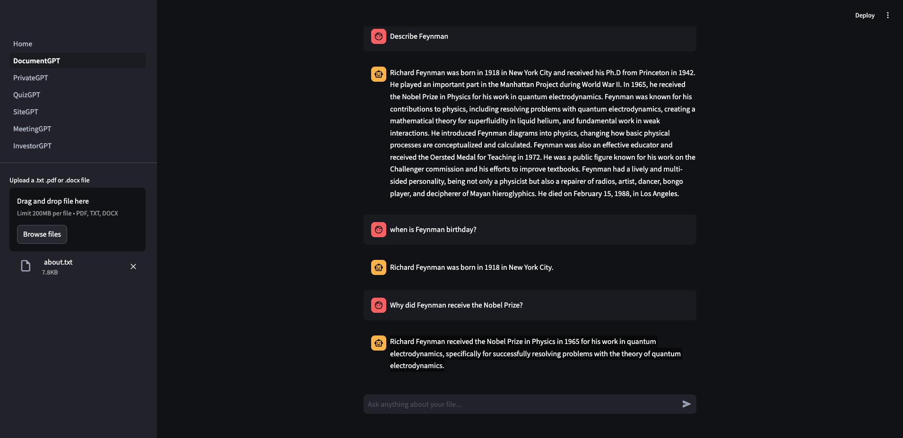
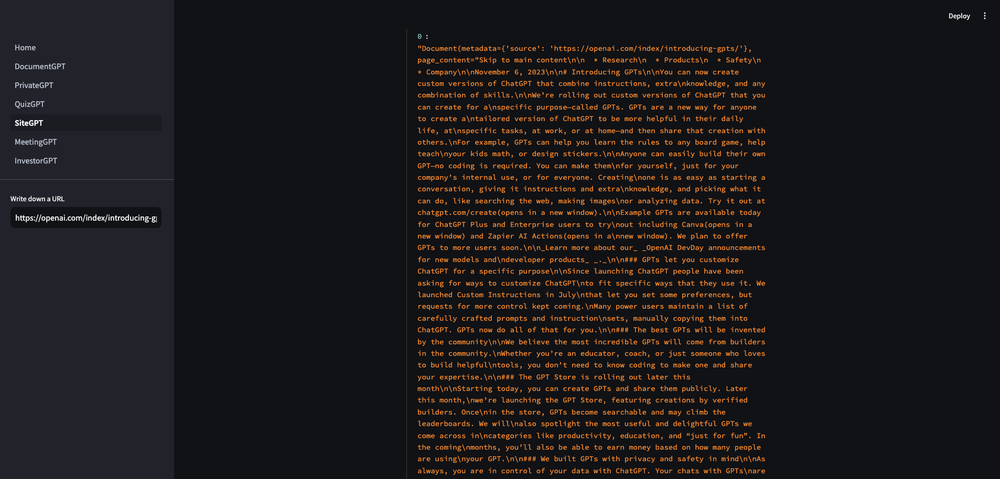

# NOTE

- 진행 중...(76%)

## Open AI를 위한 요구사항

- [x] Plus 유료 결제
- [x] API Key (유료)
- [x] 반드시 사용 한계 설정 필요

# 1. 기본 설정

VSCode 기준 필수 플러그인

- [Python language support](https://marketplace.visualstudio.com/items?itemName=ms-python.python)
- [Jupyter notebook support](https://marketplace.visualstudio.com/items?itemName=ms-toolsai.jupyter)

## 1-1. 가상환경 (Python 3.12.4)

### 정의

파이썬 가상환경(Python virtual environment)은 특정 프로젝트에서 필요한 패키지와 라이브러리들을 독립적으로 관리할 수 있게 해주는 도구입니다. 가상환경의 주요 용도는 다음과 같습니다.

- 의존성 관리: 서로 다른 프로젝트에서 서로 다른 버전의 라이브러리나 패키지가 필요할 때, 각 프로젝트가 독립적으로 해당 버전의 패키지를 사용할 수 있게 합니다. 예를 들어, 프로젝트 A에서는 Django 3.0이 필요하고, 프로젝트 B에서는 Django 4.0이 필요한 경우 가상환경을 사용하면 각 프로젝트에서 필요한 버전의 Django를 독립적으로 설치하고 사용할 수 있습니다.

- 시스템 파이썬 환경 보호: 시스템 전체에 영향을 미치지 않고, 특정 프로젝트에만 필요한 패키지들을 설치할 수 있습니다. 이를 통해 시스템 파이썬 환경을 깨끗하게 유지할 수 있습니다.

- 프로젝트 간의 충돌 방지: 여러 프로젝트가 동일한 패키지를 필요로 할 때, 각 프로젝트가 필요한 특정 버전의 패키지를 설치하고 관리할 수 있습니다. 이는 프로젝트 간의 의존성 충돌을 방지합니다.

- 재현 가능한 환경 제공: 특정 프로젝트의 개발 환경을 다른 개발자나 배포 환경에서 재현할 수 있도록 돕습니다. 가상환경을 사용하면 같은 패키지 버전을 설치하여 동일한 환경을 구축할 수 있습니다.

- 배포 환경과의 일치: 개발 환경과 배포 환경을 일치시켜, 배포 시 발생할 수 있는 문제를 줄입니다. 가상환경을 사용하면 로컬 개발 환경과 서버 환경을 쉽게 동기화할 수 있습니다. 요약하면, 파이썬 가상환경은 프로젝트별로 독립된 패키지 관리와 의존성 관리를 가능하게 하여, 개발 과정에서의 효율성과 안정성을 높이는 데 중요한 역할을 합니다.

### 가상환경 생성

여기서는 파이썬 3.3.x 이후 버전에서 표준 모듈로 제공하는 가상환경 venv 를 사용하겠습니다.

```zsh
python -m venv ./env
```

여기서 env는 가상환경의 이름입니다. 원하는 이름으로 변경할 수 있습니다.

### 가상환경 활성화

```zsh
# macOS
source env/bin/activate

# Windows
env\Scripts\activate
```

### 가상환경 비활성화

```zsh
deactivate
```

### 가상환경 삭제

가상환경을 더 이상 사용하지 않을 경우, 가상환경 디렉토리를 삭제하면 됩니다.

```zsh
rm -rf env
```

### 패키지 설치

가상환경이 활성화 된 상태에서 필요한 패키지를 설치합니다.

```zsh
pip install 패키지명
```

### 패키지 목록 정의

requirements.txt 프로젝트에서 필요한 패키지들의 목록과 해당 버전을 명시한 텍스트 파일입니다. 이 파일은 프로젝트의 의존성을 관리하고 다른 환경에서 동일한 패키지 구성을 재현하는 데 사용됩니다.

```zsh
pip install -r requirements.txt
```

### 환경변수 파일 설정

```env
OPENAI_API_KEY="sk-...n"
```

## 1-2. Jupyter Notebook

### 정의

Jupyter Notebook은 대화형 컴퓨팅 환경으로, 특히 데이터 과학, 머신러닝, 데이터 분석, 학술 연구 및 교육에서 널리 사용됩니다. Jupyter Notebook의 주요 용도는 다음과 같습니다.

- 데이터 분석 및 시각화: 데이터를 로드하고, 정제하고, 분석하고, 시각화하는 모든 과정을 한 곳에서 수행할 수 있습니다. pandas, matplotlib, seaborn 등의 라이브러리와 함께 사용하면 강력한 데이터 분석 도구로 활용할 수 있습니다.

- 데이터 과학 및 머신러닝: 데이터 전처리, 모델링, 평가, 예측 등 데이터 과학과 머신러닝의 전체 워크플로우를 처리할 수 있습니다. scikit-learn, TensorFlow, PyTorch 등과 통합하여 머신러닝 모델을 개발하고 실험할 수 있습니다.
- 대화형 코드 실행: 코드를 작성하고 즉시 실행 결과를 확인할 수 있는 대화형 환경을 제공합니다. 이는 실험적 작업이나 코드 디버깅에 매우 유용합니다.

- 교육 및 학습 자료 제작: 교육 자료, 튜토리얼, 강의 노트를 작성하는 데 유용합니다. 코드, 텍스트 설명, 수식, 이미지 등을 하나의 문서에 포함할 수 있어 이해하기 쉽고 직관적인 학습 자료를 만들 수 있습니다.

- 보고서 및 논문 작성: 데이터 분석 결과를 설명하는 보고서나 학술 논문을 작성하는 데 사용할 수 있습니다. 마크다운과 LaTeX을 지원하여 텍스트, 수식, 코드, 결과를 통합한 문서를 작성할 수 있습니다.

- 협업: Jupyter Notebook을 사용하면 다른 개발자나 연구자와 쉽게 협업할 수 있습니다. 노트북 파일(.ipynb)을 공유하여 코드와 분석 결과를 공유하고, 공동 작업할 수 있습니다.

- 데이터 시각화 및 대시보드 생성: Jupyter Notebook을 통해 데이터 시각화를 쉽게 수행할 수 있으며, 대시보드를 생성하여 실시간 데이터 모니터링 및 분석을 할 수 있습니다.

- 재현 가능한 연구: 연구 결과를 재현할 수 있는 환경을 제공하여, 연구의 신뢰성을 높입니다. Jupyter Notebook을 사용하면 코드와 결과를 함께 저장하여 언제든지 동일한 결과를 재현할 수 있습니다. Jupyter Notebook은 코드, 텍스트, 시각화를 통합하여 사용자 친화적인 환경을 제공함으로써, 데이터 과학과 관련된 다양한 작업을 효율적으로 수행할 수 있게 합니다.

### Jupyter Notebook 생성

1. notebook.ipynb 파일을 루트에 생성합니다. (파일이름은 자유롭게 설정합니다.)
2. Select Kernel을 선택하여 현재 파이썬 가상환경으로 접근하도록 경로를 설정합니다.

# 2. LANGCHAIN

- [랭체인 공식 문서](https://python.langchain.com/v0.1/docs/get_started/quickstart/)
- [OpenAI 공식 문서](https://platform.openai.com/docs/overview)

## 2-1. LLM and Chat Models

기본적으로 여러가지 모델들로 작업하기 좋은 인터페이스를 가지고 있으며 각 모델들은 서로 다른 기업에서 제공되고 또한 서로 다른 차이점을 지니고 있지만 랭체인을 사용하면 모든 모델에 호환되는 계층을 사용할 수 있습니다.

- [Open AI Models](https://platform.openai.com/docs/models)

간단하게 LLM 과 Chat Models 를 호출해보겠습니다.
이 둘은 텍스트를 Predict 할 수 있습니다.

```py
from langchain_openai import OpenAI, ChatOpenAI # LLM, Chat model

llm = OpenAI()
chat = ChatOpenAI()

a = llm.invoke("How many planets are in the solar system?")
b = chat.invoke("How many planets are in the solar system?")

a, b
```

## 2-2. Invoke (Predict Messages)

Chat model은 대화에 최적화 되어 있는데 질문을 받을 수 있을 뿐만 아니라 대화를 할 수 있습니다.
즉 메시지의 묶음이라는 의미이며, 상대로서 대화의 맥락에 맞게 대답할 수 있습니다.
Message들을 invoke 해보겠습니다.

```py
from langchain_openai import ChatOpenAI
# HumanMessage - 인간이 작성하는 메시지
# AIMessage - AI에 의해서 보내지는 메시지
# SystemMessage - LLM에 설정들을 제공하기 위한 Message
from langchain.schema import HumanMessage, AIMessage, SystemMessage

chat = ChatOpenAI(
    temperature=0.1, # 모델의 창의성을 조절하는 옵션 (높을 수록 창의적임)
)

messages = [
    SystemMessage(content="You are a geography expert. And you only reply in Italian."),
    AIMessage(content="Ciao, mi chiamo Paolo!"),
    HumanMessage(content="What is the distance between the Mexico and Thailand. Also, what is your name?"),
]

chat.invoke(messages)
```

## 2-3. Prompt Templates

prompt란 LLM 과 의사소통할 수 있는 방법입니다. prompt의 성능이 좋다면 LLM의 답변도 좋아집니다.
모든 웹사이트들이 상황에 맞는 뛰어난 성능의 prompt를 제작하는데 많은 노력을 기울입니다.
Langchain은 prompt를 공유하기 위한 커뮤니티를 만들고 있습니다. 이를 이용하여 많은 사용자들이 prompt를 공유할 수 있습니다. 많은 유틸리티 들이 prompt를 위해 존재합니다.

간단하게 문자열을 통한 predict를 실행하는 예제를 작성해 보겠습니다.

```py
from langchain_openai import ChatOpenAI
# PromptTemplate - 문자열을 이용한 template 생성
# ChatPromptTemplate - message를 이용하여 template 생성
from langchain.prompts import PromptTemplate, ChatPromptTemplate

chat = ChatOpenAI(
    temperature=0.1, # 모델의 창의성을 조절하는 옵션 (높을 수록 창의적임)
)

template = PromptTemplate.from_template("What is the distance between {country_a} and {country_b}")

prompt = template.format(country_a="Mexico", country_b="Thailand")

chat.invoke(prompt)
```

이번에는 메시지를 통한 invoke를 실행하는 예제를 작성해 보겠습니다.

```py
from langchain_openai import ChatOpenAI
# PromptTemplate - 문자열을 이용한 template 생성
# ChatPromptTemplate - message를 이용하여 template 생성
from langchain.prompts import ChatPromptTemplate, SystemMessagePromptTemplate, HumanMessagePromptTemplate, AIMessagePromptTemplate

chat = ChatOpenAI(
    temperature=0.1, # 모델의 창의성을 조절하는 옵션 (높을 수록 창의적임)
)

messages = [
    SystemMessagePromptTemplate.from_template("You are a geography expert. And you only reply in {language}."),
    AIMessagePromptTemplate.from_template("Ciao, mi chiamo {name}!"),
    HumanMessagePromptTemplate.from_template("What is the distance between the {country_a} and {country_b}. Also, what is your name?")
]

template = ChatPromptTemplate.from_messages(messages)

prompt = template.format_messages(language="Italian", name="Paolo", country_a="Mexico", country_b="Thailand")

chat.invoke(prompt)
```

## 2-4. OutputParser and LCEL

OutputParser는 LLM의 응답(Response)을 다양한 형태로 변형을 하기 위해서 사용합니다.
LCEL(langchain expression language)은 복잡할 수도 있는 코드를 간결하게 만들 수 있습니다. 그리고 다양한 template와 LLM 호출, 그리고 서로 다른 응답(Response)를 함께 사용할 수 있습니다.

첫번째로 OutputParser 예제로 간단하게 응답을 list로 변환해보겠습니다.

```py
from langchain_openai import ChatOpenAI
from langchain.schema import BaseOutputParser
# PromptTemplate - 문자열을 이용한 template 생성
# ChatPromptTemplate - message를 이용하여 template 생성
from langchain.prompts import ChatPromptTemplate, SystemMessagePromptTemplate, HumanMessagePromptTemplate, AIMessagePromptTemplate

chat = ChatOpenAI(
    temperature=0.1, # 모델의 창의성을 조절하는 옵션 (높을 수록 창의적임)
)

# 문자열 출력을 파싱하는 BaseOutputParser 확장하는 커스텀 OutputParser
class CommaOutputParser(BaseOutputParser):
    def parse(self, text: str) -> str:
        items = text.strip().split(",")
        return list(map(str.strip, items))

p = CommaOutputParser()

messages = [
    SystemMessagePromptTemplate.from_template("You are a list gernerating machine. Everything you are asked will be answered with a comma separated list of max {max_items} in lowercase. Do Not reply with else."),
    HumanMessagePromptTemplate.from_template("{question}")
]
template = ChatPromptTemplate.from_messages(messages)
prompt = template.format_messages(max_items=10, question="What are the colors?")
res = chat.invoke(prompt)
p.parse(res.content)
```

결과는 단순하지만 실행하는 코드는 너무 복잡합니다. 이것을 단순화하기 위해 Chaining 하도록 변경해 보겠습니다.

```py
from langchain_openai import ChatOpenAI
from langchain.schema import BaseOutputParser
# PromptTemplate - 문자열을 이용한 template 생성
# ChatPromptTemplate - message를 이용하여 template 생성
from langchain.prompts import ChatPromptTemplate, SystemMessagePromptTemplate, HumanMessagePromptTemplate, AIMessagePromptTemplate

chat = ChatOpenAI(
    temperature=0.1, # 모델의 창의성을 조절하는 옵션 (높을 수록 창의적임)
)

# 문자열 출력을 파싱하는 BaseOutputParser 확장하는 커스텀 OutputParser
class CommaOutputParser(BaseOutputParser):
    def parse(self, text: str) -> str:
        items = text.strip().split(",")
        return list(map(str.strip, items))

messages = [
    SystemMessagePromptTemplate.from_template("You are a list gernerating machine. Everything you are asked will be answered with a comma separated list of max {max_items} in lowercase. Do Not reply with else."),
    HumanMessagePromptTemplate.from_template("{question}")
]

# ✨Chaining✨
chain = template | chat | CommaOutputParser()
chain.invoke({
    "max_items":10,
    "question":"What are the colors?",
})
```

## 2-5. Chaining Chains

- [공식문서 - Expression Language/interface](https://python.langchain.com/v0.1/docs/expression_language/interface/)

Chaining과 LCEL(langchain expression language)에 대하여 좀 더 깊게 알아보도록 하겠습니다.
이전 Chaining과 코드를 살펴보겠습니다.

```py
chain = template | chat | CommaOutputParser()
chain.invoke({
    "max_items":10,
    "question":"What are the colors?",
})
```

우리는 현재 prompt와 chat model 그리고 OutputParser를 사용하고 있습니다. 이 외에도 다른 타입들은 위에 공식문서 링크를 참조해주세요(밑에서 다른 타입들도 사용하게 됩니다.)

실행 시 첫번째 template.format_messages 즉 prompt 명령이 실행 됩니다. 이로 인하여 그 값을 Dictionary형태로 전달하고 있습니다. 이로 인하여 Dictionary형태의 매개변수를 전달하고 있습니다. 첫번째 실행의 결과는 prompt value를 받게 됩니다.
두번째로 chat model로 첫번째 실행결과(prompt value)와 함께 이동합니다. chat model은 prompt value를 매개로 실행되며 그 실행 결과를 String 형태로 받게 됩니다.
세번째로 OutputParser로 두번째 실행결과(String)와 함께 이동합니다. OutputParser는 우리가 원하는 형태로 문자열을 가공하여 마지막 결과를 출력하게 될 것입니다.

이제 Chain들을 서로 Chaining 하는 예제를 작성해 보겠습니다.

```py
from langchain_openai import ChatOpenAI
# PromptTemplate - 문자열을 이용한 template 생성
# ChatPromptTemplate - message를 이용하여 template 생성
from langchain.prompts import ChatPromptTemplate, SystemMessagePromptTemplate, HumanMessagePromptTemplate, AIMessagePromptTemplate
from langchain.callbacks import StreamingStdOutCallbackHandler

chat = ChatOpenAI(
    temperature=0.1, # 모델의 창의성을 조절하는 옵션 (높을 수록 창의적임)
    streaming=True, # streaming 옵션을 활성화하여 대화형 모드로 설정
    callbacks=[StreamingStdOutCallbackHandler()], # 콜백 함수를 설정
)

chef_message =  [
    SystemMessagePromptTemplate.from_template("You are a world-class international chef. You create easy to fllow recipies for any type of cuisine with easy to find ingredients."),
    HumanMessagePromptTemplate.from_template("I want to cook {cuisine} food.")
]

chef_prompt = ChatPromptTemplate.from_messages(chef_message)

chef_chain = chef_prompt | chat

veg_chef_message =  [
    SystemMessagePromptTemplate.from_template("You are a vegetarian chef specialized on marking tranditional recipies vegetarian. You find alternatibe ingredients and explain their preparation. You don't redically modify the recipe. If there is no alternative for a food just say you don't know how to replace it."),
    HumanMessagePromptTemplate.from_template("{recipe}")
]

veg_chef_prompt = ChatPromptTemplate.from_messages(veg_chef_message)

veg_chef_chain = veg_chef_prompt | chat

# ✨RunnableMap✨사용
final_chain = {"recipe": chef_chain} | veg_chef_chain

final_chain.invoke({
    "cuisine":"indian",
})
```

# 3. MODEL I/O

Langchain에는 다양한 Model I/O가 존재합니다. 이는 다른 모든 언어 모델들과 인터페이스 할 수 있는 빌딩 블록을 제공합니다.


[공식문서 - Modules](https://python.langchain.com/v0.1/docs/modules/)

## 3-1. FewShotPromptTemplate

우리는 Prompt Template를 통하여 메시지의 유효성 확인하고 또한 저장 및 불러오기를 할 수 있습니다. 규모가 있는 LLM을 만들기 시작할 때 Prompt는 매우 중요합니다.
기본적으로 Fewshot 은 Model 들에게 예제들을 준다는 뜻과 같습니다. 이는 더 좋은 대답을 할 수 있도록 하는 예제들을 제공하는 것입니다.
예를 들어 구체적으로 대답하는 AI Model이 필요하다고 가정했을 시 어떻게 대답해야 하는 지에 대한 예제를 AI Model에게 제공하였을 때 Prompt를 사용해서 어떻게 대답해야 하는지 알려주는 것보다 더 좋습니다. 왜냐하면 모델은 텍스트를 만들기 때문에 Prompt로 명령을 하는 것보다 어떻게 대답해야 하는지 예제를 제공해주는 것이 더 좋은 방법입니다. 이것이 FewShotPromptTemplate이 하는 일이며 이를 통하여 예제를 형식화 할 수 있습니다.
또한 예제들이 데이터베이스에 있을 수도 있기 때문에 이런 대화 기록 같은 것들을 데이터베이스에서 가져와서 FewShotPromptTemplate이 사용하여 형식화 시켜주면 더 빠르게 잘 만들 수 있습니다.

이제 간단한 예제를 작성해보겠습니다.

```py
from langchain_openai import ChatOpenAI
# PromptTemplate - 문자열을 이용한 template 생성
# ChatPromptTemplate - message를 이용하여 template 생성
from langchain.prompts import PromptTemplate, ChatPromptTemplate, SystemMessagePromptTemplate, HumanMessagePromptTemplate, AIMessagePromptTemplate
from langchain.prompts.few_shot import FewShotPromptTemplate
from langchain.callbacks import StreamingStdOutCallbackHandler

chat = ChatOpenAI(
    temperature=0.1, # 모델의 창의성을 조절하는 옵션 (높을 수록 창의적임)
    streaming=True, # streaming 옵션을 활성화하여 대화형 모드로 설정
    callbacks=[StreamingStdOutCallbackHandler()], # 콜백 함수를 설정
)

# 모델에게 전달하는 답변 예제
examples = [
    {
        "question": "What do you know about France?",
        "answer": """
        Here is what I know:
        Capital: Paris
        Language: French
        Food: Wine and Cheese
        Currency: Euro
        """,
    },
    {
        "question": "What do you know about Italy?",
        "answer": """
        I know this:
        Capital: Rome
        Language: Italian
        Food: Pizza and Pasta
        Currency: Euro
        """,
    },
    {
        "question": "What do you know about Greece?",
        "answer": """
        I know this:
        Capital: Athens
        Language: Greek
        Food: Souvlaki and Feta Cheese
        Currency: Euro
        """,
    }]

example_prompt = PromptTemplate.from_template("Human: {question}\nAI: {answer}")

prompt = FewShotPromptTemplate(
    example_prompt=example_prompt, # Prompt 방식
    examples=examples, # 답변 예제
    suffix="Human: Wat do you know about {country}?", # 모든 형식화된 예제 마지막 내용
    input_variables=["country"] # suffix 입력 변수 (유효성 검사)
)

chain = prompt | chat

chain.invoke({
    "country":"Germany",
})
```

## 3-2. FewShotChatMessagePromptTemplate

이제 단순 문자열 형태가 아닌 메시지 형태의 FewShotChatMessagePromptTemplate를 작성해 보겠습니다.

```py
from langchain_openai import ChatOpenAI
# PromptTemplate - 문자열을 이용한 template 생성
# ChatPromptTemplate - message를 이용하여 template 생성
from langchain.prompts import PromptTemplate, ChatMessagePromptTemplate, ChatPromptTemplate, SystemMessagePromptTemplate, HumanMessagePromptTemplate, AIMessagePromptTemplate
from langchain.prompts.few_shot import FewShotPromptTemplate, FewShotChatMessagePromptTemplate
from langchain.callbacks import StreamingStdOutCallbackHandler

chat = ChatOpenAI(
    temperature=0.1, # 모델의 창의성을 조절하는 옵션 (높을 수록 창의적임)
    streaming=True, # streaming 옵션을 활성화하여 대화형 모드로 설정
    callbacks=[StreamingStdOutCallbackHandler()], # 콜백 함수를 설정
)

# 모델에게 전달하는 답변 예제
examples = [
    {
        "country": "France?",
        "answer": """
        Here is what I know:
        Capital: Paris
        Language: French
        Food: Wine and Cheese
        Currency: Euro
        """,
    },
    {
        "country": "Italy?",
        "answer": """
        I know this:
        Capital: Rome
        Language: Italian
        Food: Pizza and Pasta
        Currency: Euro
        """,
    },
    {
        "country": "Greece?",
        "answer": """
        I know this:
        Capital: Athens
        Language: Greek
        Food: Souvlaki and Feta Cheese
        Currency: Euro
        """,
    }]


example_prompt = ChatPromptTemplate.from_messages([
    HumanMessagePromptTemplate.from_template("What do you know about {country}?"),
    AIMessagePromptTemplate.from_template("{answer}"),
]
)

prompt = FewShotChatMessagePromptTemplate(
    example_prompt=example_prompt, # Prompt 방식
    examples=examples, # 답변 예제
)

final_prompt = ChatPromptTemplate.from_messages([
    SystemMessagePromptTemplate.from_template("You are a geography expert, you give short answers."),
    prompt,
    HumanMessagePromptTemplate.from_template("What do you know about {country}?")
])

chain = final_prompt | chat

chain.invoke({
    "country":"Germany",
})
```

## 3-3. LengthBasedExampleSelector

여기에서는 동적으로 예제들을 선택할 수 있는 방법에 대해 알아보겠습니다. 상황에 따라서는 많은 예제들이 존재하고 어느정도 예제들을 골라서 Prompt에 허용할 것인가에 대해 정의를 해야합니다. 이유는 많은 Prompt는 더 큰 비용을 지불해야 하며 비용이 존재하더라도 모델에 알맞은 양이 존재합니다.

간단한 길이를 조절하는 기본 예제를 작성해 보겠습니다.

```py
from langchain_openai import ChatOpenAI
# PromptTemplate - 문자열을 이용한 template 생성
# ChatPromptTemplate - message를 이용하여 template 생성
from langchain.prompts import PromptTemplate, ChatMessagePromptTemplate, ChatPromptTemplate, SystemMessagePromptTemplate, HumanMessagePromptTemplate, AIMessagePromptTemplate
from langchain.prompts.few_shot import FewShotPromptTemplate, FewShotChatMessagePromptTemplate
from langchain.callbacks import StreamingStdOutCallbackHandler
from langchain.prompts.example_selector import LengthBasedExampleSelector

chat = ChatOpenAI(
    temperature=0.1, # 모델의 창의성을 조절하는 옵션 (높을 수록 창의적임)
    streaming=True, # streaming 옵션을 활성화하여 대화형 모드로 설정
    callbacks=[StreamingStdOutCallbackHandler()], # 콜백 함수를 설정
)

# 모델에게 전달하는 답변 예제
examples = [
    {
        "question": "What do you know about France?",
        "answer": """
        Here is what I know:
        Capital: Paris
        Language: French
        Food: Wine and Cheese
        Currency: Euro
        """,
    },
    {
        "question": "What do you know about Italy?",
        "answer": """
        I know this:
        Capital: Rome
        Language: Italian
        Food: Pizza and Pasta
        Currency: Euro
        """,
    },
    {
        "question": "What do you know about Greece?",
        "answer": """
        I know this:
        Capital: Athens
        Language: Greek
        Food: Souvlaki and Feta Cheese
        Currency: Euro
        """,
    }]

example_prompt = PromptTemplate.from_template("Human: {question}\nAI: {answer}")

# 예제 선택
example_selector = LengthBasedExampleSelector(
    examples=examples, # 답변 예제
    example_prompt=example_prompt, # Prompt 방식
    max_length=180 # 최대 길이
)


prompt = FewShotPromptTemplate(
    example_prompt=example_prompt, # Prompt 방식
    example_selector=example_selector, # 답변 선택
    suffix="Human: Wat do you know about {country}?", # 모든 형식화된 예제 마지막 내용
    input_variables=["country"] # suffix 입력 변수 (유효성 검사)
)

prompt.format(country="Brazil")
```

랜덤한 예제를 선택하도록 수정해 보겠습니다.

```py
from langchain_openai import ChatOpenAI
# PromptTemplate - 문자열을 이용한 template 생성
# ChatPromptTemplate - message를 이용하여 template 생성
from langchain.prompts import PromptTemplate, ChatMessagePromptTemplate, ChatPromptTemplate, SystemMessagePromptTemplate, HumanMessagePromptTemplate, AIMessagePromptTemplate
from langchain.prompts.few_shot import FewShotPromptTemplate, FewShotChatMessagePromptTemplate
from langchain.callbacks import StreamingStdOutCallbackHandler
# from langchain.prompts.example_selector import LengthBasedExampleSelector
from langchain.prompts.example_selector.base import BaseExampleSelector

class RandomExampleSelector(BaseExampleSelector):
    def __init__(self, examples):
        self.examples = examples

    def add_example(self, example):
        self.examples.append(example)

    def select_examples(self, input_variables):
        from random import choice
        return [choice(self.examples)]

chat = ChatOpenAI(
    temperature=0.1, # 모델의 창의성을 조절하는 옵션 (높을 수록 창의적임)
    streaming=True, # streaming 옵션을 활성화하여 대화형 모드로 설정
    callbacks=[StreamingStdOutCallbackHandler()], # 콜백 함수를 설정
)

# 모델에게 전달하는 답변 예제
examples = [
    {
        "question": "What do you know about France?",
        "answer": """
        Here is what I know:
        Capital: Paris
        Language: French
        Food: Wine and Cheese
        Currency: Euro
        """,
    },
    {
        "question": "What do you know about Italy?",
        "answer": """
        I know this:
        Capital: Rome
        Language: Italian
        Food: Pizza and Pasta
        Currency: Euro
        """,
    },
    {
        "question": "What do you know about Greece?",
        "answer": """
        I know this:
        Capital: Athens
        Language: Greek
        Food: Souvlaki and Feta Cheese
        Currency: Euro
        """,
    }]

example_prompt = PromptTemplate.from_template("Human: {question}\nAI: {answer}")

# 예제 선택
example_selector = RandomExampleSelector(
    examples=examples, # 답변 예제
)


prompt = FewShotPromptTemplate(
    example_prompt=example_prompt, # Prompt 방식
    example_selector=example_selector, # 답변 선택
    suffix="Human: Wat do you know about {country}?", # 모든 형식화된 예제 마지막 내용
    input_variables=["country"] # suffix 입력 변수 (유효성 검사)
)

prompt.format(country="Brazil")
```

## 3-4. Serialization and Composition

이번에는 디스크에서 prompt template를 가져오는 방법을 알아보겠습니다. 만들어진 prompt를 가져다 쓰거나 다른 누구나 가져다 쓸 수 있도록 하고 싶다면 유용한 방법입니다.

일단 JSON 형식의 Prompt를 생성해보겠습니다.

```json
{
  "_type": "prompt",
  "template": "What is the capital of {country}",
  "input_variables": ["country"]
}
```

JSON 형태의 Prompt를 실행해 보겠습니다.

```py
from langchain_openai import ChatOpenAI
# PromptTemplate - 문자열을 이용한 template 생성
# ChatPromptTemplate - message를 이용하여 template 생성
from langchain.prompts import PromptTemplate, ChatMessagePromptTemplate, ChatPromptTemplate, SystemMessagePromptTemplate, HumanMessagePromptTemplate, AIMessagePromptTemplate
from langchain.prompts.few_shot import FewShotPromptTemplate, FewShotChatMessagePromptTemplate
from langchain.callbacks import StreamingStdOutCallbackHandler
from langchain.prompts import load_prompt

prompt = load_prompt("./prompt.json")


chat = ChatOpenAI(
    temperature=0.1, # 모델의 창의성을 조절하는 옵션 (높을 수록 창의적임)
    streaming=True, # streaming 옵션을 활성화하여 대화형 모드로 설정
    callbacks=[StreamingStdOutCallbackHandler()], # 콜백 함수를 설정
)

prompt.format(country="Germany")
```

이젠 Yaml 형태로 만들어보겠습니다.

```yaml
_type: "prompt"
template: "What is the capital of {country}"
input_variables: ["country"]
```

Yaml 형태의 Prompt를 실행해 보겠습니다.

```py
from langchain_openai import ChatOpenAI
# PromptTemplate - 문자열을 이용한 template 생성
# ChatPromptTemplate - message를 이용하여 template 생성
from langchain.prompts import PromptTemplate, ChatMessagePromptTemplate, ChatPromptTemplate, SystemMessagePromptTemplate, HumanMessagePromptTemplate, AIMessagePromptTemplate
from langchain.prompts.few_shot import FewShotPromptTemplate, FewShotChatMessagePromptTemplate
from langchain.callbacks import StreamingStdOutCallbackHandler
from langchain.prompts import load_prompt

# prompt = load_prompt("./prompt.json")
prompt = load_prompt("./prompt.yaml")


chat = ChatOpenAI(
    temperature=0.1, # 모델의 창의성을 조절하는 옵션 (높을 수록 창의적임)
    streaming=True, # streaming 옵션을 활성화하여 대화형 모드로 설정
    callbacks=[StreamingStdOutCallbackHandler()], # 콜백 함수를 설정
)

prompt.format(country="Germany")
```

이번에는 많은 prompt들을 Memory에 모두 모아두는 방법에 대해 알아보겠습니다. 이를 위해서는 PipelinePromptTemplate이 필요합니다. 이 Module은 prompt들을 하나로 합칠 수 있도록 도와줍니다.

```py
from langchain_openai import ChatOpenAI
# PromptTemplate - 문자열을 이용한 template 생성
# ChatPromptTemplate - message를 이용하여 template 생성
from langchain.prompts import PromptTemplate, ChatMessagePromptTemplate, ChatPromptTemplate, SystemMessagePromptTemplate, HumanMessagePromptTemplate, AIMessagePromptTemplate
from langchain.prompts.few_shot import FewShotPromptTemplate, FewShotChatMessagePromptTemplate
from langchain.callbacks import StreamingStdOutCallbackHandler
# Prompt Pipeline 불러오기
from langchain.prompts.pipeline import PipelinePromptTemplate

chat = ChatOpenAI(
    temperature=0.1, # 모델의 창의성을 조절하는 옵션 (높을 수록 창의적임)
    streaming=True, # streaming 옵션을 활성화하여 대화형 모드로 설정
    callbacks=[StreamingStdOutCallbackHandler()], # 콜백 함수를 설정
)

intro = PromptTemplate.from_template(
    """
    You are a role playing assistant.
    And you are impersonating a {character}
"""
)

example = PromptTemplate.from_template(
    """
    This is an example of how you talk:

    Human: {example_question}
    You: {example_answer}
"""
)

start = PromptTemplate.from_template(
    """
    Start now!

    Human: {question}
    You:
"""
)

final = PromptTemplate.from_template(
    """
    {intro}

    {example}

    {start}
"""
)

prompts = [
    ("intro", intro),
    ("example", example),
    ("start", start),
]

full_prompt = PipelinePromptTemplate(
    final_prompt=final,
    pipeline_prompts=prompts,
)

chain = full_prompt | chat

chain.invoke({
    "character":"Pirate",
    "example_question":"What is your location?",
    "example_answer":"Arrrrg! That is a secret!! Arg arg",
    "question": "What is your fav food?"
})
```

## 3-5. Caching

- [공식문서 - Caching](https://python.langchain.com/v0.1/docs/modules/model_io/llms/llm_caching/)

이곳에서는 정말 중요한 Caching에 대해서 알아보겠습니다. Caching을 사용하면 LM(Language Model)의 응답을 저장할 수 있습니다. 예를들어 채팅봇이 있고 채팅봇이 같은 질문을 받는다면 계속 답변을 만들지 않고 이미 답변한 답을 Caching하여 재사용할 수 있으며 이를 통해 비용을 절감할 수 있습니다.
Caching에는 다양한 방법이 존재하며 자세한 내용은 위에 공식문서 링크를 참조해주세요.

아래는 SQLLite를 이용한 캐싱에 예제를 보여드리겠습니다.

```py
from langchain_openai import ChatOpenAI
from langchain.callbacks import StreamingStdOutCallbackHandler
from langchain.globals import set_llm_cache, set_debug
from langchain.cache import InMemoryCache, SQLiteCache

# 인 메모리 캐시
# set_llm_cache(InMemoryCache())
# set_debug(True)

# 데이터베이스 캐시
set_llm_cache(SQLiteCache('cache.db'))

chat = ChatOpenAI(
    temperature=0.1, # 모델의 창의성을 조절하는 옵션 (높을 수록 창의적임)
    # streaming=True, # streaming 옵션을 활성화하여 대화형 모드로 설정
    # callbacks=[StreamingStdOutCallbackHandler()], # 콜백 함수를 설정
)

chat.predict("How do you make italian pasta?")
```

## 3-6. Serialization

지출하는 비용을 알아보는 방법과 Model을 어떻게 저장하고 불러오는지에 대해서 알아보겠습니다.

첫번째로 지출하는 비용알 알아보는 예제를 보여드리겠습니다.

```py
from langchain_openai import ChatOpenAI
from langchain.callbacks import get_openai_callback

chat = ChatOpenAI(
    temperature=0.1, # 모델의 창의성을 조절하는 옵션 (높을 수록 창의적임)
)

with get_openai_callback() as usage:
    a = chat.predict("What is the recipe for soju?")
    b = chat.predict("What is the recipe for bread?")
    print(a, b, "\n")
    print(usage)
```

두번째로 Serialization에 대해 알아보겠습니다. 채팅모델이 아닌 LLM으로 작업 시 너무 많은 설정을 하는 경우가 있습니다. 그래서 쉽게 처리하기 위해 예를 들어 아래와 같이 모델을 변경하고 내용을 저장한다면

```py
from langchain_openai import OpenAI

# Serialization
chat = OpenAI(
    temperature=0.1, # 모델의 창의성을 조절하는 옵션 (높을 수록 창의적임)
    max_tokens=450,
    model="gpt-3.5-turbo-16k",
)

chat.save('model.json')
```

아래와 같은 JSON 파일이 생성됩니다.

```json
{
  "model_name": "gpt-3.5-turbo-16k",
  "temperature": 0.1,
  "top_p": 1,
  "frequency_penalty": 0,
  "presence_penalty": 0,
  "n": 1,
  "logit_bias": {},
  "max_tokens": 450,
  "_type": "openai"
}
```

또는 모델을 불러온다면 아래와 같이 간단하게 처리할 수 있습니다.

```py
from langchain.llms.loading import load_llm

# 모델 불러오기
chat = load_llm('model.json')

print(chat)
```

# 4. MEMORY

Langchain에는 크게 5가지 종류의 메모리가 있으며 각각의 저장방식과 장단점이 존재합니다. 챗봇은 메모리를 추가하지 않으면 아무것도 기억할 수 없습니다. 질문이 이어가거나 이해하기 위해서는 반드시 메모리가 필요합니다. 기본적으로 OpenAI에서 제공하는 API는 Langchain 없이 사용이 가능하나 메모리는 지원하지 않습니다. 일단 각 메모리의 종류와 차이점을 살펴보고 메모리를 사용하는 방법을 알아보겠습니다. (더 자세한 내용은 아래 공식문서 링크를 참조해주세요)

- [공식문서 - Memory](https://python.langchain.com/v0.1/docs/integrations/memory/)
- [공식문서 - Memory(BETA)](https://python.langchain.com/v0.1/docs/modules/memory/)


## 4-1. ConversationBufferMemory

이 메모리의 동작 방식은 매우 단순합니다. 그냥 단순히 이전 대화 내용 전체를 저장합니다. 이 메모리의 단점은 대화 내용이 길어질수록 메모리도 계속 커지면서 비효율적일 수 밖에 없습니다. 하지만 text completion할때 유용합니다. 예측을 하거나 텍스트를 자동완성하고 싶을때 등입니다.

간단한 예제를 작성해보겠습니다.

```py
from langchain.memory import ConversationBufferMemory

# 쳇 모델 용으로 사용할 경우 return_messages=True로 설정
memory = ConversationBufferMemory(return_messages=True)

memory.save_context({"input": "Hi!"}, {"output": "How are you?"})

memory.load_memory_variables({})
```

## 4-2. ConversationBufferWindowMemory

이 메모리는 대화의 특정 부분만을 저장합니다. 예를 들어 최근 대화의 5개의 메시지만 저장한다고하면 6번째 메시지가 추가될때 가장 오래된 메시지는 버려지는 방식입니다. 저장 범위는 자유롭게 설정할 수 있으며 메모리를 특정 크기로 유지할 수 있다는 점이 장점입니다. 단점이라면 챗봇이 전체 대화가 아닌 최근 대화에만 집중한다는 점입니다.

간단한 예제를 작성해보겠습니다.

```py
from langchain.memory import ConversationBufferWindowMemory

# 쳇 모델 용으로 사용할 경우 return_messages=True로 설정, K는 메모리의 크기
memory = ConversationBufferWindowMemory(return_messages=True, k=4)

def add_message(input, output):
    memory.save_context({"input": input}, {"output": output})

add_message(1, 1)
add_message(2, 2)
add_message(3, 3)
add_message(4, 4)
add_message(5, 5)

memory.load_memory_variables({})
```

## 4-3. ConversationSummaryMemory

이 메모리는 초기값으로 LLM이 필요하며 기본적으로 비용이 발생합니다. ConversationSummaryMemory는 메시지를 그대로 저장하는게 아닌 대화를 요약을 자체적으로 처리해줍니다. 그래서 초반에는 이전보다 더 많은 토큰과 저장공간을 차지하지만 대화가 진행되면서 분량이 많아지면 전체 내용의 요약으로 인해 토큰의 양 및 저장공간이 줄어들면서 효율적으로 변합니다.

간단한 예제를 작성해보겠습니다.

```py
from langchain_openai import ChatOpenAI
from langchain.memory import ConversationSummaryMemory

chat = ChatOpenAI(
    temperature=0.1, # 모델의 창의성을 조절하는 옵션 (높을 수록 창의적임)
)

memory = ConversationSummaryMemory(llm=chat)

def add_message(input, output):
    memory.save_context({"input": input}, {"output": output})

def get_history():
    return memory.load_memory_variables({})

add_message("HI I am a human, I live in South Korea", "Wow that is cool! I am a robot living in the cloud.")
add_message("South Korea is so pretty", "I wish I could visit there.")

get_history()
```

## 4-4. ConversationSummaryBufferMemory

이 메모리는 기본적으로 ConversationSummaryMemory + ConversationBufferMemory의 결합입니다.
이것이 하는 일은 메모리에 보내온 메시지의 수를 저장합니다. 또한 한계에 다다른 순간에 메모리에서 지워지는 대신 오래된 메시지들을 요약합니다. 결론적으로는 가장 최근의 상호작용을 계속 추적합니다. 이로인하여 가장 최근 및 가장 오래 전에 주고 받은 메시지를 모두 잊지 않고 요약됩니다.

간단한 예제를 작성해보겠습니다.

```py
from langchain_openai import ChatOpenAI
from langchain.memory import ConversationSummaryBufferMemory

chat = ChatOpenAI(
    temperature=0.1, # 모델의 창의성을 조절하는 옵션 (높을 수록 창의적임)
)

# max_token_limit은 메모리에 저장할 최대 토큰 수
memory = ConversationSummaryBufferMemory(
    llm=chat,
    max_token_limit=10,
    return_messages=True
)

def add_message(input, output):
    memory.save_context({"input": input}, {"output": output})

def get_history():
    return memory.load_memory_variables({})

add_message("HI I am a human, I live in South Korea", "Wow that is cool! I am a robot living in the cloud.")
add_message("South Korea is so pretty", "I wish I could visit there.")

get_history()
```

## 4-5. ConversationKGMemory

이 메모리는 대화중의 Entity의 knowledge graph를 생성합니다. 일종의 가장 중요한 것들만 뽑아내는 요약본과 같습니다.

간단한 예제를 작성해보겠습니다.

```py
from langchain_openai import ChatOpenAI
from langchain.memory import ConversationKGMemory

chat = ChatOpenAI(
    temperature=0.1, # 모델의 창의성을 조절하는 옵션 (높을 수록 창의적임)
)

# max_token_limit은 메모리에 저장할 최대 토큰 수
memory = ConversationKGMemory(
    llm=chat,
    return_messages=True,
)

def add_message(input, output):
    memory.save_context({"input": input}, {"output": output})

add_message("HI I am a Lee, I live in South Korea", "Wow that is cool! I am a robot living in the cloud.")
add_message("Lee likes kimchi", "wow that is cool!")

memory.load_memory_variables({"input": "who is Lee"})
memory.load_memory_variables({"input": "what does Lee like"})
```

## 4-6. Memory on LLMChain

이제 메모리를 체인에 결합하는 방법과 2종류의 체인에 결합하는 방법을 알아보겠습니다.
그 중 첫번째로 LLMChain(off-the-shelf chain)이라는 것을 사용해보겠습니다. 하지만 실제로는 off-the-shelf chain보다는 일반적으로 직접 커스텀해서 활용하는 것을 더 선호합니다.

간단한 예제를 작성해보겠습니다.

```py
from langchain_openai import ChatOpenAI
from langchain.memory import ConversationSummaryBufferMemory
from langchain.chains import LLMChain
from langchain.prompts import PromptTemplate

chat = ChatOpenAI(
    temperature=0.1, # 모델의 창의성을 조절하는 옵션 (높을 수록 창의적임)
)

# max_token_limit은 메모리에 저장할 최대 토큰 수
memory = ConversationSummaryBufferMemory(
    llm=chat,
    max_token_limit=120,
    memory_key="chat_history",
)


template = """
    You are a helpful AI talking to a human.

    {chat_history}
    Human:{question}
    You:
"""

prompt = PromptTemplate.from_template(template)

chain = LLMChain(
    llm=chat,
    memory=memory,
    prompt=prompt,
    verbose=True,
)

chain.predict(question="My name is Seo")
chain.predict(question="I live Seoul in South Korea")
chain.predict(question="What is my name?")

memory.load_memory_variables({})
```

## 4-7. Chat Based Memory

4-6의 예제를 기반으로 챗을 기본으로 하는 구조로 변경하는 작업을 시작하겠습니다.

간단한 예제를 작성해보겠습니다.

```py
from langchain_openai import ChatOpenAI
from langchain.memory import ConversationSummaryBufferMemory
from langchain.chains import LLMChain
from langchain.prompts import ChatPromptTemplate, SystemMessagePromptTemplate, HumanMessagePromptTemplate, MessagesPlaceholder

chat = ChatOpenAI(
    temperature=0.1, # 모델의 창의성을 조절하는 옵션 (높을 수록 창의적임)
)

# max_token_limit은 메모리에 저장할 최대 토큰 수
memory = ConversationSummaryBufferMemory(
    llm=chat,
    max_token_limit=120,
    memory_key="chat_history",
    return_messages=True,
)


prompt = ChatPromptTemplate.from_messages([
    SystemMessagePromptTemplate.from_template("You are a helpful AI talking to a human."),
    MessagesPlaceholder(variable_name="chat_history"), # 많은 메시지들 사이를 구분하기 위한 placeholder
    HumanMessagePromptTemplate.from_template("{question}"),
])

chain = LLMChain(
    llm=chat,
    memory=memory,
    prompt=prompt,
    verbose=True,
)

chain.predict(question="My name is Seo")
chain.predict(question="I live Seoul in South Korea")
chain.predict(question="What is my name?")

memory.load_memory_variables({})
```

## 4-8. LCEL Based Memory

4-7의 예제를 기반으로 LCEL(LangChain Expresstion Language)을 이용하여 생성된 체인에 메모리를 추가하는 작업을 해보겠습니다.

간단한 예제를 작성해보겠습니다.

```py
from langchain_openai import ChatOpenAI
from langchain.memory import ConversationSummaryBufferMemory
from langchain.prompts import ChatPromptTemplate, SystemMessagePromptTemplate, HumanMessagePromptTemplate, MessagesPlaceholder
from langchain.schema.runnable import RunnablePassthrough

chat = ChatOpenAI(
    temperature=0.1, # 모델의 창의성을 조절하는 옵션 (높을 수록 창의적임)
)

# max_token_limit은 메모리에 저장할 최대 토큰 수
memory = ConversationSummaryBufferMemory(
    llm=chat,
    max_token_limit=120,
    return_messages=True,
)

prompt = ChatPromptTemplate.from_messages([
    SystemMessagePromptTemplate.from_template("You are a helpful AI talking to a human."),
    MessagesPlaceholder(variable_name="history"), # 많은 메시지들 사이를 구분하기 위한 placeholder
    HumanMessagePromptTemplate.from_template("{question}"),
])

def load_memory(_):
    return memory.load_memory_variables({})["history"]

chain = RunnablePassthrough.assign(history=load_memory) | prompt | chat

def invoke_chain(question):
    result = chain.invoke({"question": question})
    memory.save_context({"input": question}, {"output": result.content})
    return result

invoke_chain("My name is Seo")
invoke_chain("I live Seoul in South Korea")
invoke_chain("What is my name?")
```

# 5. RAG

RAG(Retrieval Augmented Generation)의 사용법을 학습하겠습니다.

모델들은 많은 데이터를 통해 학습되지만 개인적인 데이터들에는 때로는 접근할 수 없습니다. 예를 들면 개인 DB나 문서 같은 것들 입니다. 그래서 RAG를 사용합니다.

예를 들어 Foo가 뭐지 라는 질문을 하면 그 질문을 프롬프트에 전달하고 또한 동시에 우리의 질문과 관련이 있는 문서들도 준비하게 됩니다. 저장된 Vector나 검색기를 이용해서 관련 문서를 찾아내는 방법은 이후에 다루겠습니다.
여기에서는 Vector Space에서 검색하는 방법이나, 의미론적인 뜻을 알아보겠습니다. 다시 돌아가서 모델에게 질문을 하면 기존에 학습된 수 많은 data와 함께 모델이 더 나은 답변을 할 수 있도록 도와주기 위해 추가로 전송한 data까지 갖게 되어있으며 이를 RAG(Retrieval Augmented Generation)라고 합니다. 개인으로부터 제공된 data를 사용하거나 탐색함으로써 능력을 확장시키는 것입니다.

- [공식문서-RAG](https://python.langchain.com/v0.1/docs/integrations/providers/vectara/#vectara-for-retrieval-augmented-generation-rag)

## 5-1. Data Loaders and Splitters

첫번째로 알아볼 것은 Retrieval입니다. Langchain 안에는 다양한 Document Loader들이 존재하며 지금하려는 것은 전체 문서를 로드하고 분할하고 데이터를 임베드하기 위한 것입니다. 이것을 Retrieval 과정이라 하며 RAG의 첫번째 과정입니다.

- [공식문서-Document Loaders](https://python.langchain.com/v0.1/docs/integrations/document_loaders/)

Source -> Load -> Transform -> Embed -> Store -> Retrieval

어떠한 Source에서 데이터를 Load한 후 데이터를 분할하면서 변환합니다. 다음엔 변환한 데이터를 Embed하여 텍스트에서 컴퓨터가 이해할 수 있는 숫자로 변환합니다. 이를 Store에 저장하고 이후에 특정숫자를 검색합니다.

간단하게 데이터를 불러와 분할해 보겠습니다.

```py
from langchain_openai import ChatOpenAI
from langchain.document_loaders import UnstructuredFileLoader
from langchain.text_splitter import CharacterTextSplitter

# chunk_size - 텍스트를 분할하는 크기
# chunk_overlap - 분할된 텍스트의 중복 크기
# separator - 텍스트를 분할하는 구분자
splitter = CharacterTextSplitter(
    chunk_size=600,
    chunk_overlap=100,
    separator="\n"
)

loader = UnstructuredFileLoader("./files/chapter_one.pdf")

len(loader.load_and_split(text_splitter=splitter))
```

## 5-2. Tiktoken

기본적으로 모든 splitter들은 텍스트의 length를 계산해서 한 덩어리의(chunk) 크기르 알아냅니다. 그 작업에는 파이썬 표준 라이브러리가 지원하는 len함수를 사용합니다. 하지만 LLM들은 Token을 같은 방법으로 처리하지 않습니다.

- [OpenAI - Tokenizer](https://platform.openai.com/tokenizer)

5-1 예제를 내부 토큰화 함수(Tiktoken)를 사용하도록 수정해보겠습니다.

```py
from langchain_openai import ChatOpenAI
from langchain.document_loaders import UnstructuredFileLoader
from langchain.text_splitter import CharacterTextSplitter

# chunk_size - 텍스트를 분할하는 크기
# chunk_overlap - 분할된 텍스트의 중복 크기
# separator - 텍스트를 분할하는 구분자
splitter = CharacterTextSplitter.from_tiktoken_encoder(
    chunk_size=600,
    chunk_overlap=100,
    separator="\n",
)

loader = UnstructuredFileLoader("./files/chapter_one.pdf")

loader.load_and_split(text_splitter=splitter)
```

## 5-3. Vectors

이제 Embed 작업을 해보겠습니다. 사람이 읽는 텍스트를 컴퓨터가 이해할 수 있는 숫자들로 변환하는 작업으로 더 정확히는 Vectorization작업을 하게 됩니다. (OpenAI는 1000Dimension이상을 가지고 있습니다.)

예를 들어 Masculinity | Femininity | Royalty 라는 3Dimension을 기준으로 해보겠습니다.

- king: 0.9 | 0.1 | 1.0
- queen: 0.1 | 0.9 | 1.0
- man: 0.9 | 0.1 | 0.0
- woman: 0.1 | 0.9 | 0.0
- royal: 0.0 | 0.0 | 1.0

위 값에서 king - man 을 계산해 보겠습니다. 연산결과가 어떤 단어를 의미할지는 모르지만, 연산은 할 수 있습니다.

- ???: 0.0 | 0.0 | 1.0 (0.9 - 0.9 | 0.1 - 0.1 | 1.0 - 0.0 )

위 결과로 보면 royal이 됩니다. 다시 royal - woman을 해보겠습니다.

- ???: 0.1 | 0.9 | 1.0 (0.0 - 0.1 | 0.0 - 0.9 | 0.0 - 1.0 )

다시 위의 결과로 보면 queen이 나오는 것을 확인 할 수 있습니다.

이러한 예를 바탕으로 우리는 모든 내용을 숫자형태로 치환한 덕분에 단어들간의 연산이 가능하다는 것을 알 수 있습니다. 또한 우리는 Vector에 대한 Search작업이 가능해집니다. 서로 비슷한 Vector를 찾을 수 있게 되며 이것을 Vector들이 서로 가깝다라고 표현하고 이게 바로 많은 추천 알고리즘들이 작동하는 방식입니다.

- [Vector Search Example](https://turbomaze.github.io/word2vecjson/)

- [Gustav Soderstrom - Spotify Vector Search algorithm](https://www.youtube.com/watch?v=2eWuYf-aZE4)

## 5-4. Vectors Store

우선 embedding model에 대해서 알아보고 간단히 OpenAI에서 지원하는 내용을 작성해보겠습니다.

아래의 코드를 실행해보면 "Hi"에 관한 Vector값을 볼 수 있습니다. (len함수로 "Hi" Vector의 차원이 1536개 입니다.)

```py
from langchain_openai import OpenAIEmbeddings

embedder = OpenAIEmbeddings()

# Hi의 벡터값을 가져옴
embedder.embed_query("Hi")
```

이제 문서에 embed 작업을 해보겠습니다.

```py
from langchain_openai import OpenAIEmbeddings

embedder = OpenAIEmbeddings()

# 문서의 벡터값을 embedding
vectors = embedder.embed_documents([
    "hi",
    "how",
    "are",
    "you longer sentences because"
])

vectors

# Vector 개수 확인
# len(vectors)
```

이제 5-1 예제를 기반으로 실제 문서를 embedding 하겠습니다. 여기에서 중요한 것은 매번 실행될때마다 생성하는 것이 아닌 Vector Store를 통해 Caching 하여 비용을 절감하는 것이 중요하며 Vector Store에 Vector를 넣어두면 그 내용을 검색할 수 있습니다.

Vector Store에는 여러 가지 환경을 제공합니다. 여기에서는 오픈소스 중 하나인 Chroma를 사용하겠습니다.

```py
from langchain_openai import ChatOpenAI
from langchain.document_loaders import UnstructuredFileLoader
from langchain.text_splitter import CharacterTextSplitter
from langchain_openai import OpenAIEmbeddings
from langchain.embeddings import CacheBackedEmbeddings
from langchain.vectorstores import Chroma
from langchain.storage import LocalFileStore

# chunk_size - 텍스트를 분할하는 크기
# chunk_overlap - 분할된 텍스트의 중복 크기
# separator - 텍스트를 분할하는 구분자
splitter = CharacterTextSplitter.from_tiktoken_encoder(
    chunk_size=600,
    chunk_overlap=100,
    separator="\n",
)

loader = UnstructuredFileLoader("./files/chapter_one.pdf")

docs = loader.load_and_split(text_splitter=splitter)

embeddings = OpenAIEmbeddings()

# cache_dir - 캐시 디렉토리
cache_dir = LocalFileStore("./.cache/")

# 캐시된 임베딩을 사용하여 Vector Store 초기화
cached_embeddings = CacheBackedEmbeddings.from_bytes_store(
    embeddings,
    cache_dir,
)

# Vector Store 초기화
vectorstore = Chroma.from_documents(docs, cached_embeddings)

# 유사도 검색
result = vectorstore.similarity_search("what is introduction")

result
```

## 5-5. LangSmith

Langsmith란 이 도구를 사용하면 우리의 체인이 무엇을 하고 있는지 시각적으로 확인이 가능합니다.

아래 사이트에서 회원가입해주세요

- [LangSmith](https://www.langchain.com/langsmith)

이후 아래 환경설정을 추가해줍니다.

```env
LANGCHAIN_TRACING_V2=true
LANGCHAIN_ENDPOINT="https://api.smith.langchain.com"
LANGCHAIN_API_KEY="XXXXX..."
```

Jupyter notebook을 재실행해주면 LangSmith 대시보드에서 내용을 확인 할 수 있습니다.

## 5-6. RetrievalQA

이제 Document Chain을 만들겠습니다. 일단 off-the-shelf chain을 이용하고 이후에 LCEL 형태의 chain으로 변경하도록 하겠습니다.

off-the-shelf 형태의 LLMChain은 이제 Legacy 입니다. 상황에 따라서는 deprecated 될 수 있으니 참고하세요.

Document Chain에는 다양한 생성방식이 존재합니다.

그 중 첫번째로 Stuff 방식을 사용해보겠습니다. Document들로 prompt를 Stuff(채우기)를 하는데 사용한다는 뜻입니다.

두번째는 Map Reduce 방식이 존재하는데 이는 개별적으로 요약작업을 수행하고 각각의 요약본을 LLM에게 전달해 줍니다.


- [공식문서 - Document Loaders](https://python.langchain.com/v0.1/docs/modules/data_connection/document_loaders/)

- [공식문서 - Stuff](https://python.langchain.com/v0.1/docs/use_cases/summarization/#option-1-stuff)

- [RetrievalQA](https://api.python.langchain.com/en/latest/chains/langchain.chains.retrieval_qa.base.RetrievalQA.html#langchain.chains.retrieval_qa.base.RetrievalQA)

5-4 예제를 기반으로 간단한 예제를 작성해보겠습니다.

```py
from langchain_openai import ChatOpenAI
from langchain.document_loaders import UnstructuredFileLoader
from langchain.text_splitter import CharacterTextSplitter
from langchain_openai import OpenAIEmbeddings
from langchain.embeddings import CacheBackedEmbeddings
from langchain.vectorstores import Chroma
from langchain.storage import LocalFileStore
from langchain.chains import RetrievalQA

llm = ChatOpenAI(
    temperature=0.1, # 모델의 창의성을 조절하는 옵션 (높을 수록 창의적임)
)

# chunk_size - 텍스트를 분할하는 크기
# chunk_overlap - 분할된 텍스트의 중복 크기
# separator - 텍스트를 분할하는 구분자
splitter = CharacterTextSplitter.from_tiktoken_encoder(
    chunk_size=600,
    chunk_overlap=100,
    separator="\n",
)

loader = UnstructuredFileLoader("./files/chapter_one.pdf")

docs = loader.load_and_split(text_splitter=splitter)

embeddings = OpenAIEmbeddings()

# cache_dir - 캐시 디렉토리
cache_dir = LocalFileStore("./.cache/")

# 캐시된 임베딩을 사용하여 Vector Store 초기화
cached_embeddings = CacheBackedEmbeddings.from_bytes_store(
    embeddings,
    cache_dir,
)

# Vector Store 초기화
vectorstore = Chroma.from_documents(docs, cached_embeddings)

chain = RetrievalQA.from_chain_type(
    llm=llm,
    chain_type="stuff", # map_reduce, stuff
    retriever=vectorstore.as_retriever(),
)

chain.run("What is Physics?")
```

## 5-7. Stuff LCEL Chain

5-6 예제를 Stuff 기반으로 LCEL Chain으로 변경하겠습니다.

```py
from langchain_openai import ChatOpenAI
from langchain.document_loaders import UnstructuredFileLoader
from langchain.text_splitter import CharacterTextSplitter
from langchain_openai import OpenAIEmbeddings
from langchain.embeddings import CacheBackedEmbeddings
from langchain.vectorstores import Chroma
from langchain.storage import LocalFileStore
from langchain.prompts import ChatPromptTemplate
from langchain.schema.runnable import RunnablePassthrough

llm = ChatOpenAI(
    temperature=0.1, # 모델의 창의성을 조절하는 옵션 (높을 수록 창의적임)
)

# chunk_size - 텍스트를 분할하는 크기
# chunk_overlap - 분할된 텍스트의 중복 크기
# separator - 텍스트를 분할하는 구분자
splitter = CharacterTextSplitter.from_tiktoken_encoder(
    chunk_size=600,
    chunk_overlap=100,
    separator="\n",
)

loader = UnstructuredFileLoader("./files/chapter_one.pdf")

docs = loader.load_and_split(text_splitter=splitter)

embeddings = OpenAIEmbeddings()

# cache_dir - 캐시 디렉토리
cache_dir = LocalFileStore("./.cache/")

# 캐시된 임베딩을 사용하여 Vector Store 초기화
cached_embeddings = CacheBackedEmbeddings.from_bytes_store(
    embeddings,
    cache_dir,
)

# Vector Store 초기화
vectorstore = Chroma.from_documents(docs, cached_embeddings)

retriver = vectorstore.as_retriever();

prompt = ChatPromptTemplate.from_messages([
    ("system", "You are a helpfull assistant. Answer questions using only the following context. If you don't know the answer just say you don't knowm, don't make it up:\n{context}"),
    ("human", "{question}"),
])

chain = {"context": retriver, "question": RunnablePassthrough()} | prompt | llm

chain.invoke("What is Physics?")
```

## 5-8. Map Reduce LCEL Chain

5-6 예제를 Map Reduce 기반 LCEL Chain으로 변경하겠습니다.

Map Reduce 방식은 Docuemnt가 많을 수록 유리합니다.

```py
from langchain_openai import ChatOpenAI
from langchain.document_loaders import UnstructuredFileLoader
from langchain.text_splitter import CharacterTextSplitter
from langchain_openai import OpenAIEmbeddings
from langchain.embeddings import CacheBackedEmbeddings
from langchain.vectorstores import Chroma
from langchain.storage import LocalFileStore
from langchain.prompts import ChatPromptTemplate
from langchain.schema.runnable import RunnablePassthrough, RunnableLambda

llm = ChatOpenAI(
    temperature=0.1, # 모델의 창의성을 조절하는 옵션 (높을 수록 창의적임)
)

# chunk_size - 텍스트를 분할하는 크기
# chunk_overlap - 분할된 텍스트의 중복 크기
# separator - 텍스트를 분할하는 구분자
splitter = CharacterTextSplitter.from_tiktoken_encoder(
    chunk_size=600,
    chunk_overlap=100,
    separator="\n",
)

loader = UnstructuredFileLoader("./files/chapter_one.pdf")

docs = loader.load_and_split(text_splitter=splitter)

embeddings = OpenAIEmbeddings()

# cache_dir - 캐시 디렉토리
cache_dir = LocalFileStore("./.cache/")

# 캐시된 임베딩을 사용하여 Vector Store 초기화
cached_embeddings = CacheBackedEmbeddings.from_bytes_store(
    embeddings,
    cache_dir,
)

# Vector Store 초기화
vectorstore = Chroma.from_documents(docs, cached_embeddings)

retriver = vectorstore.as_retriever();

map_doc_prompt = ChatPromptTemplate.from_messages([
    ("system",
    """
    Use the following portion of a long document to see if any of the
    text is relevant to answer the question. Return any relevant text
    verbatim.
    """
    ),
    ("human", "{question}")
])

map_doc_chain = map_doc_prompt | llm

def map_docs(inputs):
    documents = inputs["documents"]
    question = inputs["question"]
    return "\n\n".join(
        map_doc_chain.invoke(
            {"question": question, "context": doc.page_content}
        ).content
        for doc in documents
    )

map_chain = {"documents": retriver, "question": RunnablePassthrough()} | RunnableLambda(map_docs)

final_prompt = ChatPromptTemplate.from_messages([
    ('system',
    """
    Given the following extracted parts of a long document and a
    question, create a final answer.
    If you don't know the answer, just say you don't know. Don't try
    to make up an anwser.
    {context}
    """
     ),
     ("human", "{question}")
])

chain = {"context": map_chain, "question": RunnablePassthrough()} | final_prompt | llm

chain.invoke("What is Physics?")
```

# 6. DOCUMENT GPT

Streamlit을 이용해서 Python 코드만으로 멋진 UI를 만들어 보겠습니다. 이전 챕터에서 진행한 Document GPT를 활용하여 Streamlit을 결합해서 멋진 UI가진 챗봇을 만드는게 목표입니다.

- [Streamlit.io](https://streamlit.io/)

일단 기본적인 환경이 실행되는지 테스트 해보겠습니다.

root경로에 Home.py 파일을 생성하겠습니다.

```py
# Home.py
import streamlit as st

st.title("Hello world!")

st.subheader("Welcome to Streamlit!")

st.markdown("""
    #### I love it!
""")
```

Streamlit의 실행을 위해 명령어를 실행합니다.

```zsh
streamlit run Home.py
```

웹서버가 정상적으로 동작한다면 우린 기본적인 준비가 끝났습니다.

## 6-1. Magic

- [docs](https://docs.streamlit.io/)

Streamlit에서 중요한 2가지를 먼저 살펴보겠습니다.

그 중 첫번째는 write입니다. 메소드 설명에 보면 Swiss Army knife라고 표현합니다. 이 뜻은 넘겨주는 무엇이든 화면에 나타내주는 메소드입니다.

```py
# Home.py
import streamlit as st
from langchain.prompts import PromptTemplate

# 문자열
st.write("hello")

# Data Structure
st.write([1,2,3,4])

# Data dict
st.write({"x": 1})

# Class
st.write(PromptTemplate)

p = PromptTemplate.from_template("xxxx")

st.write(p)
```

굳이 메소드를 사용하지 않고 Jupyter notebook 처럼 변수만 선언해도 같은 결과가 나옵니다.

```py
# Home.py
import streamlit as st
from langchain.prompts import PromptTemplate

# 문자열
"hello"

# Data Structure
[1,2,3,4]

# Data dict
{"x": 1}

# Class
PromptTemplate

p = PromptTemplate.from_template("xxxx")

p
```

멋진 기능이지만 가독성 측면에서 집적적으로 메소드를 선언해서 사용하는 것을 더 추천합니다.

## 6-2. Data Flow

Streamlit에서는 데이터가 변경되면 자동으로 화면이 다시 refresh 됩니다.

간단한 예제로만 보여드리겠습니다.

```py
# Home.py
import streamlit as st
from datetime import datetime

today = datetime.today().strftime("%H:%M:%S")

st.title(today)

model = st.selectbox("Choose your model",("GPT-4", "GPT-3"))

st.write(model)

name = st.text_input("What is your name?")

st.write(name)

value = st.slider(
    "temperature",
    min_value=0.1,
    max_value=1.0
)
st.write(value)
```

## 6-3. Multi Page

Streamlit으로 sidebar를 구성하겠습니다. 지금부터 만들어갈 앱을 포토폴리오처럼 만드려면 각각의 페이지가 필요합니다.

간단한 예제로 보여드리겠습니다.

```py
# Home.py
import streamlit as st

# Sidebar 생성
with st.sidebar:
    st.sidebar.title('Home')
    st.sidebar.text_input('xxx')

st.title('App')

# Tab bat 생성
tab_a, tab_b, tab_c = st.tabs(["A", "B", "C"])

with tab_a:
    st.write('Tab A')

with tab_b:
    st.write('Tab B')

with tab_c:
    st.write('Tab C')
```

이제 본격적으로 페이지를 구성해보겠습니다. 각각의 페이지를 만드는 방법은 간단합니다. pages폴더를 생성 후 하위에 각 페이지 파일들을 생성해 줍니다. 원하는 순서대로 정렬을 하고 싶다면 파일명에 숫자등을 통하여 순서를 정렬해 줍니다.

```py
# Home.py
# pages/01_DocumentGPT.py
# pages/02_QuizGPT.py
# pages/03_PrivateGPT.py
```

## 6-4. Chat Message

지금부터 chatbot을 만들기 시작하겠습니다.

일단 Home.py에 할 일들을 정리하기 위한 간단한 마크다운을 작성하겠습니다.

```py
# Home.py
import streamlit as st

st.set_page_config(
    page_title="F/S GPT HOME",
    page_icon="🤖",
)

st.markdown(
"""
# Hello!

Welcome to my F/S GPT!

Here are the apps I made:

- [ ] [DocumentGPT](/DocumentGPT)
- [ ] [PrivateGPT](/PrivateGPT)
- [ ] [QuizGPT](/QuizGPT)
- [ ] [SiteGPT](/SiteGPT)
- [ ] [MeetingGPT](/MeetingGPT)
- [ ] [InvestorGPT](/InvestorGPT)
"""
)
```

이제 본격적으로 Langchain을 가져오기 이전에 Streamlit이 가진 Chat element를 사용하는 법을 알아보겠습니다.

```py
# pages/DocumentGPT.py
import streamlit as st
import time

st.set_page_config(
    page_title="DocumentGPT",
    page_icon="📜",
)

st.title('DocumentGPT')

# USER
with st.chat_message("human"):
    st.write("Hello, I'm a HUMAN!")

# AI
with st.chat_message("ai"):
    st.write("Hello, I'm an AI!")

# Chat message input
st.chat_input("Send a message to AI")

# 상태 표기 (Loader)
with st.status("Embedding file...", expanded=True) as status:
    time.sleep(2)
    st.write("Getting the file")
    time.sleep(2)
    st.write("Embedding the file")
    time.sleep(2)
    st.write("Caching the file")
    status.update(label="Error", state="error")
```

이제 실제로 메시지를 주고 받는 UI의 기본 구조를 구성해 보겠습니다.

```py
# pages/DocumentGPT.py
# 메시지 저장소
if "messages" not in st.session_state:
    st.session_state["messages"] = []

# 채팅 메시지 출력
def send_message(message, role, save=True):
    with st.chat_message(role):
        st.write(message)
    if save:
        st.session_state["messages"].append({"message": message, "role": role})

# 캐싱한 채팅 메시지 출력
for message in st.session_state["messages"]:
    send_message(message["message"], message["role"], save=False)

# 채팅 입력
message = st.chat_input("Send a message to AI")

# 입력된 채팅 메시지 출력
if message:
    send_message(message, 'human')
    time.sleep(2)
    send_message(f"You said: {message}", "ai")

    with st.sidebar:
        st.write(st.session_state)
```

위 코드의 실행 화면입니다.


## 6-5. Uploading Documents

파일을 업로드하여 Stuff 방식으로 처리하는 코드를 작성해보겠습니다.

이전에 환경설정 파일 및 캐시 폴더를 작성해 줍니다. (불필요 파일 제거)

```toml
# .streamlit/screts.toml
OPENAI_API_KEY="sk-...n"

# .cache/files
# .cache/embeddings
```

이제 실제 코드를 작성하겠습니다.

```py
# pages/DocumentGPT.py
import streamlit as st
from langchain.document_loaders import UnstructuredFileLoader
from langchain.storage import LocalFileStore
from langchain.document_loaders import UnstructuredFileLoader
from langchain.text_splitter import CharacterTextSplitter
from langchain_openai import OpenAIEmbeddings
from langchain.embeddings import CacheBackedEmbeddings
from langchain.vectorstores import Chroma

st.set_page_config(
    page_title="DocumentGPT",
    page_icon="📜",
)


# 파일 처리
def embed_file(file):
    file_content = file.read()
    file_path = f"./.cache/files/{file.name}"

    with open(file_path, "wb") as f:
        f.write(file_content)

    # cache_dir - 캐시 디렉토리
    cache_dir = LocalFileStore(f"./.cache/embeddings/{file.name}")
    # chunk_size - 텍스트를 분할하는 크기
    # chunk_overlap - 분할된 텍스트의 중복 크기
    # separator - 텍스트를 분할하는 구분자
    splitter = CharacterTextSplitter.from_tiktoken_encoder(
        chunk_size=600,
        chunk_overlap=100,
        separator="\n",
    )
    loader = UnstructuredFileLoader(file_path)
    docs = loader.load_and_split(text_splitter=splitter)
    embeddings = OpenAIEmbeddings()
    # 캐시된 임베딩을 사용하여 Vector Store 초기화
    cached_embeddings = CacheBackedEmbeddings.from_bytes_store(
        embeddings,
        cache_dir,
    )
    # Vector Store 초기화
    vectorstore = Chroma.from_documents(docs, cached_embeddings)
    retriver = vectorstore.as_retriever()
    return retriver


st.title("DocumentGPT")

st.markdown(
    """
Welcome!

Use this chatbot to ask questions to an AI about your files!
"""
)

# 파일 업로드
file = st.file_uploader("Upload a .txt .pdf or .docx file", type=["pdf", "txt", "docx"])

if file:
    s = embed_file(file)
    docs = s.invoke("what is physics?")
    st.write(docs)
```

실행결과 화면 입니다.


## 6-6. Chat History

6-5에서의 DocumentGPT를 개선하고 기능을 추가해 보겠습니다. 내용은 아래와 같습니다.

1. 불필요한 함수 동작 - cache_resource라는 데코레이터를 통해서 동일한 파일은 embed_file 함수가 재실행되지 않도록 수정
2. 메시지를 입력받아서 히스토리를 저장할 수 있도록 함수 추가 및 코드 수정

위 내용을 기반으로 예제를 작성하겠습니다.

```py
# pages/DocumentGPT.py
import streamlit as st
from langchain.document_loaders import UnstructuredFileLoader
from langchain.storage import LocalFileStore
from langchain.document_loaders import UnstructuredFileLoader
from langchain.text_splitter import CharacterTextSplitter
from langchain_openai import OpenAIEmbeddings
from langchain.embeddings import CacheBackedEmbeddings
from langchain.vectorstores import Chroma

st.set_page_config(
    page_title="DocumentGPT",
    page_icon="📜",
)


# 파일 처리
@st.cache_resource(
    show_spinner="Embedding file...",
)
def embed_file(file):
    file_content = file.read()
    file_path = f"./.cache/files/{file.name}"

    with open(file_path, "wb") as f:
        f.write(file_content)

    # cache_dir - 캐시 디렉토리
    cache_dir = LocalFileStore(f"./.cache/embeddings/{file.name}")
    # chunk_size - 텍스트를 분할하는 크기
    # chunk_overlap - 분할된 텍스트의 중복 크기
    # separator - 텍스트를 분할하는 구분자
    splitter = CharacterTextSplitter.from_tiktoken_encoder(
        chunk_size=600,
        chunk_overlap=100,
        separator="\n",
    )
    loader = UnstructuredFileLoader(file_path)
    docs = loader.load_and_split(text_splitter=splitter)
    embeddings = OpenAIEmbeddings()
    # 캐시된 임베딩을 사용하여 Vector Store 초기화
    cached_embeddings = CacheBackedEmbeddings.from_bytes_store(
        embeddings,
        cache_dir,
    )
    # Vector Store 초기화
    vectorstore = Chroma.from_documents(docs, cached_embeddings)
    retriver = vectorstore.as_retriever()
    return retriver


# 메시지 전송
def send_message(message, role, save=True):
    with st.chat_message(role):
        st.markdown(message)
    if save:
        st.session_state["messages"].append({"message": message, "role": role})


# 이전 메시지 표시
def paint_history():
    for message in st.session_state["messages"]:
        send_message(message["message"], message["role"], save=False)


st.title("DocumentGPT")

st.markdown(
    """
Welcome!

Use this chatbot to ask questions to an AI about your files!

Upload your files on the sidebar.
"""
)

# 사이드바
with st.sidebar:
    # 파일 업로드
    file = st.file_uploader(
        "Upload a .txt .pdf or .docx file", type=["pdf", "txt", "docx"]
    )

if file:
    rr = embed_file(file)

    send_message("I'm ready! Ask away!", "ai", save=False)

    paint_history()

    message = st.chat_input("Ask anything about your file...")

    if message:
        send_message(message, "human")
else:
    st.session_state["messages"] = []
```

실행결과 화면 입니다.


## 6-7. Chain

6-6 까지 진행한 구조를 기반으로 LLM을 Stuff Chain 해보겠습니다.

```py
# pages/DocumentGPT.py
import streamlit as st
from langchain.document_loaders import UnstructuredFileLoader
from langchain.storage import LocalFileStore
from langchain.document_loaders import UnstructuredFileLoader
from langchain.text_splitter import CharacterTextSplitter
from langchain_openai import OpenAIEmbeddings
from langchain.embeddings import CacheBackedEmbeddings
from langchain.vectorstores import Chroma
from langchain.prompts import ChatPromptTemplate
from langchain_openai import ChatOpenAI
from langchain.callbacks import StreamingStdOutCallbackHandler
from langchain.schema.runnable import RunnableLambda, RunnablePassthrough

llm = ChatOpenAI(
    temperature=0.1,  # 모델의 창의성을 조절하는 옵션 (높을 수록 창의적임)
    streaming=True,  # streaming 옵션을 활성화하여 대화형 모드로 설정
    callbacks=[StreamingStdOutCallbackHandler()],  # 콜백 함수를 설정
)

st.set_page_config(
    page_title="DocumentGPT",
    page_icon="📜",
)


# 파일 처리
@st.cache_resource(
    show_spinner="Embedding file...",
)
def embed_file(file):
    file_content = file.read()
    file_path = f"./.cache/files/{file.name}"

    with open(file_path, "wb") as f:
        f.write(file_content)

    # cache_dir - 캐시 디렉토리
    cache_dir = LocalFileStore(f"./.cache/embeddings/{file.name}")
    # chunk_size - 텍스트를 분할하는 크기
    # chunk_overlap - 분할된 텍스트의 중복 크기
    # separator - 텍스트를 분할하는 구분자
    splitter = CharacterTextSplitter.from_tiktoken_encoder(
        chunk_size=600,
        chunk_overlap=100,
        separator="\n",
    )
    loader = UnstructuredFileLoader(file_path)
    docs = loader.load_and_split(text_splitter=splitter)
    embeddings = OpenAIEmbeddings()
    # 캐시된 임베딩을 사용하여 Vector Store 초기화
    cached_embeddings = CacheBackedEmbeddings.from_bytes_store(
        embeddings,
        cache_dir,
    )
    # Vector Store 초기화
    vectorstore = Chroma.from_documents(docs, cached_embeddings)
    retriver = vectorstore.as_retriever()
    return retriver


# 메시지 전송
def send_message(message, role, save=True):
    with st.chat_message(role):
        st.markdown(message)
    if save:
        st.session_state["messages"].append({"message": message, "role": role})


# 이전 메시지 표시
def paint_history():
    for message in st.session_state["messages"]:
        send_message(message["message"], message["role"], save=False)


# 문서 형식
def format_docs(docs):
    return "\n\n".join(document.page_content for document in docs)


# 템플릿
prompt = ChatPromptTemplate.from_messages(
    [
        (
            "system",
            """
            Answer the question using Only the following context, If you don't know the answer
            just say you don't know. DON'T make anything up.

            Context: {context}
            """,
        ),
        ("human", "{question}"),
    ]
)

st.title("DocumentGPT")

st.markdown(
    """
Welcome!

Use this chatbot to ask questions to an AI about your files!

Upload your files on the sidebar.
"""
)

# 사이드바
with st.sidebar:
    # 파일 업로드
    file = st.file_uploader(
        "Upload a .txt .pdf or .docx file", type=["pdf", "txt", "docx"]
    )

if file:
    retriever = embed_file(file)
    send_message("I'm ready! Ask away!", "ai", save=False)
    paint_history()
    message = st.chat_input("Ask anything about your file...")

    if message:
        send_message(message, "human")
        # 대화 체인
        chain = (
            {
                "context": retriever | RunnableLambda(format_docs),
                "question": RunnablePassthrough(),
            }
            | prompt
            | llm
        )
        # 메시지 전송
        response = chain.invoke(message)
        send_message(response.content, "ai")
else:
    st.session_state["messages"] = []
```

실행 화면입니다.



## 6-8. Streaming

6-7 예제를 기본으로 이제 챗봇에게 생동감을 주기위해 모든 메시지가 100% 생성되기까지 기다리는 대신, 생성되는 과정을 지켜볼 수 있도록 우리들만의 Streaming Callback Handler를 추가해보겠습니다.
(Streaming은 오래된 모델 혹은 몇몇 모델들은 지원하지 않습니다.)

Streaming Callback Handler는 기본적으로 llm의 event를 listen하는 class입니다. llm이 무언가를 만들기 시작할 때, 작업을 끝낼 때, 글자를 생성하거나 Streaming할 때, llm에 에러가 발생할 때도 listen합니다.

간단한 Callback의 구조를 테스트 해보겠습니다.

```py
# pages/DocumentGPT.py

# ...n
from langchain.callbacks.base import BaseCallbackHandler

# 콜백 핸들러
class ChatCallbackHandler(BaseCallbackHandler):
    # llm_start 이벤트
    def on_llm_start(self, *args, **kwargs):
        with st.sidebar:
            st.write("llm started!!")

    # llm_end 이벤트
    def on_llm_end(self, *args, **kwargs):
        with st.sidebar:
            st.write("llm ended!!")

    # llm_new_token 이벤트
    def on_llm_new_token(self, token, *args, **kwargs):
        with st.sidebar:
            st.write(f"llm token: {token}")


llm = ChatOpenAI(
    temperature=0.1,  # 모델의 창의성을 조절하는 옵션 (높을 수록 창의적임)
    streaming=True,  # streaming 옵션을 활성화하여 대화형 모드로 설정
    callbacks=[ChatCallbackHandler()],  # 콜백 함수를 설정
)

# ...n
```

위 코드를 추가해서 실행해보면 llm 이벤트의 시작과 끝 중간에 각 토큰들이 표기됩니다.

이제 우리가 활용할 수 있도록 수정해 보겠습니다.

```py
# pages/DocumentGPT.py
import streamlit as st
from langchain.document_loaders import UnstructuredFileLoader
from langchain.storage import LocalFileStore
from langchain.document_loaders import UnstructuredFileLoader
from langchain.text_splitter import CharacterTextSplitter
from langchain_openai import OpenAIEmbeddings
from langchain.embeddings import CacheBackedEmbeddings
from langchain.vectorstores import Chroma
from langchain.prompts import ChatPromptTemplate
from langchain_openai import ChatOpenAI
from langchain.callbacks.base import BaseCallbackHandler
from langchain.schema.runnable import RunnableLambda, RunnablePassthrough


# 콜백 핸들러
class ChatCallbackHandler(BaseCallbackHandler):
    # 메시지
    message = ""

    # llm_start 이벤트
    def on_llm_start(self, *args, **kwargs):
        # 메시지 박스 ( 비어있는 위젯 )
        self.message_box = st.empty()

    # llm_end 이벤트
    def on_llm_end(self, *args, **kwargs):
        save_message(self.message, "ai")

    # llm_new_token 이벤트
    def on_llm_new_token(self, token, *args, **kwargs):
        self.message += token
        self.message_box.markdown(self.message)


llm = ChatOpenAI(
    temperature=0.1,  # 모델의 창의성을 조절하는 옵션 (높을 수록 창의적임)
    streaming=True,  # streaming 옵션을 활성화하여 대화형 모드로 설정
    callbacks=[ChatCallbackHandler()],  # 콜백 함수를 설정
)

st.set_page_config(
    page_title="DocumentGPT",
    page_icon="📜",
)


# 파일 처리
@st.cache_resource(
    show_spinner="Embedding file...",
)
def embed_file(file):
    file_content = file.read()
    file_path = f"./.cache/files/{file.name}"

    with open(file_path, "wb") as f:
        f.write(file_content)

    # cache_dir - 캐시 디렉토리
    cache_dir = LocalFileStore(f"./.cache/embeddings/{file.name}")
    # chunk_size - 텍스트를 분할하는 크기
    # chunk_overlap - 분할된 텍스트의 중복 크기
    # separator - 텍스트를 분할하는 구분자
    splitter = CharacterTextSplitter.from_tiktoken_encoder(
        chunk_size=600,
        chunk_overlap=100,
        separator="\n",
    )
    loader = UnstructuredFileLoader(file_path)
    docs = loader.load_and_split(text_splitter=splitter)
    embeddings = OpenAIEmbeddings()
    # 캐시된 임베딩을 사용하여 Vector Store 초기화
    cached_embeddings = CacheBackedEmbeddings.from_bytes_store(
        embeddings,
        cache_dir,
    )
    # Vector Store 초기화
    vectorstore = Chroma.from_documents(docs, cached_embeddings)
    retriver = vectorstore.as_retriever()
    return retriver


# 메시지 저장
def save_message(message, role):
    st.session_state["messages"].append({"message": message, "role": role})


# 메시지 전송
def send_message(message, role, save=True):
    with st.chat_message(role):
        st.markdown(message)
    if save:
        save_message(message, role)


# 이전 메시지 표시
def paint_history():
    for message in st.session_state["messages"]:
        send_message(message["message"], message["role"], save=False)


# 문서 형식
def format_docs(docs):
    return "\n\n".join(document.page_content for document in docs)


# 템플릿
prompt = ChatPromptTemplate.from_messages(
    [
        (
            "system",
            """
            Answer the question using Only the following context, If you don't know the answer
            just say you don't know. DON'T make anything up. but If you ask a question in another language, we will translate the context and process it.

            Context: {context}
            """,
        ),
        ("human", "{question}"),
    ]
)

st.title("DocumentGPT")

st.markdown(
    """
Welcome!

Use this chatbot to ask questions to an AI about your files!

Upload your files on the sidebar.
"""
)

# 사이드바
with st.sidebar:
    # 파일 업로드
    file = st.file_uploader(
        "Upload a .txt .pdf or .docx file", type=["pdf", "txt", "docx"]
    )

if file:
    retriever = embed_file(file)
    send_message("I'm ready! Ask away!", "ai", save=False)
    paint_history()
    message = st.chat_input("Ask anything about your file...")

    if message:
        send_message(message, "human")
        # 대화 체인
        chain = (
            {
                "context": retriever | RunnableLambda(format_docs),
                "question": RunnablePassthrough(),
            }
            | prompt
            | llm
        )

        with st.chat_message("ai"):
            # 메시지 전송
            response = chain.invoke(message)

else:
    st.session_state["messages"] = []
```

실행 화면입니다.


# 7. PRIVATE GPT

이제 Private GPT를 만들어 보겠습니다. 기존 Document GPT와 동일한 코드이나 임베딩 모델과 LLM모델을 각각 Swap하고 OpenAI를 사용하지 않기 때문에 인터넷을 사용하지 않을 겁니다. 따라서 파일은 컴퓨터에 유지되고 우리 컴퓨터는 embedding을 생성하고 model을 실행합니다.

우선은 Model들을 다운운 받아야합니다. 이 후에는 100% 오프라인으로 동작할 예정입니다.

기존에 Document GPT 파일의 내용을 Private GPT로 그대로 복사합니다. 이후 타이틀을 변경하고 private_files, private_embeddings 폴더를 생성하고 코드에서 경로를 수정합니다.

## 7-1. HuggingFaceHub

- [HuggingFaceHub](https://huggingface.co/)

이번에는 HuggingFaceHub를 이용해보겠습니다. 이곳을 이용하는 방법은 2가지가 있습니다.

첫번째는 HuggingFace Interface API를 사용하는 방법입니다. 이 경우는 실제 HuggingFace Server를 사용(유료/무료)해야 하기 때문에 우리가 현재 원하는 방식은 아닙니다.

두번째는 실제 모델은 다운로드 받아서 실행하는 방법입니다. 우리가 하려는 방법은 바로 이 두번째 방법입니다.

위 링크에서 HuggingFaceHub로 접속하여 로그인 후 Settings/Access Tokens 메뉴에서 토큰을 생성하세요

아래와 같이 환경 변수에 설정 하겠습니다.

```env
...n
HUGGINGFACEHUB_API_TOKEN="hf_xxxxx..."
```

사용할 모델은 Meta-Llama-3-8B-Instruct 또는 mistralai/Mistral-7B-Instruct-v0.3를 사용하겠습니다.

⚠️ 저장소에서 사용 승인처리를 반드시 해주어야 해당 모델 사용이 가능합니다.

- [Meta-Llama-3-8B-Instruct](https://huggingface.co/meta-llama/Meta-Llama-3-8B-Instruct)
- [mistralai/Mistral-7B-Instruct-v0.3](https://huggingface.co/mistralai/Mistral-7B-Instruct-v0.3)

잠시 Jupyter Notebook으로 돌아가겠습니다. API 형태로의 사용예제를 우선 작성해 보겠습니다.

```py
from langchain.llms import HuggingFaceHub
from langchain.prompts import PromptTemplate

prompt = PromptTemplate.from_template("What is the meaning of {word}")

llm = HuggingFaceHub(
    # repo_id="mistralai/Mistral-7B-Instruct-v0.3",
    repo_id="meta-llama/Meta-Llama-3-8B-Instruct",
    model_kwargs={
        "max_new_tokens": 250,
    }
)

chain = prompt | llm

chain.invoke({"word": "potato"})
```

## 7-2. HuggingFacePipeline

이제 실제 모델을 다운로드하여 로컬에서 실행되도록 구성해보겠습니다. 모델에 종류나 사용가능한 GPU 여부에 따라 여러 변수들이 존재합니다.

7-1에서 사용한 모델은 크기가 너무 크기 때문에 여기서는 규모가 작은 모델(GPT-2)을 사용하겠습니다.

- [GPT-2](https://huggingface.co/openai-community/gpt2)

아래 예제를 작성해보겠습니다.

```py
from langchain.llms import HuggingFacePipeline
from langchain.prompts import PromptTemplate

prompt = PromptTemplate.from_template("A {word} is a")

llm = HuggingFacePipeline.from_model_id(
    model_id="openai-community/gpt2",
    task="text-generation",
    pipeline_kwargs={
        "max_new_tokens": 50,
    },
)

chain = prompt | llm

chain.invoke({"word": "potato"})
```

## 7-3. GPT4ALL

- [GPT4ALL](https://www.nomic.ai/gpt4all)

GPT4ALL은 로컬에서 모델을 실행하는 또 다른 방법이며, 매우 훌륭합니다.

로컬 모델과 함께 할 수 있는 UI APP을 가지고 있으며 ChatGPT와 매우 흡사한 구성을 가지고 있습니다.
또한 미세조정을 할 수 있는 모델들을 유지하고 있습니다.

GPT4ALL은 APP에서 관련 모델을 다운로드 해주세요

간단한 예제를 작성해 보겠습니다.

```py
from langchain_community.llms import GPT4All
from langchain.prompts import PromptTemplate

prompt = PromptTemplate.from_template("A {word} is a")

llm = GPT4All(model="./gpt4all-falcon-q4_0.gguf", n_threads=1)

chain = prompt | llm

chain.invoke({"word": "tomato"})
```

## 7-4. Ollama

- [Ollama](https://ollama.com/)

Ollama를 통해서 로컬에서 실행시켜 보겠습니다. 이제 다시 PrivateGPT로 돌아가서 Ollama를 활용하여 모델을 SWAP해 보겠습니다.

위 Ollama에 접속해서 APP을 다운로드를 받아야합니다.

설치가 완료 되었다면 Mac기준 상단에 라마아이콘이 보여야합니다.


정상적으로 동작한다면 모델 llama3를 설치해보겠습니다.

- [llama3](https://ollama.com/library/llama3)

```zsh
ollama run llama3
```

처음 실행시에는 다운로드가 시작되고 이후에는 바로 콘솔에서 사용가능해집니다.


종료하려면 아래 명령어를 실행해주세요

```zsh
>>> /bye
```

Ollama가 작동하는 방식은 설치된 위치에 서버를 만듭니다.

아래와 같이 요청을 해보면 확인 할 수 있습니다.

```zsh
curl -X POST http://localhost:11434/api/generate -d '{
  "model": "llama3",
  "prompt":"Why is the sky blue?"
 }'
```

langchain에서는 ollama를 위한 wrapper를 가지고 있습니다. 수동적으로 요청을 보내는 행위를 할 필요가 없습니다. 이 모든 것은 langchain에서 다처리할 것입니다.

이제 PrivateGPT를 수정해보겠습니다.

```py
# pages/PrivateGPT.py
import streamlit as st
from langchain.document_loaders import UnstructuredFileLoader
from langchain.storage import LocalFileStore
from langchain.text_splitter import CharacterTextSplitter
from langchain.embeddings import CacheBackedEmbeddings, OllamaEmbeddings
from langchain.vectorstores.faiss import FAISS
from langchain.prompts import ChatPromptTemplate
from langchain_community.llms import Ollama
from langchain.callbacks.base import BaseCallbackHandler
from langchain.schema.runnable import RunnableLambda, RunnablePassthrough


# 콜백 핸들러
class ChatCallbackHandler(BaseCallbackHandler):
    # 메시지
    message = ""

    # llm_start 이벤트
    def on_llm_start(self, *args, **kwargs):
        # 메시지 박스 ( 비어있는 위젯 )
        self.message_box = st.empty()

    # llm_end 이벤트
    def on_llm_end(self, *args, **kwargs):
        save_message(self.message, "ai")

    # llm_new_token 이벤트
    def on_llm_new_token(self, token, *args, **kwargs):
        self.message += token
        self.message_box.markdown(self.message)


llm = Ollama(
    model="llama3:latest",  # 모델 선택
    temperature=0.1,  # 모델의 창의성을 조절하는 옵션 (높을 수록 창의적임)
    # streaming=True,  # streaming 옵션을 활성화하여 대화형 모드로 설정 (Ollama에서는 지원하지 않음)
    callbacks=[ChatCallbackHandler()],  # 콜백 함수를 설정
)

st.set_page_config(
    page_title="PrivateGPT",
    page_icon="🔒",
)


# 파일 처리
@st.cache_resource(
    show_spinner="Embedding file...",
)
def embed_file(file):
    file_content = file.read()
    file_path = f"./.cache/private_files/{file.name}"

    with open(file_path, "wb") as f:
        f.write(file_content)

    # cache_dir - 캐시 디렉토리
    cache_dir = LocalFileStore(f"./.cache/private_embeddings/{file.name}")
    # chunk_size - 텍스트를 분할하는 크기
    # chunk_overlap - 분할된 텍스트의 중복 크기
    # separator - 텍스트를 분할하는 구분자
    splitter = CharacterTextSplitter.from_tiktoken_encoder(
        chunk_size=600,
        chunk_overlap=100,
        separator="\n",
    )
    loader = UnstructuredFileLoader(file_path)
    docs = loader.load_and_split(text_splitter=splitter)
    embeddings = OllamaEmbeddings(model="llama3:latest")
    # 캐시된 임베딩을 사용하여 Vector Store 초기화
    cached_embeddings = CacheBackedEmbeddings.from_bytes_store(
        embeddings,
        cache_dir,
    )
    # Vector Store 초기화
    vectorstore = FAISS.from_documents(docs, cached_embeddings)
    retriver = vectorstore.as_retriever()
    return retriver


# 메시지 저장
def save_message(message, role):
    st.session_state["messages"].append({"message": message, "role": role})


# 메시지 전송
def send_message(message, role, save=True):
    with st.chat_message(role):
        st.markdown(message)
    if save:
        save_message(message, role)


# 이전 메시지 표시
def paint_history():
    for message in st.session_state["messages"]:
        send_message(message["message"], message["role"], save=False)


# 문서 형식
def format_docs(docs):
    return "\n\n".join(document.page_content for document in docs)


# 템플릿
prompt = ChatPromptTemplate.from_template(
    """Answer the question using Only the following context, If you don't know the answer
    just say you don't know. DON'T make anything up. but If you ask a question in another language, we will translate the context and process it.

    Context: {context}
    Question: {question}
    """
)

st.title("PrivateGPT")

st.markdown(
    """
Welcome!

Use this chatbot to ask questions to an AI about your files!

Upload your files on the sidebar.
"""
)

# 사이드바
with st.sidebar:
    # 파일 업로드
    file = st.file_uploader(
        "Upload a .txt .pdf or .docx file", type=["pdf", "txt", "docx"]
    )

if file:
    retriever = embed_file(file)
    send_message("I'm ready! Ask away!", "ai", save=False)
    paint_history()
    message = st.chat_input("Ask anything about your file...")

    if message:
        send_message(message, "human")
        # 대화 체인
        chain = (
            {
                "context": retriever | RunnableLambda(format_docs),
                "question": RunnablePassthrough(),
            }
            | prompt
            | llm
        )

        with st.chat_message("ai"):
            # 메시지 전송
            response = chain.invoke(message)

else:
    st.session_state["messages"] = []
```

실행 결과입니다.


# 8. QUIZ GPT

이제 Quiz GPT 페이지를 만들어 보겠습니다. 파일을 받는 다는 점에서는 Document GPT와 비슷하지만 파일에 대한 내용을 우리가 질문을 하는 것이 아닌 LLM이 파일에 관련된 내용을 질문하도록 명령하겠습니다.

무엇인가 공부하거나 스스로의 시험을 해보고 싶다면 유용한 도구가 될 내용입니다.

이 부분에서 중요한 점은 Output Parser를 이해하는 것입니다. Document GPT 나 Private GPT 에서는 모델이 어떤 형태이던 모델이 원하는 방향으로 답을 했습니다. 그저 우리가 업로드한 파일에 대해 질문을 했으며 모델은 거기서 나온 문자열을 기반으로 답을 했습니다. 하지만 여기에서는 모델이 특정 형식으로 답을 하도록 강제하려 합니다. 왜냐하면 모델이 우리에게 질문과 그에 대한 답을 할 것이며 어떤 답이 정답인지도 알려줄 것이기 떄문입니다. 우리는 그 결과를 Parser해서 실제로 Quiz를 생성합니다. 이러기 위해서는 결과는 특정한 구조를 지녀야 합니다.

그 외에는 GPT3, GPT4에서만 가능한 기능인 Function Calling을 알아보겠습니다.

Function Calling은 유용한 기능이며 우리가 만든 함수가 어떻게 생겼는지, 어떤 Parameter값을 원하는지 LLM에게 설명할 수 있습니다.

우리가 LLM을 호출했을 때 text로 답하는게 아닌 우리가 작성한 함수들을 호출하게 됩니다.

## 8-1. WikipediaRetriever

WikipediaRetriever는 특정 질문이나 키워드에 대한 정보를 검색하고, 그 결과를 가져오기 위해 위키백과(Wikipedia)를 조회하는 기능을 수행하는 도구입니다

사이드바에 몇가지 기능을 추가하면서 시작해보겠습니다. 우선 업로드한 파일 또는 Wikipedia에서 가져올지를 선택하는 기능를 추가하겠습니다.

파일을 업로드 하는 부분에서는 이전처럼 embedding 하지 않도록 수정하겠습니다. 단 파일은 Cache하기 때문에 폴더를 생성해 줍니다.

예제는 아래와 같습니다.

```py
# pages/QuizGPT.py
import streamlit as st
from langchain.retrievers import WikipediaRetriever
from langchain.text_splitter import CharacterTextSplitter
from langchain.document_loaders import UnstructuredFileLoader

st.set_page_config(
    page_title="QuizGPT",
    page_icon="🧐",
)


# 파일 처리
@st.cache_resource(
    show_spinner="Loading file...",
)
def split_file(file):
    file_content = file.read()
    file_path = f"./.cache/quiz_files/{file.name}"

    with open(file_path, "wb") as f:
        f.write(file_content)

    # chunk_size - 텍스트를 분할하는 크기
    # chunk_overlap - 분할된 텍스트의 중복 크기
    # separator - 텍스트를 분할하는 구분자
    splitter = CharacterTextSplitter.from_tiktoken_encoder(
        chunk_size=600,
        chunk_overlap=100,
        separator="\n",
    )
    loader = UnstructuredFileLoader(file_path)
    docs = loader.load_and_split(text_splitter=splitter)
    return docs


st.title("QuizGPT")

with st.sidebar:
    choice = st.selectbox("Choose what you want to use", ("File", "Wikipedia Article"))

    if choice == "File":
        file = st.file_uploader(
            "Upload a .docx, .txt or .pdf file", type=["docx", "pdf", "txt"]
        )
        if file:
            docs = split_file(file)
    else:
        topic = st.text_input("Search Wikipedia...")
        if topic:
            # top_k_results - Wikipedia에서 가져올 결과의 수
            retriever = WikipediaRetriever(top_k_results=5)
            with st.status("Searching wikipedia..."):
                # Wikipedia에서 관련 문서를 가져옴
                docs = retriever.get_relevant_documents(topic)
```

실행결과 입니다.


## 8-2. GPT4-Turbo

문서에 분량에 따라서는 많은 양의 토큰이 필요합니다. 하지만 GPT3.5 또는 GPT4는 방대한 양의 컨텍스트를 가지고 있으므로 무리없이 사용할 수 있습니다.

- [GPT-3.5-turbo](https://platform.openai.com/docs/models/gpt-3-5-turbo)
- [GPT-4-turbo](https://platform.openai.com/docs/models/gpt-4-turbo-and-gpt-4)

위 리스트중 하나의 모델을 이용하여 질문을 할 수 있도록 하기전에 기본 구성을 작성해보겠습니다.
예제에서는 gpt-3.5-turbo-1106 모델을 사용하겠습니다.

```py
# pages/QuizGPT.py
import streamlit as st
from langchain.retrievers import WikipediaRetriever
from langchain.text_splitter import CharacterTextSplitter
from langchain.document_loaders import UnstructuredFileLoader
from langchain_openai import ChatOpenAI

st.set_page_config(
    page_title="QuizGPT",
    page_icon="🧐",
)

llm = ChatOpenAI(
    temperature=0.1,  # temperature - 다양성을 조절하는 매개변수
    model="gpt-3.5-turbo-1106",  # model - 사용할 모델
)


# 파일 처리
@st.cache_resource(
    show_spinner="Loading file...",
)
def split_file(file):
    file_content = file.read()
    file_path = f"./.cache/quiz_files/{file.name}"

    with open(file_path, "wb") as f:
        f.write(file_content)

    # chunk_size - 텍스트를 분할하는 크기
    # chunk_overlap - 분할된 텍스트의 중복 크기
    # separator - 텍스트를 분할하는 구분자
    splitter = CharacterTextSplitter.from_tiktoken_encoder(
        chunk_size=600,
        chunk_overlap=100,
        separator="\n",
    )
    loader = UnstructuredFileLoader(file_path)
    docs = loader.load_and_split(text_splitter=splitter)
    return docs


st.title("QuizGPT")

with st.sidebar:
    docs = None
    choice = st.selectbox("Choose what you want to use", ("File", "Wikipedia Article"))

    if choice == "File":
        file = st.file_uploader(
            "Upload a .docx, .txt or .pdf file", type=["docx", "pdf", "txt"]
        )
        if file:
            docs = split_file(file)
    else:
        topic = st.text_input("Search Wikipedia...")
        if topic:
            # top_k_results - Wikipedia에서 가져올 결과의 수
            retriever = WikipediaRetriever(top_k_results=5)
            with st.status("Searching wikipedia..."):
                # Wikipedia에서 관련 문서를 가져옴
                docs = retriever.get_relevant_documents(topic)

if not docs:
    st.markdown(
        """
    Welcome to QuizGPT.

    I Will mak a quiz from Wikipedia article or files you upload to test
    your knowledge and help you study.

    Get started by uploading a file or searching on Wikipedia in the sidebar.
    """
    )
else:
    st.write(docs)
```

## 8-3. Questions Prompt

이제 본격적으로 Chain을 구성해서 문서를 기반으로 질문을 생성할 수 있도록 해보겠습니다. 우선 prompt를 통해서 LLM에 몇가지 예시들을 제공하겠습니다. 이를 통해 질문들을 원하는데로 설정할 수 있는지 확인해 보겠습니다.

```py
# pages/QuizGPT.py
import streamlit as st
from langchain.retrievers import WikipediaRetriever
from langchain.text_splitter import CharacterTextSplitter
from langchain.document_loaders import UnstructuredFileLoader
from langchain_openai import ChatOpenAI
from langchain.prompts import ChatPromptTemplate
from langchain.callbacks import StreamingStdOutCallbackHandler

st.set_page_config(
    page_title="QuizGPT",
    page_icon="🧐",
)

llm = ChatOpenAI(
    temperature=0.1,  # temperature - 다양성을 조절하는 매개변수
    model="gpt-3.5-turbo-1106",  # model - 사용할 모델
    streaming=True,
    callbacks=[StreamingStdOutCallbackHandler()],
)


# 파일 처리
@st.cache_resource(
    show_spinner="Loading file...",
)
def split_file(file):
    file_content = file.read()
    file_path = f"./.cache/quiz_files/{file.name}"

    with open(file_path, "wb") as f:
        f.write(file_content)

    # chunk_size - 텍스트를 분할하는 크기
    # chunk_overlap - 분할된 텍스트의 중복 크기
    # separator - 텍스트를 분할하는 구분자
    splitter = CharacterTextSplitter.from_tiktoken_encoder(
        chunk_size=600,
        chunk_overlap=100,
        separator="\n",
    )
    loader = UnstructuredFileLoader(file_path)
    docs = loader.load_and_split(text_splitter=splitter)
    return docs


# 문서 형식
def format_docs(docs):
    return "\n\n".join(document.page_content for document in docs)


st.title("QuizGPT")

with st.sidebar:
    docs = None
    choice = st.selectbox("Choose what you want to use", ("File", "Wikipedia Article"))

    if choice == "File":
        file = st.file_uploader(
            "Upload a .docx, .txt or .pdf file", type=["docx", "pdf", "txt"]
        )
        if file:
            docs = split_file(file)
    else:
        topic = st.text_input("Search Wikipedia...")
        if topic:
            # top_k_results - Wikipedia에서 가져올 결과의 수
            retriever = WikipediaRetriever(top_k_results=5)
            with st.status("Searching wikipedia..."):
                # Wikipedia에서 관련 문서를 가져옴
                docs = retriever.get_relevant_documents(topic)

if not docs:
    st.markdown(
        """
    Welcome to QuizGPT.

    I Will mak a quiz from Wikipedia article or files you upload to test
    your knowledge and help you study.

    Get started by uploading a file or searching on Wikipedia in the sidebar.
    """
    )
else:

    prompt = ChatPromptTemplate.from_messages(
        [
            (
                "system",
                """
        You are a helpfull assistant that is role playing as a teacher.

        Based ONLY on the following context make 10 questions to test the user's
        knowledge about the text.

        Each question should have 4 answers, three of them must be incorrect and
        one should be correct.

        Use (o) to signal the correct answer.

        Question example:

        Question: What is the color of the ocean?
        Answers: Red|Yellow|Green|Blue(o)

        Question: What is the capital or Georgia?
        Answers: Bakum Tbilisi(o)|Manila|Beirut

        Question: When was Avartar released?
        Answers: 2007|2001|2009(o)|1998

        Question: Who was Julius Caesar?
        Answers: A Roamn Emperor(o)|Painter|Actor|Model

        Your turn!

        Context: {context}
        """,
            )
        ]
    )

    chain = {"context": format_docs} | prompt | llm

    start = st.button("Generate Quiz")

    if start:
        chain.invoke(docs)
```

실행결과 입니다.


## 8-4. Formatter Prompt

Streamlit 로직과 LLM AI로직을 분리하는 작업을 잠시 진행하겠습니다. 동시에 Formatter Prompt를 작성하겠습니다.

````py
# pages/QuizGPT.py
import streamlit as st
from langchain.retrievers import WikipediaRetriever
from langchain.text_splitter import CharacterTextSplitter
from langchain.document_loaders import UnstructuredFileLoader
from langchain_openai import ChatOpenAI
from langchain.prompts import ChatPromptTemplate
from langchain.callbacks import StreamingStdOutCallbackHandler

st.set_page_config(
    page_title="QuizGPT",
    page_icon="🧐",
)

llm = ChatOpenAI(
    temperature=0.1,  # temperature - 다양성을 조절하는 매개변수
    model="gpt-3.5-turbo-1106",  # model - 사용할 모델
    streaming=True,
    callbacks=[StreamingStdOutCallbackHandler()],
)


# 문서 형식
def format_docs(docs):
    return "\n\n".join(document.page_content for document in docs)


questions_prompt = ChatPromptTemplate.from_messages(
    [
        (
            "system",
            """
        You are a helpfull assistant that is role playing as a teacher.

        Based ONLY on the following context make 10 questions to test the user's
        knowledge about the text.

        Each question should have 4 answers, three of them must be incorrect and
        one should be correct.

        Use (o) to signal the correct answer.

        Question example:

        Question: What is the color of the ocean?
        Answers: Red|Yellow|Green|Blue(o)

        Question: What is the capital or Georgia?
        Answers: Bakum Tbilisi(o)|Manila|Beirut

        Question: When was Avartar released?
        Answers: 2007|2001|2009(o)|1998

        Question: Who was Julius Caesar?
        Answers: A Roamn Emperor(o)|Painter|Actor|Model

        Your turn!

        Context: {context}
        """,
        )
    ]
)

questions_chain = {"context": format_docs} | questions_prompt | llm

formatting_prompt = ChatPromptTemplate.from_messages(
    [
        (
            "system",
            """
            You are a powerful formatting algorithm.

            You format exam questions into JSON format.
            Answers with (o) are the correct ones.

            Example Input:
            Question: What is the color of the ocean?
            Answers: Red|Yellow|Green|Blue(o)

            Question: What is the capital or Georgia?
            Answers: Baku|Tbilisi(o)|Manila|Beirut

            Question: When was Avatar released?
            Answers: 2007|2001|2009(o)|1998

            Question: Who was Julius Caesar?
            Answers: A Roman Emperor(o)|Painter|Actor|Model


            Example Output:

            ```json
            {{ "questions": [
                    {{
                        "question": "What is the color of the ocean?",
                        "answers": [
                                {{
                                    "answer": "Red",
                                    "correct": false
                                }},
                                {{
                                    "answer": "Yellow",
                                    "correct": false
                                }},
                                {{
                                    "answer": "Green",
                                    "correct": false
                                }},
                                {{
                                    "answer": "Blue",
                                    "correct": true
                                }},
                        ]
                    }},
                                {{
                        "question": "What is the capital or Georgia?",
                        "answers": [
                                {{
                                    "answer": "Baku",
                                    "correct": false
                                }},
                                {{
                                    "answer": "Tbilisi",
                                    "correct": true
                                }},
                                {{
                                    "answer": "Manila",
                                    "correct": false
                                }},
                                {{
                                    "answer": "Beirut",
                                    "correct": false
                                }},
                        ]
                    }},
                                {{
                        "question": "When was Avatar released?",
                        "answers": [
                                {{
                                    "answer": "2007",
                                    "correct": false
                                }},
                                {{
                                    "answer": "2001",
                                    "correct": false
                                }},
                                {{
                                    "answer": "2009",
                                    "correct": true
                                }},
                                {{
                                    "answer": "1998",
                                    "correct": false
                                }},
                        ]
                    }},
                    {{
                        "question": "Who was Julius Caesar?",
                        "answers": [
                                {{
                                    "answer": "A Roman Emperor",
                                    "correct": true
                                }},
                                {{
                                    "answer": "Painter",
                                    "correct": false
                                }},
                                {{
                                    "answer": "Actor",
                                    "correct": false
                                }},
                                {{
                                    "answer": "Model",
                                    "correct": false
                                }},
                        ]
                    }}
                ]
            }}
            ```''
            Your turn!
            Questions: {context}
            """,
        )
    ]
)

formatting_chain = formatting_prompt | llm


# 파일 처리
@st.cache_resource(
    show_spinner="Loading file...",
)
def split_file(file):
    file_content = file.read()
    file_path = f"./.cache/quiz_files/{file.name}"

    with open(file_path, "wb") as f:
        f.write(file_content)

    # chunk_size - 텍스트를 분할하는 크기
    # chunk_overlap - 분할된 텍스트의 중복 크기
    # separator - 텍스트를 분할하는 구분자
    splitter = CharacterTextSplitter.from_tiktoken_encoder(
        chunk_size=600,
        chunk_overlap=100,
        separator="\n",
    )
    loader = UnstructuredFileLoader(file_path)
    docs = loader.load_and_split(text_splitter=splitter)
    return docs


st.title("QuizGPT")

with st.sidebar:
    docs = None
    choice = st.selectbox("Choose what you want to use", ("File", "Wikipedia Article"))

    if choice == "File":
        file = st.file_uploader(
            "Upload a .docx, .txt or .pdf file", type=["docx", "pdf", "txt"]
        )
        if file:
            docs = split_file(file)
    else:
        topic = st.text_input("Search Wikipedia...")
        if topic:
            # top_k_results - Wikipedia에서 가져올 결과의 수
            retriever = WikipediaRetriever(top_k_results=5)
            with st.status("Searching wikipedia..."):
                # Wikipedia에서 관련 문서를 가져옴
                docs = retriever.get_relevant_documents(topic)

if not docs:
    st.markdown(
        """
    Welcome to QuizGPT.

    I Will mak a quiz from Wikipedia article or files you upload to test
    your knowledge and help you study.

    Get started by uploading a file or searching on Wikipedia in the sidebar.
    """
    )
else:

    start = st.button("Generate Quiz")

    if start:
        questions_response = questions_chain.invoke(docs)
        formatting_response = formatting_chain.invoke(
            {"context": questions_response.content}
        )
        st.write(formatting_response.content)

````

실행결과 입니다.


## 8-5. Output Parser

이제 8-4 예제에서 만들어진 JSON 데이터를 사용할 수 있도록 Ouput Parser를 만들어보겠습니다.

이전에 나누어서 실행하는 Chain을 서로 연결하고 그러면서 Ouput Parser도 Chain 안으로 넣어서 실행되도록 하겠습니다.

````py
# pages/QuizGPT.py
import json
import streamlit as st
from langchain.retrievers import WikipediaRetriever
from langchain.text_splitter import CharacterTextSplitter
from langchain.document_loaders import UnstructuredFileLoader
from langchain_openai import ChatOpenAI
from langchain.prompts import ChatPromptTemplate
from langchain.callbacks import StreamingStdOutCallbackHandler
from langchain.schema import BaseOutputParser


class JsonOutputParser(BaseOutputParser):
    def parse(self, text):
        text = text.replace("```json", "").replace("```", "")
        return json.loads(text)


output_parser = JsonOutputParser()

st.set_page_config(
    page_title="QuizGPT",
    page_icon="🧐",
)

llm = ChatOpenAI(
    temperature=0.1,  # temperature - 다양성을 조절하는 매개변수
    model="gpt-3.5-turbo-1106",  # model - 사용할 모델
    streaming=True,
    callbacks=[StreamingStdOutCallbackHandler()],
)


# 문서 형식
def format_docs(docs):
    return "\n\n".join(document.page_content for document in docs)


questions_prompt = ChatPromptTemplate.from_messages(
    [
        (
            "system",
            """
        You are a helpfull assistant that is role playing as a teacher.

        Based ONLY on the following context make 10 questions to test the user's
        knowledge about the text.

        Each question should have 4 answers, three of them must be incorrect and
        one should be correct.

        Use (o) to signal the correct answer.

        Question example:

        Question: What is the color of the ocean?
        Answers: Red|Yellow|Green|Blue(o)

        Question: What is the capital or Georgia?
        Answers: Bakum Tbilisi(o)|Manila|Beirut

        Question: When was Avartar released?
        Answers: 2007|2001|2009(o)|1998

        Question: Who was Julius Caesar?
        Answers: A Roamn Emperor(o)|Painter|Actor|Model

        Your turn!

        Context: {context}
        """,
        )
    ]
)

questions_chain = {"context": format_docs} | questions_prompt | llm

formatting_prompt = ChatPromptTemplate.from_messages(
    [
        (
            "system",
            """
            You are a powerful formatting algorithm.

            You format exam questions into JSON format.
            Answers with (o) are the correct ones.

            Example Input:
            Question: What is the color of the ocean?
            Answers: Red|Yellow|Green|Blue(o)

            Question: What is the capital or Georgia?
            Answers: Baku|Tbilisi(o)|Manila|Beirut

            Question: When was Avatar released?
            Answers: 2007|2001|2009(o)|1998

            Question: Who was Julius Caesar?
            Answers: A Roman Emperor(o)|Painter|Actor|Model


            Example Output:

            ```json
            {{ "questions": [
                    {{
                        "question": "What is the color of the ocean?",
                        "answers": [
                                {{
                                    "answer": "Red",
                                    "correct": false
                                }},
                                {{
                                    "answer": "Yellow",
                                    "correct": false
                                }},
                                {{
                                    "answer": "Green",
                                    "correct": false
                                }},
                                {{
                                    "answer": "Blue",
                                    "correct": true
                                }},
                        ]
                    }},
                                {{
                        "question": "What is the capital or Georgia?",
                        "answers": [
                                {{
                                    "answer": "Baku",
                                    "correct": false
                                }},
                                {{
                                    "answer": "Tbilisi",
                                    "correct": true
                                }},
                                {{
                                    "answer": "Manila",
                                    "correct": false
                                }},
                                {{
                                    "answer": "Beirut",
                                    "correct": false
                                }},
                        ]
                    }},
                                {{
                        "question": "When was Avatar released?",
                        "answers": [
                                {{
                                    "answer": "2007",
                                    "correct": false
                                }},
                                {{
                                    "answer": "2001",
                                    "correct": false
                                }},
                                {{
                                    "answer": "2009",
                                    "correct": true
                                }},
                                {{
                                    "answer": "1998",
                                    "correct": false
                                }},
                        ]
                    }},
                    {{
                        "question": "Who was Julius Caesar?",
                        "answers": [
                                {{
                                    "answer": "A Roman Emperor",
                                    "correct": true
                                }},
                                {{
                                    "answer": "Painter",
                                    "correct": false
                                }},
                                {{
                                    "answer": "Actor",
                                    "correct": false
                                }},
                                {{
                                    "answer": "Model",
                                    "correct": false
                                }},
                        ]
                    }}
                ]
            }}
            ```""
            Your turn!
            Questions: {context}
            """,
        )
    ]
)

formatting_chain = formatting_prompt | llm


# 파일 처리
@st.cache_resource(
    show_spinner="Loading file...",
)
def split_file(file):
    file_content = file.read()
    file_path = f"./.cache/quiz_files/{file.name}"

    with open(file_path, "wb") as f:
        f.write(file_content)

    # chunk_size - 텍스트를 분할하는 크기
    # chunk_overlap - 분할된 텍스트의 중복 크기
    # separator - 텍스트를 분할하는 구분자
    splitter = CharacterTextSplitter.from_tiktoken_encoder(
        chunk_size=600,
        chunk_overlap=100,
        separator="\n",
    )
    loader = UnstructuredFileLoader(file_path)
    docs = loader.load_and_split(text_splitter=splitter)
    return docs


st.title("QuizGPT")

with st.sidebar:
    docs = None
    choice = st.selectbox("Choose what you want to use", ("File", "Wikipedia Article"))

    if choice == "File":
        file = st.file_uploader(
            "Upload a .docx, .txt or .pdf file", type=["docx", "pdf", "txt"]
        )
        if file:
            docs = split_file(file)
    else:
        topic = st.text_input("Search Wikipedia...")
        if topic:
            # top_k_results - Wikipedia에서 가져올 결과의 수
            retriever = WikipediaRetriever(top_k_results=5)
            with st.status("Searching wikipedia..."):
                # Wikipedia에서 관련 문서를 가져옴
                docs = retriever.get_relevant_documents(topic)

if not docs:
    st.markdown(
        """
    Welcome to QuizGPT.

    I Will mak a quiz from Wikipedia article or files you upload to test
    your knowledge and help you study.

    Get started by uploading a file or searching on Wikipedia in the sidebar.
    """
    )
else:

    start = st.button("Generate Quiz")

    if start:
        chain = {"context": questions_chain} | formatting_chain | output_parser
        response = chain.invoke(docs)

        st.write(response)
````

실행결과 입니다.


## 8-6. Caching

약간의 개선작업을 추가하려 합니다 현재의 문제는 실행할때 마다 Chain이 같은 내용에도 반복하고 있습니다. 한번 실행하는데 많은 시간이 소요됩니다. 같은 내용에는 Cache할 수 있도록 변경하겠습니다.

````py
# pages/QuizGPT.py
import json
import streamlit as st
from langchain.retrievers import WikipediaRetriever
from langchain.text_splitter import CharacterTextSplitter
from langchain.document_loaders import UnstructuredFileLoader
from langchain_openai import ChatOpenAI
from langchain.prompts import ChatPromptTemplate
from langchain.callbacks import StreamingStdOutCallbackHandler
from langchain.schema import BaseOutputParser


class JsonOutputParser(BaseOutputParser):
    def parse(self, text):
        text = text.replace("```json", "").replace("```", "")
        return json.loads(text)


output_parser = JsonOutputParser()

st.set_page_config(
    page_title="QuizGPT",
    page_icon="🧐",
)

llm = ChatOpenAI(
    temperature=0.1,  # temperature - 다양성을 조절하는 매개변수
    model="gpt-3.5-turbo-1106",  # model - 사용할 모델
    streaming=True,
    callbacks=[StreamingStdOutCallbackHandler()],
)


# 문서 형식
def format_docs(docs):
    return "\n\n".join(document.page_content for document in docs)


questions_prompt = ChatPromptTemplate.from_messages(
    [
        (
            "system",
            """
        You are a helpfull assistant that is role playing as a teacher.

        Based ONLY on the following context make 10 questions to test the user's
        knowledge about the text.

        Each question should have 4 answers, three of them must be incorrect and
        one should be correct.

        Use (o) to signal the correct answer.

        Question example:

        Question: What is the color of the ocean?
        Answers: Red|Yellow|Green|Blue(o)

        Question: What is the capital or Georgia?
        Answers: Bakum Tbilisi(o)|Manila|Beirut

        Question: When was Avartar released?
        Answers: 2007|2001|2009(o)|1998

        Question: Who was Julius Caesar?
        Answers: A Roamn Emperor(o)|Painter|Actor|Model

        Your turn!

        Context: {context}
        """,
        )
    ]
)

questions_chain = {"context": format_docs} | questions_prompt | llm

formatting_prompt = ChatPromptTemplate.from_messages(
    [
        (
            "system",
            """
            You are a powerful formatting algorithm.

            You format exam questions into JSON format.
            Answers with (o) are the correct ones.

            Example Input:
            Question: What is the color of the ocean?
            Answers: Red|Yellow|Green|Blue(o)

            Question: What is the capital or Georgia?
            Answers: Baku|Tbilisi(o)|Manila|Beirut

            Question: When was Avatar released?
            Answers: 2007|2001|2009(o)|1998

            Question: Who was Julius Caesar?
            Answers: A Roman Emperor(o)|Painter|Actor|Model


            Example Output:

            ```json
            {{ "questions": [
                    {{
                        "question": "What is the color of the ocean?",
                        "answers": [
                                {{
                                    "answer": "Red",
                                    "correct": false
                                }},
                                {{
                                    "answer": "Yellow",
                                    "correct": false
                                }},
                                {{
                                    "answer": "Green",
                                    "correct": false
                                }},
                                {{
                                    "answer": "Blue",
                                    "correct": true
                                }},
                        ]
                    }},
                                {{
                        "question": "What is the capital or Georgia?",
                        "answers": [
                                {{
                                    "answer": "Baku",
                                    "correct": false
                                }},
                                {{
                                    "answer": "Tbilisi",
                                    "correct": true
                                }},
                                {{
                                    "answer": "Manila",
                                    "correct": false
                                }},
                                {{
                                    "answer": "Beirut",
                                    "correct": false
                                }},
                        ]
                    }},
                                {{
                        "question": "When was Avatar released?",
                        "answers": [
                                {{
                                    "answer": "2007",
                                    "correct": false
                                }},
                                {{
                                    "answer": "2001",
                                    "correct": false
                                }},
                                {{
                                    "answer": "2009",
                                    "correct": true
                                }},
                                {{
                                    "answer": "1998",
                                    "correct": false
                                }},
                        ]
                    }},
                    {{
                        "question": "Who was Julius Caesar?",
                        "answers": [
                                {{
                                    "answer": "A Roman Emperor",
                                    "correct": true
                                }},
                                {{
                                    "answer": "Painter",
                                    "correct": false
                                }},
                                {{
                                    "answer": "Actor",
                                    "correct": false
                                }},
                                {{
                                    "answer": "Model",
                                    "correct": false
                                }},
                        ]
                    }}
                ]
            }}
            ```""
            Your turn!
            Questions: {context}
            """,
        )
    ]
)

formatting_chain = formatting_prompt | llm


# 파일 처리
@st.cache_resource(
    show_spinner="Loading file...",
)
def split_file(file):
    file_content = file.read()
    file_path = f"./.cache/quiz_files/{file.name}"

    with open(file_path, "wb") as f:
        f.write(file_content)

    # chunk_size - 텍스트를 분할하는 크기
    # chunk_overlap - 분할된 텍스트의 중복 크기
    # separator - 텍스트를 분할하는 구분자
    splitter = CharacterTextSplitter.from_tiktoken_encoder(
        chunk_size=600,
        chunk_overlap=100,
        separator="\n",
    )
    loader = UnstructuredFileLoader(file_path)
    docs = loader.load_and_split(text_splitter=splitter)
    return docs


# 퀴즈 실행
@st.cache_data(show_spinner="Making quiz...")
def run_quiz_chain(_docs, topic):
    chain = {"context": questions_chain} | formatting_chain | output_parser
    return chain.invoke(_docs)


# 위키백과 검색
@st.cache_data(show_spinner="Searching Wikipedia...")
def wiki_search(term):
    # top_k_results - Wikipedia에서 가져올 결과의 수
    retriever = WikipediaRetriever(top_k_results=5)
    # Wikipedia에서 관련 문서를 가져옴
    docs = retriever.get_relevant_documents(term)
    return docs


st.title("QuizGPT")

with st.sidebar:
    docs = None
    choice = st.selectbox("Choose what you want to use", ("File", "Wikipedia Article"))

    if choice == "File":
        file = st.file_uploader(
            "Upload a .docx, .txt or .pdf file", type=["docx", "pdf", "txt"]
        )
        if file:
            docs = split_file(file)
    else:
        topic = st.text_input("Search Wikipedia...")
        if topic:
            docs = wiki_search(topic)


if not docs:
    st.markdown(
        """
    Welcome to QuizGPT.

    I Will mak a quiz from Wikipedia article or files you upload to test
    your knowledge and help you study.

    Get started by uploading a file or searching on Wikipedia in the sidebar.
    """
    )
else:

    start = st.button("Generate Quiz")

    if start:
        st.write(run_quiz_chain(docs, topic if topic else file.name))
````

실행결과 입니다.


## 8-7. Grading Questions

이제 모든 질문 데이터를 가지고 각각의 UI를 생성해 보겠습니다.

````py
# pages/QuizGPT.py
import json
import streamlit as st
from langchain.retrievers import WikipediaRetriever
from langchain.text_splitter import CharacterTextSplitter
from langchain.document_loaders import UnstructuredFileLoader
from langchain_openai import ChatOpenAI
from langchain.prompts import ChatPromptTemplate
from langchain.callbacks import StreamingStdOutCallbackHandler
from langchain.schema import BaseOutputParser


class JsonOutputParser(BaseOutputParser):
    def parse(self, text):
        text = text.replace("```json", "").replace("```", "")
        return json.loads(text)


output_parser = JsonOutputParser()

st.set_page_config(
    page_title="QuizGPT",
    page_icon="🧐",
)

llm = ChatOpenAI(
    temperature=0.1,  # temperature - 다양성을 조절하는 매개변수
    model="gpt-3.5-turbo-1106",  # model - 사용할 모델
    streaming=True,
    callbacks=[StreamingStdOutCallbackHandler()],
)


# 문서 형식
def format_docs(docs):
    return "\n\n".join(document.page_content for document in docs)


questions_prompt = ChatPromptTemplate.from_messages(
    [
        (
            "system",
            """
        You are a helpfull assistant that is role playing as a teacher.

        Based ONLY on the following context make 10 questions to test the user's
        knowledge about the text.

        Each question should have 4 answers, three of them must be incorrect and
        one should be correct.

        Use (o) to signal the correct answer.

        Question example:

        Question: What is the color of the ocean?
        Answers: Red|Yellow|Green|Blue(o)

        Question: What is the capital or Georgia?
        Answers: Bakum Tbilisi(o)|Manila|Beirut

        Question: When was Avartar released?
        Answers: 2007|2001|2009(o)|1998

        Question: Who was Julius Caesar?
        Answers: A Roamn Emperor(o)|Painter|Actor|Model

        Your turn!

        Context: {context}
        """,
        )
    ]
)

questions_chain = {"context": format_docs} | questions_prompt | llm

formatting_prompt = ChatPromptTemplate.from_messages(
    [
        (
            "system",
            """
            You are a powerful formatting algorithm.

            You format exam questions into JSON format.
            Answers with (o) are the correct ones.

            Example Input:
            Question: What is the color of the ocean?
            Answers: Red|Yellow|Green|Blue(o)

            Question: What is the capital or Georgia?
            Answers: Baku|Tbilisi(o)|Manila|Beirut

            Question: When was Avatar released?
            Answers: 2007|2001|2009(o)|1998

            Question: Who was Julius Caesar?
            Answers: A Roman Emperor(o)|Painter|Actor|Model


            Example Output:

            ```json
            {{ "questions": [
                    {{
                        "question": "What is the color of the ocean?",
                        "answers": [
                                {{
                                    "answer": "Red",
                                    "correct": false
                                }},
                                {{
                                    "answer": "Yellow",
                                    "correct": false
                                }},
                                {{
                                    "answer": "Green",
                                    "correct": false
                                }},
                                {{
                                    "answer": "Blue",
                                    "correct": true
                                }},
                        ]
                    }},
                                {{
                        "question": "What is the capital or Georgia?",
                        "answers": [
                                {{
                                    "answer": "Baku",
                                    "correct": false
                                }},
                                {{
                                    "answer": "Tbilisi",
                                    "correct": true
                                }},
                                {{
                                    "answer": "Manila",
                                    "correct": false
                                }},
                                {{
                                    "answer": "Beirut",
                                    "correct": false
                                }},
                        ]
                    }},
                                {{
                        "question": "When was Avatar released?",
                        "answers": [
                                {{
                                    "answer": "2007",
                                    "correct": false
                                }},
                                {{
                                    "answer": "2001",
                                    "correct": false
                                }},
                                {{
                                    "answer": "2009",
                                    "correct": true
                                }},
                                {{
                                    "answer": "1998",
                                    "correct": false
                                }},
                        ]
                    }},
                    {{
                        "question": "Who was Julius Caesar?",
                        "answers": [
                                {{
                                    "answer": "A Roman Emperor",
                                    "correct": true
                                }},
                                {{
                                    "answer": "Painter",
                                    "correct": false
                                }},
                                {{
                                    "answer": "Actor",
                                    "correct": false
                                }},
                                {{
                                    "answer": "Model",
                                    "correct": false
                                }},
                        ]
                    }}
                ]
            }}
            ```""
            Your turn!
            Questions: {context}
            """,
        )
    ]
)

formatting_chain = formatting_prompt | llm


# 파일 처리
@st.cache_resource(
    show_spinner="Loading file...",
)
def split_file(file):
    file_content = file.read()
    file_path = f"./.cache/quiz_files/{file.name}"

    with open(file_path, "wb") as f:
        f.write(file_content)

    # chunk_size - 텍스트를 분할하는 크기
    # chunk_overlap - 분할된 텍스트의 중복 크기
    # separator - 텍스트를 분할하는 구분자
    splitter = CharacterTextSplitter.from_tiktoken_encoder(
        chunk_size=600,
        chunk_overlap=100,
        separator="\n",
    )
    loader = UnstructuredFileLoader(file_path)
    docs = loader.load_and_split(text_splitter=splitter)
    return docs


# 퀴즈 실행
@st.cache_data(show_spinner="Making quiz...")
def run_quiz_chain(_docs, topic):
    chain = {"context": questions_chain} | formatting_chain | output_parser
    return chain.invoke(_docs)


# 위키백과 검색
@st.cache_data(show_spinner="Searching Wikipedia...")
def wiki_search(term):
    # top_k_results - Wikipedia에서 가져올 결과의 수
    retriever = WikipediaRetriever(top_k_results=5)
    # Wikipedia에서 관련 문서를 가져옴
    docs = retriever.get_relevant_documents(term)
    return docs


st.title("QuizGPT")

with st.sidebar:
    docs = None
    choice = st.selectbox("Choose what you want to use", ("File", "Wikipedia Article"))

    if choice == "File":
        file = st.file_uploader(
            "Upload a .docx, .txt or .pdf file", type=["docx", "pdf", "txt"]
        )
        if file:
            docs = split_file(file)
    else:
        topic = st.text_input("Search Wikipedia...")
        if topic:
            docs = wiki_search(topic)


if not docs:
    st.markdown(
        """
    Welcome to QuizGPT.

    I Will mak a quiz from Wikipedia article or files you upload to test
    your knowledge and help you study.

    Get started by uploading a file or searching on Wikipedia in the sidebar.
    """
    )
else:
    response = run_quiz_chain(docs, topic if topic else file.name)
    with st.form("questions_form"):
        for idx, question in enumerate(response["questions"]):
            st.write(question["question"])
            value = st.radio(
                f"Select an option",
                [answer["answer"] for answer in question["answers"]],
                key=f"{idx}_radio",
                index=None,
            )
            if {"answer": value, "correct": True} in question["answers"]:
                st.success("Correct")
            elif value is not None:
                st.error("Wrong")
        button = st.form_submit_button()
````

실행결과 입니다.


## 8-8. Function Calling

이제 Function Calling의 대해서 알아보겠습니다. 이 기능은 GPT3.5 GPT4에서만 작동합니다.

Jupyter Notebook으로 잠시 돌아가보겠습니다. 간단한 프롬프트를 작성 후 실행해 보겠습니다.

```py
from langchain_openai import ChatOpenAI
from langchain.prompts import PromptTemplate

llm = ChatOpenAI(
    temperature=0.1 # 모델의 창의성을 조절하는 옵션 (높을 수록 창의적임)
)

prompt = PromptTemplate.from_template("Who is the weather in {city}")

chain = prompt | llm

chain.invoke({"city": "Seoul"})
```

위 코드를 실행해보면 실시간으로 데이터를 실행할 수 없다고 답합니다.

이를 실시간 데이터를 가져올 수 있는 함수가 있다는 가정하에 함수를 작성해서 모델이 판단하여 함수를 실행시켜 그 결과로 답을 할 수 있도록 수정해보겠습니다.

```py
# 8-8. Function Calling
from langchain_openai import ChatOpenAI
from langchain.prompts import PromptTemplate
import json

# 날씨 함수 정의
def get_weather(lon, lat):
    print(f"Call an API...{lon}, {lat}")

# 날씨 함수 스키마
function = {
    "name": "get_weather",
    "description": "function that takes longitude and latitude to find the weather of a place",
    "parameters": {
        "type": "object",
        "properties": {
            "lon": {"type": "string", "description": "The longitue coordinate"},
            "lat": {"type": "string", "description": "The latitude coordinate"},
        },
    },
    "required": ["lon", "lat"]
}

llm = ChatOpenAI(
    temperature=0.1  # 모델의 창의성을 조절하는 옵션 (높을 수록 창의적임)
).bind(
    function_call="auto",  # 자동으로 함수 호출
    functions=[function],  # 함수 정의
)

# 템플릿 생성
prompt = PromptTemplate.from_template("Who is the weather in {city}")

# 체인 생성
chain = prompt | llm

# 체인 실행
response = chain.invoke({"city": "Seoul"})

# 함수 호출
response = response.additional_kwargs["function_call"]["arguments"]

# JSON 파싱
r = json.loads(response)

# 함수 호출
get_weather(**r)
```

우리는 위 코드를 통해서 LLM이 이전처럼 처리할 수 없음이 아닌 정보를 가져올 수 있다는 함수가 존재함을 인지하고 관련 인자값을 전달해 줍니다. 이를 가지고 함수를 실행함으로써 우리는 현재 도시의 날씨를 알 수 있습니다.

# 9. SITE GPT

이제 SITE GPT 페이지를 작업해보겠습니다. 이 곳에서는 웹사이트를 스크랩하는 기능을 중점적으로 다루어 보겠습니다.

스크랩한 정보를 기반으로 질문할 수도 있으며, 출처를 인용할 수도 있습니다. 또한 그 출처로 이동해서 정보가 사실인지 아닌지 확인도 할 수 있습니다.

우리는 LangChain Intergration을 통해 웹사이트로부터 데이터를 얻고 그 데이터를 정리하는 법을 배우게 될 것 입니다. 그리고 Map Re-Rank라는 또다른 타입의 Document chain을 구현해보겠습니다. 기존에는 주로 Stuff Chain 방식을 사용해왔습니다. Stuff Chain은 모든 query와 관련된 모든 document를 prompt로 전달하며 LLM은 그 prompt의 context를 기반으로 답변을 생성합니다. 또 Map reduce 방식도 알아보았습니다.
각 document를 살펴보면서, 가능한 경우, 개별 document에 대한 답변을 생성하고 마지막 최종답변이 어떠한지 확인했습니다.

Map Re-Rank 방식은 우선 LLM에게 개별 document만 이용하여 답변을 생성하고 각 응답을 평가합니다. 그리고 모든 응답이 생성되면 가장 높은 점수를 받은 응답을 사용자에게 반환합니다.

## 9-1. AsyncChromiumLoader

사이드바에서 URL을 입력받고 입력받은 웹사이트로부터 데이터를 얻은 후 웹사이트의 모든 data, text를 스크랩 해보겠습니다.

HTML 파일을 가져온 후, HTML 코드를 정리해서 text만 추출해보겠습니다. 이 작업을 위한 방법으로는 2가지가 있습니다.

첫번째 방법은 playwright와 chrominum을 사용하는 방법입니다. browser control을 할 수 있는 package입니다. selenium이랑 비슷하다고 할 수 있습니다. 이 도구는 많은 양의 javascript 코드가 있는 웹사이트로 부터 data를 추출할 때 사용합니다. LangChain Intergration을 통해서 간편하게 사용할 수 있습니다.

두번째 방법은 Sitemap loader을 이용하여 각 웹사이트의 sitemap을 읽는 방법입니다. 모두는 아니지만 sitemap을 가지고 있는 웹사이트들이 존재합니다. 이를 확인해보면 URL의 모든 디렉토리를 볼 수 있습니다. sitemap을 활용하면 웹사이트에 존재하는 모든 페이지의 url을 찾아낼 수 있습니다.

정리하면 대상 웹사이트에 sitemap이 없거나, javascript가 load되는 것을 기다려야하는 경우엔 첫번째 방법을 사용합니다. 이런 아주 동적인(dynamic) 웹사이트에서는 playwright와 chrominum 사용합니다. 그 외 sitemap이 존재하거나 정적인(static) 웹사이트에서는 두번째 방법을 이용합니다.

첫번째 방법을 사용해보겠습니다. 특정페이지에서 데이터를 가져와보도록 하겠습니다. (⚠️ playwright install을 실행해주세요)

```py
# pages/SiteGPT.py
import streamlit as st
from langchain.document_loaders import AsyncChromiumLoader

st.set_page_config(
    page_title="SiteGPT",
    page_icon="🌏",
)

st.title("SiteGPT")

st.markdown(
    """
    Ask questions about the content of a website.

    Start by writing the URL of the website on the sidebar.
    """
)

with st.sidebar:
    url = st.text_input("Write down a URL", placeholder="https://www.example.com")


if url:
    # Load the website
    loader = AsyncChromiumLoader([url])
    docs = loader.load()
    st.write(docs)
```

위 코드를 실행하면 아래와 같이 HTML 데이터의 모습을 볼 수 있습니다.


이제 가져온 HTML 데이터를 문자열로 변환해보겠습니다.

```py
# pages/SiteGPT.py
import streamlit as st
from langchain.document_loaders import AsyncChromiumLoader
from langchain.document_transformers import Html2TextTransformer

st.set_page_config(
    page_title="SiteGPT",
    page_icon="🌏",
)

st.title("SiteGPT")

# Transformer to convert HTML to text
html2text_transformer = Html2TextTransformer()

st.markdown(
    """
    Ask questions about the content of a website.

    Start by writing the URL of the website on the sidebar.
    """
)

with st.sidebar:
    url = st.text_input("Write down a URL", placeholder="https://www.example.com")


if url:
    # Load the website
    loader = AsyncChromiumLoader([url])
    docs = loader.load()
    # Transform the HTML to text
    transformed = html2text_transformer.transform_documents(docs)
    st.write(transformed)

```

위 코드를 실행하면 아래와 같은 변환된 문자열의 모습을 볼 수 있습니다.



## 9-2. SitemapLoader

Sitemap loader를 사용하도록 변경해보겠습니다.

```py
# pages/SiteGPT.py
import streamlit as st
from langchain.document_loaders import SitemapLoader


# Load the website
@st.cache_data(show_spinner="Loading...website")
def load_website(url):
    loader = SitemapLoader(url)
    loader.requests_per_second = 5
    docs = loader.load()
    return docs


st.set_page_config(
    page_title="SiteGPT",
    page_icon="🌏",
)

st.title("SiteGPT")


st.markdown(
    """
    Ask questions about the content of a website.

    Start by writing the URL of the website on the sidebar.
    """
)

with st.sidebar:
    url = st.text_input("Write down a URL", placeholder="https://www.example.com")


if url:
    # Check if the URL is a SiteMap
    if ".xml" not in url:
        with st.sidebar:
            st.error("Please write down a SiteMap URL")
    else:
        # Load the SiteMap
        docs = load_website(url)
        st.write(docs)
```

위 코드를 실행해보면 아래와 같은 화면을 얻게 됩니다.


## 9-3. Parsing Function

Parsing Function을 통해서 데이터를 정제 할 수 있습니다. 내부에서 beautifulsoup을 사용합니다. 이를 이용하여 데이터 정제 및 문자열을 분리해보겠습니다.

- [Beautifulsoup](https://www.crummy.com/software/BeautifulSoup/)

9-2의 예제를 기반으로 내용을 필터링 해보겠습니다.

```py
# pages/SiteGPT.py
import streamlit as st
from langchain.document_loaders import SitemapLoader
from langchain.text_splitter import RecursiveCharacterTextSplitter


def parse_page(soup):
    header = soup.find("header")
    footer = soup.find("footer")
    if header:
        header.decompose()
    if footer:
        footer.decompose()
    return str(soup.get_text()).replace("\n", " ").replace("\xa0", " ")


# Load the website
@st.cache_data(show_spinner="Loading...website")
def load_website(url):
    # splitter - 텍스트를 분할하는 방법
    # chunk_size - 텍스트를 분할하는 크기
    # chunk_overlap - 분할된 텍스트의 중복 크기
    splitter = RecursiveCharacterTextSplitter.from_tiktoken_encoder(
        chunk_size=1000,
        chunk_overlap=200,
    )
    # Load the website
    # filter_urls - 필터링할 URL
    # parsing_function - 파싱 함수
    loader = SitemapLoader(
        url,
        filter_urls=[
            # "https://openai.com/index/data-partnerships",
            r"^(.*\/index\/).*",
        ],
        parsing_function=parse_page,
    )
    loader.requests_per_second = 5
    docs = loader.load_and_split(text_splitter=splitter)
    return docs


st.set_page_config(
    page_title="SiteGPT",
    page_icon="🌏",
)

st.title("SiteGPT")


st.markdown(
    """
    Ask questions about the content of a website.

    Start by writing the URL of the website on the sidebar.
    """
)

with st.sidebar:
    url = st.text_input("Write down a URL", placeholder="https://www.example.com")


if url:
    # Check if the URL is a SiteMap
    if ".xml" not in url:
        with st.sidebar:
            st.error("Please write down a SiteMap URL")
    else:
        # Load the SiteMap
        docs = load_website(url)
        st.write(docs)
```

실행결과 입니다.


## 9-4. Map Re Rank Chain part One

이제 9-3 예제에 Map Re Rank Chain을 구성해보겠습니다. 먼저 Vector Store를 만들고 이를 통하여 검색과 관련있는 Document를 검색할 수 있도록 합니다.

```py
import streamlit as st
from langchain.document_loaders import SitemapLoader
from langchain.text_splitter import RecursiveCharacterTextSplitter
from langchain.vectorstores.faiss import FAISS
from langchain.embeddings import OpenAIEmbeddings


def parse_page(soup):
    header = soup.find("header")
    footer = soup.find("footer")
    if header:
        header.decompose()
    if footer:
        footer.decompose()
    return str(soup.get_text()).replace("\n", " ").replace("\xa0", " ")


# Load the website
@st.cache_resource(show_spinner="Loading...website")
def load_website(url):
    # splitter - 텍스트를 분할하는 방법
    # chunk_size - 텍스트를 분할하는 크기
    # chunk_overlap - 분할된 텍스트의 중복 크기
    splitter = RecursiveCharacterTextSplitter.from_tiktoken_encoder(
        chunk_size=1000,
        chunk_overlap=200,
    )
    # Load the website
    # filter_urls - 필터링할 URL
    # parsing_function - 파싱 함수
    loader = SitemapLoader(
        url,
        filter_urls=[
            # "https://openai.com/index/data-partnerships",
            # r"^(.*\/index\/).*",
        ],
        parsing_function=parse_page,
    )
    # requests_per_second - 초당 요청 수
    loader.requests_per_second = 5
    docs = loader.load_and_split(text_splitter=splitter)
    # vector_store - 문서 벡터 저장소
    vector_store = FAISS.from_documents(docs, OpenAIEmbeddings())
    return vector_store.as_retriever()


st.set_page_config(
    page_title="SiteGPT",
    page_icon="🌏",
)

st.title("SiteGPT")


st.markdown(
    """
    Ask questions about the content of a website.

    Start by writing the URL of the website on the sidebar.
    """
)

with st.sidebar:
    url = st.text_input("Write down a URL", placeholder="https://www.example.com")


if url:
    # Check if the URL is a SiteMap
    if ".xml" not in url:
        with st.sidebar:
            st.error("Please write down a SiteMap URL")
    else:
        # Load the SiteMap
        retriever = load_website(url)
        docs = retriever.invoke("Ways to partner with us?")
        st.write(docs)
```

실행결과 입니다.


이제 Map Re Rank Chain이 작동하는 방식을 이해해보겠습니다. retriever로 부터 받은 document들을 살펴보고 결과를 LLM에게 전달해서 물어봅니다. 답변이 생성되면 LLM에게 답변에 유용한 정도를 평가해달라고 합니다. 평가는 0 ~ 5점까지의 점수로 유용성을 평가합니다. 그렇게 만들어진 모든 답변과 점수는 또다른 Prompt에게 입력되고 LLM에게 주어진 답들을 살펴보고, 가장 높은 점수를 가지고 있으며 가장 최근 작성된 것을 선택해 달라고 합니다.

이제 위의 내용을 구현하기 위한 첫번째 Chain을 만들어보겠습니다.

```py
# pages/SiteGPT.py
import streamlit as st
from langchain.document_loaders import SitemapLoader
from langchain.text_splitter import RecursiveCharacterTextSplitter
from langchain.vectorstores.faiss import FAISS
from langchain.embeddings import OpenAIEmbeddings
from langchain.schema.runnable import RunnablePassthrough, RunnableLambda
from langchain_openai import ChatOpenAI
from langchain.prompts import ChatPromptTemplate

# Define the language model
llm = ChatOpenAI(
    temperature=0.1,
)

# Define the prompt
ansers_prompt = ChatPromptTemplate.from_template(
    """
    Using ONLY the following context answer the user's question. If you can't just say you don't know, don't make anything up.

    Then, give a score to the answer between 0 and 5.
    If the answer answers the user question the score should be high, else it should be low.
    Make sure to always include the answer's score even if it's 0.
    Context: {context}

    Examples:

    Question: How far away is the moon?
    Answer: The moon is 384,400 km away.
    Score: 5

    Question: How far away is the sun?
    Answer: I don't know
    Score: 0

    Your turn!
    Question: {question}
    """
)


# Define the function to get the answers
def get_answers(inputs):
    docs = inputs["docs"]
    question = inputs["question"]
    answers_chain = ansers_prompt | llm
    answers = []
    for doc in docs:
        result = answers_chain.invoke(
            {
                "context": doc.page_content,
                "question": question,
            }
        )
        answers.append(result)
    st.write(answers)


# Define the function to parse the page
def parse_page(soup):
    header = soup.find("header")
    footer = soup.find("footer")
    if header:
        header.decompose()
    if footer:
        footer.decompose()
    return str(soup.get_text()).replace("\n", " ").replace("\xa0", " ")


# Load the website
@st.cache_resource(show_spinner="Loading...website")
def load_website(url):
    # splitter - 텍스트를 분할하는 방법
    # chunk_size - 텍스트를 분할하는 크기
    # chunk_overlap - 분할된 텍스트의 중복 크기
    splitter = RecursiveCharacterTextSplitter.from_tiktoken_encoder(
        chunk_size=1000,
        chunk_overlap=200,
    )
    # Load the website
    # filter_urls - 필터링할 URL
    # parsing_function - 파싱 함수
    loader = SitemapLoader(
        url,
        filter_urls=[
            # "https://openai.com/index/data-partnerships",
            # r"^(.*\/index\/).*",
        ],
        parsing_function=parse_page,
    )
    # requests_per_second - 초당 요청 수
    loader.requests_per_second = 5
    docs = loader.load_and_split(text_splitter=splitter)
    # vector_store - 문서 벡터 저장소
    vector_store = FAISS.from_documents(docs, OpenAIEmbeddings())
    return vector_store.as_retriever()


st.set_page_config(
    page_title="SiteGPT",
    page_icon="🌏",
)

st.title("SiteGPT")


st.markdown(
    """
    Ask questions about the content of a website.

    Start by writing the URL of the website on the sidebar.
    """
)

with st.sidebar:
    url = st.text_input("Write down a URL", placeholder="https://www.example.com")


if url:
    # Check if the URL is a SiteMap
    if ".xml" not in url:
        with st.sidebar:
            st.error("Please write down a SiteMap URL")
    else:
        # Load the SiteMap
        retriever = load_website(url)

        chain = {
            "docs": retriever,
            "question": RunnablePassthrough(),
        } | RunnableLambda(get_answers)

        chain.invoke("Ways to partner with us?")
```

실행결과 입니다.


## 9-5. Map Re Rank Chain part Two

9-4의 Chain의 내용을 전달할 2번째 Chain을 구성 및 코드를 일부 개선해보겠습니다.

```py
# pages/SiteGPT.py
import streamlit as st
from langchain.document_loaders import SitemapLoader
from langchain.text_splitter import RecursiveCharacterTextSplitter
from langchain.vectorstores.faiss import FAISS
from langchain.embeddings import OpenAIEmbeddings
from langchain.schema.runnable import RunnablePassthrough, RunnableLambda
from langchain_openai import ChatOpenAI
from langchain.prompts import ChatPromptTemplate

# Define the language model
llm = ChatOpenAI(
    temperature=0.1,
)

# Define the prompt
ansers_prompt = ChatPromptTemplate.from_template(
    """
    Using ONLY the following context answer the user's question. If you can't just say you don't know, don't make anything up.

    Then, give a score to the answer between 0 and 5.
    If the answer answers the user question the score should be high, else it should be low.
    Make sure to always include the answer's score even if it's 0.
    Context: {context}

    Examples:

    Question: How far away is the moon?
    Answer: The moon is 384,400 km away.
    Score: 5

    Question: How far away is the sun?
    Answer: I don't know
    Score: 0

    Your turn!
    Question: {question}
    """
)


# Define the function to get the answers
def get_answers(inputs):
    docs = inputs["docs"]
    question = inputs["question"]
    answers_chain = ansers_prompt | llm
    return {
        "question": question,
        "answers": [
            {
                "answer": answers_chain.invoke(
                    {
                        "context": doc.page_content,
                        "question": question,
                    }
                ).content,
                "source": doc.metadata["source"],
                "date": doc.metadata["lastmod"],
            }
            for doc in docs
        ],
    }


choose_prompt = ChatPromptTemplate.from_messages(
    [
        (
            "system",
            """
        Use ONLY the following pre-existing answers to answer the user's question.

        Use the answers that have the highest score (more helpful) and favor the most recent ones.

        Cite sources. Do not modify the source, keep it as a link.

        Return the sources of the answers as they are, do not change them.

        Answers: {answers}
        """,
        ),
        ("human", "{question}"),
    ]
)


# Define the function to choose the answer
def choose_answer(inputs):
    answers = inputs["answers"]
    question = inputs["question"]
    choose_chain = choose_prompt | llm
    condensed = "\n\n".join(
        f"{answer['answer']}\nSource:{answer['source']}\nDate:{answer['date']}\n"
        for answer in answers
    )
    return choose_chain.invoke({"answers": condensed, "question": question})


# Define the function to parse the page
def parse_page(soup):
    header = soup.find("header")
    footer = soup.find("footer")
    if header:
        header.decompose()
    if footer:
        footer.decompose()
    return str(soup.get_text()).replace("\n", " ").replace("\xa0", " ")


# Load the website
@st.cache_resource(show_spinner="Loading...website")
def load_website(url):
    # splitter - 텍스트를 분할하는 방법
    # chunk_size - 텍스트를 분할하는 크기
    # chunk_overlap - 분할된 텍스트의 중복 크기
    splitter = RecursiveCharacterTextSplitter.from_tiktoken_encoder(
        chunk_size=1000,
        chunk_overlap=200,
    )
    # Load the website
    # filter_urls - 필터링할 URL
    # parsing_function - 파싱 함수
    loader = SitemapLoader(
        url,
        filter_urls=[
            # "https://openai.com/index/data-partnerships",
            # r"^(.*\/index\/).*",
        ],
        parsing_function=parse_page,
    )
    # requests_per_second - 초당 요청 수
    loader.requests_per_second = 5
    docs = loader.load_and_split(text_splitter=splitter)
    # vector_store - 문서 벡터 저장소
    vector_store = FAISS.from_documents(docs, OpenAIEmbeddings())
    return vector_store.as_retriever()


st.set_page_config(
    page_title="SiteGPT",
    page_icon="🌏",
)

st.title("SiteGPT")


st.markdown(
    """
    Ask questions about the content of a website.

    Start by writing the URL of the website on the sidebar.
    """
)

with st.sidebar:
    url = st.text_input("Write down a URL", placeholder="https://www.example.com")


if url:
    # Check if the URL is a SiteMap
    if ".xml" not in url:
        with st.sidebar:
            st.error("Please write down a SiteMap URL")
    else:
        # Load the SiteMap
        retriever = load_website(url)
        query = st.text_input("Ask a question to the website", key="question")
        if query:
            chain = (
                {
                    "docs": retriever,
                    "question": RunnablePassthrough(),
                }
                | RunnableLambda(get_answers)
                | RunnableLambda(choose_answer)
            )

            result = chain.invoke(query)

            st.write(result.content)
```

실행결과 입니다.


## 9-6. Code Challenge

9-5 까지의 예제를 기반으로 챗봇형태로 만들어보기 (준비중...)

# 10. MEETING GPT

이제 MeetingGPT 페이지를 구성해보겠습니다. 이 곳에서는 회의 영상이나, 사람들이 대화하는 팟캐스트를 업로드 할 수 있습니다. 사용자는 대화의 요약본을 얻게되며 대화중에 어떠한 일이 일어났는지 질문할 수도 있습니다.

우리가 할 일은 사용자가 동영상을 업로드하면 영상부분을 제거 후 오디오만 추출합니다. 해당 오디오를 10분 단위로 분할해서 해당 오디오를 OpenAI API를 이용하여 Whisper Model에 입력합니다. Whisper Model은 대화를 받아적고 그 내용을 우리에게 넘겨줍니다. 이 내용에 Chain을 구현하여 전체 대화의 내용을 요약하도록 하고 문서를 embed한 다음에 사용자가 다른 chain을 실행하도록 할 수 있습니다. 예를들어 Stuff, Map reduce, Map rerank 같은 Chain을 의미합니다.

- [Whisper AI](https://github.com/openai/whisper)

## 10-1. Audio Extraction

잠시 Jupyter notebook으로 돌아가겠습니다. 여러 기능들을 각각 테스트 후에 조합해서 완성해 나아가겠습니다.

FFmpeg 설치가 필요합니다. 아래의 공식페이지에서 OS 맞춰서 다운로드 받아서 설치해주세요.

- [FFmpeg](https://ffmpeg.org/)

```zsh
# Mac 기준 Brew로 설치가 가능합니다.
brew install ffmpeg
```

동영상을 가져오고 오디오를 추출하기 위한 ffmpeg 명령어는 아래와 같습니다.

```zsh
# files/podcast.mp4 <- 만약 이 경로에 동영상파일이 존재한다면
ffmpeg -i files/podcast.mp4 -vn files/audio.mp3
```

위의 CLI 동작을 파이썬 코드로 구성하기 위해 subprocess를 사용해보겠습니다.

- [Subprocess](https://docs.python.org/ko/3/library/subprocess.html)

```py
import subprocess

# extract_audio_from_video 함수를 사용하여 오디오 추출
def extract_audio_from_video(video_path, audio_path):
    command = ["ffmpeg", "-i", video_path, "-vn", audio_path]
    subprocess.run(command)

extract_audio_from_video("./files/podcast.mp4", "./files/audio.mp3")
```

실행모습입니다.


## 10-2. Cutting The Audio

10-1에서 만들어진 오디오 파일을 pydub를 이용해서 10분 길이의 mp3파일로 변환해보겠습니다.

pydub은 파이썬에서 오디오에 대한 다양한 편집이 가능한 라이브러리입니다.

- [pydub](https://github.com/jiaaro/pydub)

```py
import math
from pydub import AudioSegment

# 오디오를 10분 단위로 자르기
def cutting_audio_into_chunks(audio_path, chunks_path):
    track = AudioSegment.from_file(audio_path)
    ten_minutes = 10 * 60 * 1000
    chunks = math.ceil(len(track) / ten_minutes)
    for i in range(chunks):
        start_time = i * ten_minutes
        end_time = (i + 1) * ten_minutes
        chunk = track[start_time:end_time]
        chunk.export(f"{chunks_path}/chunk_{i}.mp3", format="mp3")

cutting_audio_into_chunks("./files/audio.mp3", "./files/chunks")
```

위 코드를 실행하면 chunk 단위로 파일이 생성된 것을 확인 할 수 있습니다.

## 10-3. Whisper Transcript

이제 2개정도의 chunk 오디오 파일(각 10분)만을 이용해서 Whisper Model을 사용하여 녹취록을 받아보겠습니다.

```py
import openai
import glob

# Get Audio to Text
def transcribe_chunks(chunk_path, destination):
    files = glob.glob(f"{chunk_path}/*.mp3")
    for file in files:
        with open(file, "rb") as audio_file, open(destination, "a") as text_file:
            # transcribe audio
            transcript = openai.audio.transcriptions.create(
                model="whisper-1", file=open(audio_file.name, "rb"), language="en"
            )
            text_file.write(transcript.text)

transcribe_chunks("./files/chunks", "./files/transcript.txt")
```

위 코드를 실행하면 transcript.txt 파일이 생성된 것을 확인 할 수 있습니다.

## 10-4. Upload UI

이제 파일을 업로드하는 UI를 구성하고 위에서 작성한 함수들을 약간의 개선 및 적용해보겠습니다.

```py
# pages/MeetingGPT.py
import streamlit as st
import openai
import glob
import math
import subprocess
from pydub import AudioSegment
import os

# 학습을 위한 불필요 동작 방지
has_transcript = os.path.exists("./.cache/podcast.txt")


# extract_audio_from_video 함수를 사용하여 오디오 추출
@st.cache_data()
def extract_audio_from_video(video_path):
    if has_transcript:
        return
    audio_path = video_path.replace("mp4", "mp3")
    command = ["ffmpeg", "-i", video_path, "-vn", audio_path]
    subprocess.run(command)


# 오디오를 10분 단위로 자르기
@st.cache_data()
def cutting_audio_into_chunks(audio_path, chunks_path):
    if has_transcript:
        return
    track = AudioSegment.from_file(audio_path)
    ten_minutes = 10 * 60 * 1000
    chunks = math.ceil(len(track) / ten_minutes)
    for i in range(chunks):
        start_time = i * ten_minutes
        end_time = (i + 1) * ten_minutes
        chunk = track[start_time:end_time]
        chunk.export(f"{chunks_path}/chunk_{i}.mp3", format="mp3")


# Get Audio to Text
@st.cache_data()
def transcribe_chunks(chunk_path, destination):
    if has_transcript:
        return
    files = glob.glob(f"{chunk_path}/*.mp3")
    files.sort()
    for file in files:
        with open(file, "rb") as audio_file, open(destination, "a") as text_file:
            # transcribe audio
            transcript = openai.audio.transcriptions.create(
                model="whisper-1", file=open(audio_file.name, "rb"), language="en"
            )
            text_file.write(transcript.text)


st.set_page_config(
    page_title="MeetingGPT",
    page_icon="📆",
)

st.title("MeetingGPT")

st.markdown(
    """
    Welcome to MeetingGPT, upload a video and I will give you a transcript, a summary and a chat bot to ask any questions about it.

    Get started by uploading a video file in the sidebar.
    """
)

with st.sidebar:
    video = st.file_uploader("Video", type=["mp4", "mov", "avi", "mkv"])
if video:
    with st.status("Loading video..."):
        video_content = video.read()
        video_path = f"./.cache/{video.name}"
        audio_path = video_path.replace("mp4", "mp3")
        chunks_path = "./.cache/chunks"
        destination_path = video_path.replace("mp4", "txt")
        with open(video_path, "wb") as f:
            f.write(video_content)
    with st.status("Extracting audio..."):
        extract_audio_from_video(video_path)
    with st.status("Cutting audio segments..."):
        cutting_audio_into_chunks(audio_path, chunks_path)
    with st.status("Trascribing audio..."):
        transcribe_chunks(chunks_path, destination_path)
```

실행화면입니다.


## 10-5. Refine Chain Plan

간단하게 Tab 메뉴를 생성하겠습니다.

첫번째는 원본 문서를 보여주는 예제입니다.

```py
# pages/MeetingGPT.py
import streamlit as st
import openai
import glob
import math
import subprocess
from pydub import AudioSegment
import os

# 학습을 위한 불필요 동작 방지
has_transcript = os.path.exists("./.cache/podcast.txt")


# extract_audio_from_video 함수를 사용하여 오디오 추출
@st.cache_data()
def extract_audio_from_video(video_path):
    if has_transcript:
        return
    audio_path = video_path.replace("mp4", "mp3")
    command = ["ffmpeg", "-i", video_path, "-vn", audio_path]
    subprocess.run(command)


# 오디오를 10분 단위로 자르기
@st.cache_data()
def cutting_audio_into_chunks(audio_path, chunks_path):
    if has_transcript:
        return
    track = AudioSegment.from_file(audio_path)
    ten_minutes = 10 * 60 * 1000
    chunks = math.ceil(len(track) / ten_minutes)
    for i in range(chunks):
        start_time = i * ten_minutes
        end_time = (i + 1) * ten_minutes
        chunk = track[start_time:end_time]
        chunk.export(f"{chunks_path}/chunk_{i}.mp3", format="mp3")


# Get Audio to Text
@st.cache_data()
def transcribe_chunks(chunk_path, destination):
    if has_transcript:
        return
    files = glob.glob(f"{chunk_path}/*.mp3")
    files.sort()
    for file in files:
        with open(file, "rb") as audio_file, open(destination, "a") as text_file:
            # transcribe audio
            transcript = openai.audio.transcriptions.create(
                model="whisper-1", file=open(audio_file.name, "rb"), language="en"
            )
            text_file.write(transcript.text)


st.set_page_config(
    page_title="MeetingGPT",
    page_icon="📆",
)

st.title("MeetingGPT")

st.markdown(
    """
    Welcome to MeetingGPT, upload a video and I will give you a transcript, a summary and a chat bot to ask any questions about it.

    Get started by uploading a video file in the sidebar.
    """
)

with st.sidebar:
    video = st.file_uploader("Video", type=["mp4", "mov", "avi", "mkv"])
if video:
    with st.status("Loading video...") as status:
        video_content = video.read()
        video_path = f"./.cache/{video.name}"
        audio_path = video_path.replace("mp4", "mp3")
        chunks_path = "./.cache/chunks"
        destination_path = video_path.replace("mp4", "txt")
        with open(video_path, "wb") as f:
            f.write(video_content)
        status.update(label="Extracting audio...")
        extract_audio_from_video(video_path)
        status.update(label="Cutting audio segments...")
        cutting_audio_into_chunks(audio_path, chunks_path)
        status.update(label="Trascribing audio...")
        transcribe_chunks(chunks_path, destination_path)

    trascript_tab, summary_tab, qa_tab = st.tabs(["Transcript", "Summary", "Q&A"])

    with trascript_tab:
        with open(destination_path, "r") as file:
            st.write(file.read())
```

실행화면입니다.


## 10-6. Refine Chain

두번째는 LLM의 요약본을 만드는 예제입니다. 요약본을 생성할 때 Refine 방식을 사용합니다. 이는 input doucment들을 looping 하면서 업데이트 하는 방식입니다.

예제를 작성해보겠습니다.

```py
# pages/MeetingGPT.py
import streamlit as st
import openai
import glob
import math
import subprocess
import os
from pydub import AudioSegment
from langchain_openai import ChatOpenAI
from langchain.prompts import ChatPromptTemplate
from langchain.document_loaders import TextLoader
from langchain.text_splitter import RecursiveCharacterTextSplitter
from langchain.schema import StrOutputParser

# LLM 생성
llm = ChatOpenAI(
    temperature=0.1,
)

# 학습을 위한 불필요 동작 방지
has_transcript = os.path.exists("./.cache/podcast.txt")


# extract_audio_from_video 함수를 사용하여 오디오 추출
@st.cache_data()
def extract_audio_from_video(video_path):
    if has_transcript:
        return
    audio_path = video_path.replace("mp4", "mp3")
    command = ["ffmpeg", "-i", video_path, "-vn", audio_path]
    subprocess.run(command)


# 오디오를 10분 단위로 자르기
@st.cache_data()
def cutting_audio_into_chunks(audio_path, chunks_path):
    if has_transcript:
        return
    track = AudioSegment.from_file(audio_path)
    ten_minutes = 10 * 60 * 1000
    chunks = math.ceil(len(track) / ten_minutes)
    for i in range(chunks):
        start_time = i * ten_minutes
        end_time = (i + 1) * ten_minutes
        chunk = track[start_time:end_time]
        chunk.export(f"{chunks_path}/chunk_{i}.mp3", format="mp3")


# Get Audio to Text
@st.cache_data()
def transcribe_chunks(chunk_path, destination):
    if has_transcript:
        return
    files = glob.glob(f"{chunk_path}/*.mp3")
    files.sort()
    for file in files:
        with open(file, "rb") as audio_file, open(destination, "a") as text_file:
            # transcribe audio
            transcript = openai.audio.transcriptions.create(
                model="whisper-1", file=open(audio_file.name, "rb"), language="en"
            )
            text_file.write(transcript.text)


st.set_page_config(
    page_title="MeetingGPT",
    page_icon="📆",
)

st.title("MeetingGPT")

st.markdown(
    """
    Welcome to MeetingGPT, upload a video and I will give you a transcript, a summary and a chat bot to ask any questions about it.

    Get started by uploading a video file in the sidebar.
    """
)

with st.sidebar:
    video = st.file_uploader("Video", type=["mp4", "mov", "avi", "mkv"])
if video:
    with st.status("Loading video...") as status:
        video_content = video.read()
        video_path = f"./.cache/{video.name}"
        audio_path = video_path.replace("mp4", "mp3")
        chunks_path = "./.cache/chunks"
        destination_path = video_path.replace("mp4", "txt")
        with open(video_path, "wb") as f:
            f.write(video_content)
        status.update(label="Extracting audio...")
        extract_audio_from_video(video_path)
        status.update(label="Cutting audio segments...")
        cutting_audio_into_chunks(audio_path, chunks_path)
        status.update(label="Trascribing audio...")
        transcribe_chunks(chunks_path, destination_path)

    trascript_tab, summary_tab, qa_tab = st.tabs(["Transcript", "Summary", "Q&A"])

    with trascript_tab:
        with open(destination_path, "r") as file:
            st.write(file.read())

    with summary_tab:
        start = st.button("Generate Summary")

        if start:
            # Load the documents
            loader = TextLoader(destination_path)
            # Define the text splitter
            splitter = RecursiveCharacterTextSplitter.from_tiktoken_encoder(
                chunk_size=800,
                chunk_overlap=100,
            )
            # Load and split the documents
            docs = loader.load_and_split(text_splitter=splitter)

            # Define the prompt for the first summary
            first_summary_prompt = ChatPromptTemplate.from_template(
                """
                Write a concise summary of the following:
                "{context}"
                CONCISE SUMMARY:
                """
            )

            # Define the chain of operations
            first_summary_chain = first_summary_prompt | llm | StrOutputParser()

            # Summarize the first document
            summary = first_summary_chain.invoke({"context": docs[0].page_content})

            # Define the prompt for refining the summary
            refine_prompt = ChatPromptTemplate.from_template(
                """
                Your job is to produce a final summary.
                We have provided an existing summary up to a certain point: {existing_summary}
                We habe the opportunity to refine the existing summary (only if needed) with some more context below.
                ----------
                "{context}"
                ----------
                Given the new context, refine the original summary.
                If the context isn't useful, RETURN the original context.
                """
            )

            # Define the chain of operations
            refine_chain = refine_prompt | llm | StrOutputParser()

            # Summarize the rest of the documents
            with st.status("Summarizing...") as status:
                for i, doc in enumerate(docs[1:]):
                    status.update(label=f"Processing document {i+1}/{len(docs) - 1}")
                    summary = refine_chain.invoke(
                        {"existing_summary": summary, "context": doc.page_content}
                    )
                    st.write(summary)
            st.write(summary)
```

실행화면입니다.


## 10-7. Q&A Tab

파일을 Embed 하고 질문할 수 있도록 하겠습니다.

예제를 작성해보겠습니다.

```py
# pages/MeetingGPT.py
import streamlit as st
import openai
import glob
import math
import subprocess
import os
from pydub import AudioSegment
from langchain_openai import ChatOpenAI
from langchain.prompts import ChatPromptTemplate
from langchain.document_loaders import TextLoader
from langchain.text_splitter import (
    RecursiveCharacterTextSplitter,
)
from langchain.schema import StrOutputParser
from langchain.vectorstores.faiss import FAISS
from langchain.embeddings import OpenAIEmbeddings, CacheBackedEmbeddings
from langchain.storage import LocalFileStore
from langchain.schema.runnable import RunnableLambda, RunnablePassthrough

# LLM 생성
llm = ChatOpenAI(
    temperature=0.1,
)

# 학습을 위한 불필요 동작 방지
has_transcript = os.path.exists("./.cache/podcast.txt")

# Define the text splitter
splitter = RecursiveCharacterTextSplitter.from_tiktoken_encoder(
    chunk_size=800,
    chunk_overlap=100,
)


# 문서 형식
def format_docs(docs):
    return "\n\n".join(document.page_content for document in docs)


# 파일 처리
@st.cache_resource(
    show_spinner="Embedding file...",
)
def embed_file(file_path):
    # cache_dir - 캐시 디렉토리
    cache_dir = LocalFileStore(f"./.cache/meeting_embeddings/{file.name}")
    # chunk_size - 텍스트를 분할하는 크기
    # chunk_overlap - 분할된 텍스트의 중복 크기
    loader = TextLoader(file_path)
    docs = loader.load_and_split(text_splitter=splitter)
    embeddings = OpenAIEmbeddings()
    # 캐시된 임베딩을 사용하여 Vector Store 초기화
    cached_embeddings = CacheBackedEmbeddings.from_bytes_store(
        embeddings,
        cache_dir,
    )
    # Vector Store 초기화
    vectorstore = FAISS.from_documents(docs, cached_embeddings)
    retriver = vectorstore.as_retriever()
    return retriver


# extract_audio_from_video 함수를 사용하여 오디오 추출
@st.cache_data()
def extract_audio_from_video(video_path):
    if has_transcript:
        return
    audio_path = video_path.replace("mp4", "mp3")
    command = ["ffmpeg", "-i", video_path, "-vn", audio_path]
    subprocess.run(command)


# 오디오를 10분 단위로 자르기
@st.cache_data()
def cutting_audio_into_chunks(audio_path, chunks_path):
    if has_transcript:
        return
    track = AudioSegment.from_file(audio_path)
    ten_minutes = 10 * 60 * 1000
    chunks = math.ceil(len(track) / ten_minutes)
    for i in range(chunks):
        start_time = i * ten_minutes
        end_time = (i + 1) * ten_minutes
        chunk = track[start_time:end_time]
        chunk.export(f"{chunks_path}/chunk_{i}.mp3", format="mp3")


# Get Audio to Text
@st.cache_data()
def transcribe_chunks(chunk_path, destination):
    if has_transcript:
        return
    files = glob.glob(f"{chunk_path}/*.mp3")
    files.sort()
    for file in files:
        with open(file, "rb") as audio_file, open(destination, "a") as text_file:
            # transcribe audio
            transcript = openai.audio.transcriptions.create(
                model="whisper-1", file=open(audio_file.name, "rb"), language="en"
            )
            text_file.write(transcript.text)


st.set_page_config(
    page_title="MeetingGPT",
    page_icon="📆",
)

st.title("MeetingGPT")

st.markdown(
    """
    Welcome to MeetingGPT, upload a video and I will give you a transcript, a summary and a chat bot to ask any questions about it.

    Get started by uploading a video file in the sidebar.
    """
)

with st.sidebar:
    video = st.file_uploader("Video", type=["mp4", "mov", "avi", "mkv"])
if video:
    with st.status("Loading video...") as status:
        video_content = video.read()
        video_path = f"./.cache/{video.name}"
        audio_path = video_path.replace("mp4", "mp3")
        chunks_path = "./.cache/chunks"
        destination_path = video_path.replace("mp4", "txt")
        with open(video_path, "wb") as f:
            f.write(video_content)
        status.update(label="Extracting audio...")
        extract_audio_from_video(video_path)
        status.update(label="Cutting audio segments...")
        cutting_audio_into_chunks(audio_path, chunks_path)
        status.update(label="Trascribing audio...")
        transcribe_chunks(chunks_path, destination_path)

    trascript_tab, summary_tab, qa_tab = st.tabs(["Transcript", "Summary", "Q&A"])

    with trascript_tab:
        with open(destination_path, "r") as file:
            st.write(file.read())

    with summary_tab:
        start = st.button("Generate Summary")

        if start:
            # Load the documents
            loader = TextLoader(destination_path)

            # Load and split the documents
            docs = loader.load_and_split(text_splitter=splitter)

            # Define the prompt for the first summary
            first_summary_prompt = ChatPromptTemplate.from_template(
                """
                Write a concise summary of the following:
                "{context}"
                CONCISE SUMMARY:
                """
            )

            # Define the chain of operations
            first_summary_chain = first_summary_prompt | llm | StrOutputParser()

            # Summarize the first document
            summary = first_summary_chain.invoke({"context": docs[0].page_content})

            # Define the prompt for refining the summary
            refine_prompt = ChatPromptTemplate.from_template(
                """
                Your job is to produce a final summary.
                We have provided an existing summary up to a certain point: {existing_summary}
                We habe the opportunity to refine the existing summary (only if needed) with some more context below.
                ----------
                "{context}"
                ----------
                Given the new context, refine the original summary.
                If the context isn't useful, RETURN the original context.
                """
            )

            # Define the chain of operations
            refine_chain = refine_prompt | llm | StrOutputParser()

            # Summarize the rest of the documents
            with st.status("Summarizing...") as status:
                for i, doc in enumerate(docs[1:]):
                    status.update(label=f"Processing document {i+1}/{len(docs) - 1}")
                    summary = refine_chain.invoke(
                        {"existing_summary": summary, "context": doc.page_content}
                    )
                    st.write(summary)
            st.write(summary)

    with qa_tab:
        retriever = embed_file(destination_path)

        qustion = st.text_input(label="Ask a question")

        qna_prompt = ChatPromptTemplate.from_template(
            """
            Answer the question using Only the following context, If you don't know the answer
            just say you don't know. DON'T make anything up.
            If you ask a question in not english, we will translate the context and process it.

            Context: {context}
            Question: {question}
            """
        )

        if qustion:
            qna_chain = (
                {
                    "context": retriever | RunnableLambda(format_docs),
                    "question": RunnablePassthrough(),
                }
                | qna_prompt
                | llm
            )

            with st.chat_message("ai"):
                res = qna_chain.invoke(qustion)
                st.markdown(res.content)
```

실행화면입니다.


# 11. INVESTOR GPT

Agent에 대해서 알아보겠습니다. Agent를 생성해서 회사의 이름을 전달해주면 검색엔진에서 회사에 관한 정보 검색을 결정합니다. 정보를 수집하면 수집된 정보를 기반으로 Tool들을 선택합니다. 이 Tool은 여러 기능을 제공해 줍니다. 예를 들어 회사의 stock 가격을 검색하거나 news를 얻기 위한 API를 사용하거나 회사의 손익계산서등을 확인하는 등의 Tool들을 우리가 만들어주면 Agent는 사용할 Tool을 선택하여 사용합니다.
우리는 Agent에게 정보를 주지 않고 결론을 만들어내라는 요청도 하지 않습니다. Agent는 Tool을 이용해서 알아서 추론해 내고 결론을 보고할 것 입니다.

- [LangChain - Agent](https://python.langchain.com/v0.1/docs/modules/agents/)

## 11-1. Your First Agent

간단한 Custom Agent Tool을 생성해서 Agent를 실행해보겠습니다.

잠시 Jupyter Notebook으로 돌아가 예제를 작성해하겠습니다.

```py
from langchain_openai import ChatOpenAI
from langchain.tools import StructuredTool
from langchain.agents import initialize_agent, AgentType

llm = ChatOpenAI(
    temperature=0.1 # 모델의 창의성을 조절하는 옵션 (높을 수록 창의적임)
)

def plus(a, b):
    return float(a) + float(b)

agent = initialize_agent(
    llm=llm, # LLM 모델
    verbose=True, # 상세 모드
    agent=AgentType.STRUCTURED_CHAT_ZERO_SHOT_REACT_DESCRIPTION, # 에이전트 타입
    tools=[
        StructuredTool.from_function(
            func=plus,
            name="Sum Calculator",
            description="Use this to perform sums of two numbers. This tool take two arguments, both should be numbers.",
        ) # 함수 정의
    ]
)

prompt = "Cost of $355.39 + $924.87 + $721.2 + $1940.29 + $573.63 + $65.72 + $35.00 + $552.00 + $76.16 + $29.12"

agent.invoke(prompt)
```

실행 결과에서 우리가 넘겨준 도구를 가지고 계산하는 과정과 결과를 확인할 수 있습니다.


## 11-2. How do Agents Work

우리는 LangSmith에서 Agent가 실행되는 과정을 좀 더 시각적으로 자세히 확인 할 수 있습니다.

11-1의 예제에서 Agent가 실행되는 과정을 간단히 설명하자면 Agent에 Input을 줄 때 runtime은 LLM으로부터 get_action을 받아오려 합니다. 이때 LLM 한테 어떤 함수를 사용할지 고르게 됩니다. LLM은 다음 Action에 대해서 AgentFinish로 응답하지 않는다면 함수를 실행하게 됩니다. 이것이 우리가 넘겨준 Custom Tool을 사용하게 되는 결과입니다.

일반적으로 요약하자면 Agent는 다음과 같은 단계로 동작합니다:

1. 입력 처리

LangChain 에이전트는 사용자로부터 입력을 받습니다. 이 입력은 텍스트, 음성 또는 다른 형태일 수 있습니다. 음성이나 이미지 같은 비텍스트 데이터는 먼저 처리하여 텍스트 형식으로 변환됩니다.

2. 컨텍스트 이해

에이전트는 사용자의 입력을 분석하여 의도와 맥락을 파악합니다. 이 과정에서 LangChain의 자연어 이해 기능이 활용되며, 입력 데이터에서 키워드, 문맥, 감정 등을 추출합니다.

3. 데이터 및 지식 기반 접근

에이전트는 필요에 따라 외부 데이터 소스나 내부 데이터베이스에 접근할 수 있습니다. 이를 통해 사용자 질문에 대한 답변을 구성하거나, 필요한 정보를 수집합니다. LangChain은 다양한 데이터 소스와의 통합을 지원하여, 보다 풍부한 반응을 생성할 수 있도록 합니다.

4. 반응 생성

사용자의 요구와 맥락에 맞는 반응을 생성하기 위해 LangChain은 언어 모델을 사용합니다. 이 단계에서는 입력, 컨텍스트 분석 결과, 데이터 조회 결과를 바탕으로 적절한 답변이나 메시지를 구성합니다.

5. 출력 제공

에이전트는 생성된 반응을 사용자에게 전달합니다. 이 출력은 단순한 텍스트 응답일 수도 있고, 조작이 필요한 명령이나 타 시스템과의 인터페이스를 통한 작업 결과일 수도 있습니다.

6. 지속적인 학습과 개선

LangChain 에이전트는 사용자의 피드백과 상호작용을 통해 지속적으로 학습하고 개선합니다. 이 과정에서 기계 학습 알고리즘을 활용하여 에이전트의 성능을 점차 최적화시킵니다.

- [LangChain - Agent](https://python.langchain.com/v0.1/docs/modules/agents/)


## 11-3. Zero-shot ReAct Agent

Agent에는 다양한 유형이 있지만 우리가 살펴볼 것은 Zero-shot ReAct입니다. 가장 범용적인 Agent입니다.

Structured Input은 여러입력을 가질 수 있지만 Zero-shot은 그렇지 않습니다.

ReAct(Reason + Act)에 대해서 간단히 요약하자면 대화형 에이전트가 언어 모델을 사용하여 특정 상황에 대응하고, 사용자의 요구에 맞는 동작을 수행할 수 있게 하는 기법 중 하나입니다. 이 방법은 사용자의 요청을 정확하게 파악하고, 그에 따른 적절한 반응을 생성하기 위해 설계되었습니다. ReAct는 다음과 같은 몇 가지 핵심 단계를 포함합니다:

1. 요청 분석

   ReAct 방식에서는 먼저 사용자의 입력이나 요청을 분석합니다. 이는 입력된 텍스트나 명령을 이해하고, 이를 특정 행동이나 명령으로 변환할 수 있는 정보로 처리하는 과정을 포함합니다.

2. 적절한 반응 생성

   입력 분석을 통해 도출된 정보를 바탕으로, 언어 모델은 적절하고 자연스러운 반응을 생성합니다. 이 과정에서는 다양한 맥락 정보, 이전 대화 내용, 사용자의 선호 등이 고려될 수 있습니다.

3. 동작 실행

   생성된 반응은 사용자에게 전달되기 전에, 필요한 경우 특정 동작으로 변환되어 실행됩니다. 예를 들어, "내일 오전 일정을 알려줘"라는 요청에 대해, 에이전트는 내부적으로 캘린더에 접근하여 사용자의 일정을 확인하고 이를 요약하여 답변할 수 있습니다.

4. 피드백 반영

   사용자의 피드백을 받아 이를 통해 에이전트의 반응을 더욱 정교하게 조정합니다. 이는 학습 과정을 통해 이루어질 수 있으며, 사용자 만족도를 높이기 위한 지속적인 개선이 이루어집니다.

ReAct 방식은 특히 서비스나 제품에서 사용자 경험을 중요시하는 경우, 빠르고 정확한 반응을 제공함으로써 사용자 만족도를 크게 향상시킬 수 있습니다. 이는 텍스트 기반의 대화뿐만 아니라 음성 인식, 이미지 분석 등 다양한 입력 형식에서도 활용될 수 있습니다.

자세한 ReAct관련된 내용은 아래 논문 링크을 참고해주세요

- [LangChain - Agent Types](https://python.langchain.com/v0.1/docs/modules/agents/agent_types/)

- [LangChain - ReAct](https://python.langchain.com/v0.1/docs/modules/agents/agent_types/react/)

- [ReAct - Google Research, Brain team](https://arxiv.org/pdf/2210.03629.pdf)

```py
from langchain_openai import ChatOpenAI
from langchain.tools import StructuredTool, Tool
from langchain.agents import initialize_agent, AgentType

llm = ChatOpenAI(
    temperature=0.1 # 모델의 창의성을 조절하는 옵션 (높을 수록 창의적임)
)

def plus(input):
    a, b = input.split(",")
    return float(a) + float(b)

agent = initialize_agent(
    llm=llm,  # LLM 모델
    verbose=True,  # 상세 모드
    agent=AgentType.ZERO_SHOT_REACT_DESCRIPTION,  # 에이전트 타입
    handle_parsing_errors=True,  # 파싱 에러 처리
    tools=[
        Tool.from_function(
            func=plus,
            name="Sum Calculator",
            description="Use this to perform sums of two numbers. Use this tool by sending a pair of number separated by a comma.\nExample: 1,2",
        )  # 함수 정의
    ],
)

prompt = "Cost of $355.39 + $924.87 + $721.2 + $1940.29 + $573.63 + $65.72 + $35.00 + $552.00 + $76.16 + $29.12"

agent.invoke(prompt)
```

실행결과입니다.


## 11-4. OpenAI Functions Agent

이제 Agent Type을 OPENAI_FUNCTIONS로 변경해서 Agent을 실행해보겠습니다.

Tool을 전달하는 방식도 변경하기 위해 이를 위해 Pydantic을 활용하겠습니다. Pydantic은 Python에서 데이터 유효성 라이브러리 중 하나입니다.

- [Pydantic](https://docs.pydantic.dev/latest/)

```py
from langchain_openai import ChatOpenAI
from langchain.tools import BaseTool
from langchain.agents import initialize_agent, AgentType
from pydantic import BaseModel, Field
from typing import Type

# LLM 모델 초기화
llm = ChatOpenAI(temperature=0.1)  # 모델의 창의성을 조절하는 옵션 (높을 수록 창의적임)

# 계산기 툴 스키마
class CalculatorToolArgsSchema(BaseModel):
    a: float = Field(description="The first number")
    b: float = Field(description="The second number")

# 계산기 툴
class CalculatorTool(BaseTool):
    name = "CalculatorTool"
    description = """
    Use this to perform sums of two numbers.
    The first and second arguments should be numbers.
    Only receives two arguments.
    """
    args_schema: Type[CalculatorToolArgsSchema] = CalculatorToolArgsSchema

    def _run(self, a, b):
        return a + b

# 에이전트 초기화
agent = initialize_agent(
    llm=llm,  # LLM 모델
    verbose=True,  # 상세 모드
    agent=AgentType.OPENAI_FUNCTIONS,  # 에이전트 타입
    handle_parsing_errors=True,  # 파싱 에러 처리
    tools=[CalculatorTool()],
)

# 프롬프트
prompt = "Cost of $355.39 + $924.87 + $721.2 + $1940.29 + $573.63 + $65.72 + $35.00 + $552.00 + $76.16 + $29.12"

# 에이전트 실행
agent.invoke(prompt)
```

실행결과입니다.


## 11-5. Search Tool

이제 본격적으로 Investor GPT를 만들기 위한 Tool을 만들어 보겠습니다.

가장 먼저 회사의 정보를 웹에서 찾는 Tool을 만들겠습니다.

```py
from langchain_openai import ChatOpenAI
from langchain.tools import BaseTool
from langchain.utilities import DuckDuckGoSearchAPIWrapper
from langchain.agents import initialize_agent, AgentType
from pydantic import BaseModel, Field
from typing import Type


# LLM 모델 초기화
llm = ChatOpenAI(temperature=0.1)  # 모델의 창의성을 조절하는 옵션 (높을 수록 창의적임)

class StockMarketSymbolSearchToolArgsSchema(BaseModel):
    query: str = Field(description="The query you will search for")


class StockMarketSymbolSearchTool(BaseTool):
    name = "StockMarketSymbolSearchTool"
    description = "Use this tool to find the stock market symbol of a company."
    args_schema: Type[StockMarketSymbolSearchToolArgsSchema] = (
        StockMarketSymbolSearchToolArgsSchema
    )

    def _run(self, query):
        ddg = DuckDuckGoSearchAPIWrapper()
        return ddg.run(query=query)


# 에이전트 초기화
agent = initialize_agent(
    llm=llm,  # LLM 모델
    verbose=True,  # 상세 모드
    agent=AgentType.OPENAI_FUNCTIONS,  # 에이전트 타입
    handle_parsing_errors=True,  # 파싱 에러 처리
    tools=[StockMarketSymbolSearchTool()],
)

prompt = "Give me information on Cloudflare stock and help me analyze if it's a potential good investment. Also tell me what symbol does the stock have."

agent.invoke(prompt)
```

실행결과입니다.


## 11-6. Stock Information Tools

관련 주식에 대한 정보를 가져오기 위해 야후 Alpha Ventage를 이용해보겠습니다.

우선 아래 홈페이지에서 회원가입 후 API키를 발급해야 합니다.

- [Alpha Ventage](https://www.alphavantage.co/)

예제를 작성해보겠습니다.

```py
# 11-6. Stock Information Tools
from langchain_openai import ChatOpenAI
from langchain.tools import BaseTool
from langchain.utilities import DuckDuckGoSearchAPIWrapper
from langchain.agents import initialize_agent, AgentType
from pydantic import BaseModel, Field
from typing import Type
import os
import requests

alpha_ventage_api_key = os.environ.get("ALPHA_VENTAGE_API_KEY")

# LLM 모델 초기화
llm = ChatOpenAI(
    model="gpt-4-turbo",
    temperature=0.1
)  # 모델의 창의성을 조절하는 옵션 (높을 수록 창의적임)


class StockMarketSymbolSearchToolArgsSchema(BaseModel):
    query: str = Field(description="The query you will search for")


class StockMarketSymbolSearchTool(BaseTool):
    name = "StockMarketSymbolSearchTool"
    description = "Use this tool to find the stock market symbol of a company."
    args_schema: Type[StockMarketSymbolSearchToolArgsSchema] = (
        StockMarketSymbolSearchToolArgsSchema
    )

    def _run(self, query):
        ddg = DuckDuckGoSearchAPIWrapper()
        return ddg.run(query=query)

class CampayOverviewToolArgsSchema(BaseModel):
    symbol: str = Field(description="Stock symbol of the company.\nExample:APPL,TSLA")

class CompanyOverviewTool(BaseTool):
    name = "CompanyOverview"
    description = """
    Use this to get an overview of the financials of the company.
    You should enter a stock symbol.
    """
    args_schema: Type[CampayOverviewToolArgsSchema] = CampayOverviewToolArgsSchema

    def _run(self, symbol):
        r = requests.get(
            f"https://www.alphavantage.co/query?function=OVERVIEW&symbol={symbol}&apikey={alpha_ventage_api_key}"
        )
        return r.json()


class CompanyIncomeStatementTool(BaseTool):
    name = "CompanyIncomeStatement"
    description = """
    Use this to get the income statement of a company.
    You should enter a stock symbol.
    """
    args_schema: Type[CampayOverviewToolArgsSchema] = CampayOverviewToolArgsSchema

    def _run(self, symbol):
        r = requests.get(
            f"https://www.alphavantage.co/query?function=INCOME_STATEMENT&symbol={symbol}&apikey={alpha_ventage_api_key}"
        )
        return r.json()["annualReports"]


class CompanyStockPerformanceTool(BaseTool):
    name = "CompanyStockPerformance"
    description = """
    Use this to get the weekly performance of a company stock.
    You should enter a stock symbol.
    """
    args_schema: Type[CampayOverviewToolArgsSchema] = CampayOverviewToolArgsSchema

    def _run(self, symbol):
        r = requests.get(
            f"https://www.alphavantage.co/query?function=TIME_SERIES_WEEKLY&symbol={symbol}&apikey={alpha_ventage_api_key}"
        )
        return r.json()


# 에이전트 초기화
agent = initialize_agent(
    llm=llm,  # LLM 모델
    verbose=True,  # 상세 모드
    agent=AgentType.OPENAI_FUNCTIONS,  # 에이전트 타입
    handle_parsing_errors=True,  # 파싱 에러 처리
    tools=[
        StockMarketSymbolSearchTool(),
        CompanyOverviewTool(),
        CompanyIncomeStatementTool(),
        CompanyStockPerformanceTool(),
    ],
)

prompt = """
Give me financial information on Cloudflare stock,
considering it's financials, income statements and stock performance help me analyze if it's a potential good investment.
"""

result = agent.invoke(prompt)

result["output"]
```

야후 파이낸스를 이용할 수도 있습니다.

```zsh
# 야후 파이낸스 라이브러리 설치
pip install yfinance
```

```py
msft = yf.Ticker("MSFT") # microsoft

# get historical market data
hist = msft.history(period="1mo")
# show financials:
# - income statement
msft.income_stmt
msft.quarterly_income_stmt
# - balance sheet
msft.balance_sheet
msft.quarterly_balance_sheet
# - cash flow statement
msft.cashflow
msft.quarterly_cashflow
# show news
msft.news
```

## 11-7. Agent Prompt

이제 본격적으로 InvestorGPT 페이지를 작성해보겠습니다. 앞서 한 예제들을 활용할 것이며 LangChain 0.1.0의 initialize_agent 방식이 아닌 0.2.0 이후의 create_openai_functions_agent을 사용하여 작성하겠습니다.

- [ReAct-Agent](https://python.langchain.com/v0.1/docs/integrations/toolkits/python/#using-react-agent)

```py
# pages/InvestorGPT.py
import streamlit as st
import yfinance as yf
from langchain import hub
from langchain_openai import ChatOpenAI
from langchain.tools import BaseTool
from langchain.utilities import DuckDuckGoSearchAPIWrapper
from langchain.agents import create_openai_functions_agent, AgentExecutor

# LLM 모델 초기화
llm = ChatOpenAI(
    model="gpt-4-turbo", temperature=0.1
)  # 모델의 창의성을 조절하는 옵션 (높을 수록 창의적임)


class StockMarketSymbolSearchTool(BaseTool):
    name = "StockMarketSymbolSearchTool"
    description = "Use this tool to find the stock market symbol of a company."
    args_description = {
        "query": "The query you will search for",
    }

    def _run(self, query: str):
        ddg = DuckDuckGoSearchAPIWrapper()
        return ddg.run(query=query)


class CompanyHistoryTool(BaseTool):
    name = "CompanyHistory"
    description = """
    Use this to get an history of the financials of the company.
    You should enter a stock symbol.
    """
    args_description = {"symbol": "Stock symbol of the company.\nExample:APPL,TSLA"}

    def _run(self, symbol: str):
        c = yf.Ticker(symbol)
        return c.history(period="1mo")


class CompanyIncomeStatementTool(BaseTool):
    name = "CompanyIncomeStatement"
    description = """
    Use this to get the income statement of a company.
    You should enter a stock symbol.
    """
    args_description = {"symbol": "Stock symbol of the company.\nExample:APPL,TSLA"}

    def _run(self, symbol: str):
        c = yf.Ticker(symbol)
        return c.income_stmt


class CompanyBalanceSheetTool(BaseTool):
    name = "CompanyBalanceSheet"
    description = """
    Use this to get the balance sheet of a company stock.
    You should enter a stock symbol.
    """
    args_description = {"symbol": "Stock symbol of the company.\nExample:APPL,TSLA"}

    def _run(self, symbol: str):
        c = yf.Ticker(symbol)
        return c.balance_sheet


class CompanyCashflowTool(BaseTool):
    name = "CompanyCashflow"
    description = """
    Use this to get the cashflow of a company stock.
    You should enter a stock symbol.
    """
    args_description = {"symbol": "Stock symbol of the company.\nExample:APPL,TSLA"}

    def _run(self, symbol: str):
        c = yf.Ticker(symbol)
        return c.cashflow


tools = [
    StockMarketSymbolSearchTool(),
    CompanyHistoryTool(),
    CompanyIncomeStatementTool(),
    CompanyBalanceSheetTool(),
    CompanyCashflowTool(),
]

# System prompt
instructions = """
You are a hedge fund manager.

You evaluate a company and provide your opinion and reasons why the stock is a buy or not.

Consider the performance of a stock, the company history, income statement and cashflow.

Be assertive in your judgement and recommand the stock or advise the user against it.
"""

# prompt
prompt = """
Give me financial information on Unity software stock,
considering it's history, financials, income statements, balance sheet and cashflow help me analyze if it's a potential good investment.
"""

# Base prompt
base_prompt = hub.pull("langchain-ai/openai-functions-template")

# Agent
agent = create_openai_functions_agent(llm=llm, tools=tools, prompt=base_prompt)

# Agent executor
agent_executor = AgentExecutor(agent=agent, tools=tools, verbose=True)


st.set_page_config(
    page_title="InvestorGPT",
    page_icon="📈",
)

st.title("Investor GPT")

st.markdown(
    """
Welcome to InvestorGPT.

Write down the name of a company and our Agent will do the research for you.
"""
)

company = st.text_input("Write the name of the company you are interested on.")

if company:
    result = agent_executor.invoke({"input": company, "instructions": instructions})

    st.write(result["output"])
```

실행화면입니다.


## 11-8. SQLDatabase Toolkit

LangChain은 기본적으로 아주 많은 서드파티 제공자들과 병합할 수 있습니다. 우리는 서드파트 중 하나인 SQLDatabase Toolkit을 사용해보겠습니다.

- [Tools](https://python.langchain.com/v0.1/docs/integrations/tools/)

다시 Jupyter Notebook으로 돌아가서 간단한 예제를 작성해보겠습니다.

```py
from langchain_openai import ChatOpenAI
from langchain.agents import create_sql_agent, AgentType
from langchain.agents.agent_toolkits import SQLDatabaseToolkit
from langchain.sql_database import SQLDatabase

llm = ChatOpenAI(
    model="gpt-4-turbo",
    temperature=0.1
    )

db = SQLDatabase.from_uri("sqlite:///movies.sqlite")

toolkit = SQLDatabaseToolkit(db=db, llm=llm)

agent = create_sql_agent(
    llm=llm,
    toolkit=toolkit,
    agent_type=AgentType.ZERO_SHOT_REACT_DESCRIPTION,
    verbose=True,
)

agent.invoke("Give me the 5 derector that have the highest grossing films.")
```

실행화면입니다.


# 12. CHEF GPT

OpenAI에서 더이상 개인이 만든 GPT Plugin을 받지 않으면서 CustomGPT를 만드는 것을 권장하고 있습니다. 이전 GPT Plugin을 대신해서 GPT Action이라 부르며 이는 이미 Activate된 많은 Plugin들과 업로드 가능한 Document들로 단지 GPT를 미리 Packaging 하고 Loading하는 것입니다.

이제 GPT Action에서 알아보기 전에 Cloudflared를 설치해야 합니다.
해당 작업을 위해서 HTTPS가 필요합니다. localhost를 HTTPS 주소로 Redirect해야합니다.

- [Cloudflare Zero Trust](https://developers.cloudflare.com/cloudflare-one/connections/connect-networks/downloads/)

```zsh
brew install cloudflared
```

아래 명령어를 실행하여 설치되었는지 확인합니다.

```zsh
cloudflared help
```

## 12-1. CustomGPT Creation

최종적으로 ChefGPT라는 CustomGPT를 생성하려 합니다.

Server는 FastAPI를, RAG를 위해 LangChain을 사용하고 Vector Store는 Pinecone을 사용할 것입니다.

CustomGPT의 목표는 사용자가 우리의 Database에 있는 레시피를 찾을 수 있도록 도와주는 것입니다.

우선 CustomGPT에 대해 알아보기 위해 예제를 간단히 만들겠습니다.

1. ChatGPT에서 GPT 만들기를 선택합니다.


이제 GPT가 반드시 항상 Action을 실행하도록 합니다.

우선 GPT Builder 메시지를 넣으면 GPT가 자동으로 모든 것을 생성합니다.


## 12-2. FastAPI Server

CustomGPT에 명언을 제공하는 API를 만들어봅시다.

main.py 파일을 root에 생성합니다. 이 후 기본 예제를 작성하겠습니다.

```py
# main.py
from fastapi import FastAPI

app = FastAPI(
    title="CO Maximus Quote Giver",
    description="Get a real quote said by CO Maximus himself.",
)


@app.get("/quote")
def get_quote():
    return {"quote": "Life is short so eat it all."}
```

이제 실행해보겠습니다.

```zsh
uvicorn main:app --reload
```

위 명령어를 실행하면 서버가 실행됩니다.(default: 8000)

아래 경로로 접속하면 결과값을 확인 할 수 있습니다.

```zsh
http://localhost:8000/quote
```

또한 아래 경로로 들어가면 문서가 자동으로 생성되는 것을 확인할 수 있습니다.

실제로 OpenAI, Chat GPT Plugin, Custom GPT Action은 이것을 참조하게 됩니다.

```zsh
http://localhost:8000/docs
```

아래 경로에서는 API설명을 위한 표준 Schema를 볼 수 있습니다.

```zsh
http://localhost:8000/openapi.json
```

API에 Summary, Description 과 Model을 추가하겠습니다.

```py
# main.py
from fastapi import FastAPI
from pydantic import BaseModel, Field

app = FastAPI(
    title="CO Maximus Quote Giver",
    description="Get a real quote said by CO Maximus himself.",
)


class Quote(BaseModel):
    quote: str = Field(..., description="The quote that CO Maximus said.")
    year: int = Field(..., description="The year when CO Maximus.")


@app.get(
    "/quote",
    summary="Returns a random quote by CO Maximus",
    description="Upon receiving a GET request this endpoint will return a real quiote said by CO Maximus himself.",
    response_description="A Quote object that contains the quote said by CO Maximus and the date when the quote was said.",
    response_model=Quote,
)
def get_quote():
    return {"quote": "Life is short so eat it all.", "year": 2024}
```


## 12-3. GPT Action

12-2에서 작성한 API를 CustomGPT가 API를 알 수 있도록 하겠습니다.

일단 터널링을 하겠습니다.

```zsh
cloudflared tunnel --url http://127.0.0.1:8000
```

임시 https redirect 주소를 이용해서 GPT Action을 사용해 보겠습니다.

FestAPI에 서버 임시 URL을 넣어 줍니다.

```py
# main.py
from fastapi import FastAPI
from pydantic import BaseModel, Field

app = FastAPI(
    title="CO Maximus Quote Giver",
    description="Get a real quote said by CO Maximus himself.",
    servers=[{"url": "{임시주소}"}],
)


class Quote(BaseModel):
    quote: str = Field(..., description="The quote that CO Maximus said.")
    year: int = Field(..., description="The year when CO Maximus.")


@app.get(
    "/quote",
    summary="Returns a random quote by CO Maximus",
    description="Upon receiving a GET request this endpoint will return a real quiote said by CO Maximus himself.",
    response_description="A Quote object that contains the quote said by CO Maximus and the date when the quote was said.",
    response_model=Quote,
)
def get_quote():
    return {"quote": "Life is short so eat it all.", "year": 2024}
```

작업을 추가해서 Server URL을 넣어 줍니다. ({임시URL}/openapi.json)


## 12-4. API Key Auth

API Auth를 추가하는 2가지 중 API Key 방식 알아보겠습니다.

임의의 API KEY를 아래 화면처럼 넣어줍니다.


요청에서 헤더를 확인해보면 API KEY를 확인할 수 있습니다.

이를 이용하여 Auth 처리를 진행하면 접근은 제한할 수 있습니다.

```py
# main.py
...n
def get_quote(request: Request):
    print(request.headers["authorization"])
    return {"quote": "Life is short so eat it all.", "year": 2024}
```

## 12-5. OAuth

이제 OAuth 방식을 알아보고 구현해보도록 하겠습니다. CustomGPT에 OAuth 내용을 미리 입력합시다.

클라이언트 아이디: {0c1UTjKjSF}

클라이언트 시크릿: {eFTjgI8eNe}

인증 URL: {URL}/authorize

토큰 URL: {URL}/token

범위: user:read,user:delete


이제 Endpoint를 만들어 봅시다.

```py
from fastapi import FastAPI, Request, Form
from fastapi.responses import HTMLResponse
from pydantic import BaseModel, Field

app = FastAPI(
    title="CO Maximus Quote Giver",
    description="Get a real quote said by CO Maximus himself.",
    servers=[{"url": "https://az-reliance-rug-strip.trycloudflare.com"}],
)


class Quote(BaseModel):
    quote: str = Field(..., description="The quote that CO Maximus said.")
    year: int = Field(..., description="The year when CO Maximus.")


@app.get(
    "/quote",
    summary="Returns a random quote by CO Maximus",
    description="Upon receiving a GET request this endpoint will return a real quiote said by CO Maximus himself.",
    response_description="A Quote object that contains the quote said by CO Maximus and the date when the quote was said.",
    response_model=Quote,
    openapi_extra={
        "x-openai-isConsequential": True,
    },
)
def get_quote(request: Request):
    print(request.headers["authorization"])
    return {"quote": "Life is short so eat it all.", "year": 2024}


user_token_db = {"token": "hUCpjCx79e"}


@app.get("/authorize", response_class=HTMLResponse)
def handle_authorize(
    response_type: str,
    client_id: str,
    redirect_uri: str,
    scope: str,
    state: str,
):

    return f"""
    <html>
        <head>
            <title>Authorization</title>
        </head>
        <body>
            <h1>Log Into CO Maximus</h1>
            <a href="{redirect_uri}?code=token&state={state}">Authorize CO Maximus GPT</a>
        </body>
    </html>
    """


@app.post("/token")
def handle_token(code=Form(...)):
    if user_token_db[code]:
        return {"access_token": user_token_db[code], "token_type": "bearer"}
    else:
        return {"error": "invalid_grant"}
```

기존의 OAuth 방식으로 로그인 확인 후 실행하는 과정을 볼 수 있습니다.

## 12-6. Chef API

```py

```

## 12-7. Code Challenge

```py

```

## 12-8. Conclusions

# 13. ASSISTANTS API

## 13-1. How Assistants Work

## 13-2. Creating The Assistants

## 13-3. Assistants Tools

## 13-4. Running A Thread

## 13-5. Assistants Actions

## 13-6. Code Challenge

## 13-7. RAG Assistant

## 13-8. Conclusions

# 14. AzureGPT & AWS BEDROCK

## 14-1. AWS BEDROCK

## 14-2. AWS IAM

## 14-4. BEDROCKCHAT

## 14-5. AzureChatOpenAI

# 15. CrewAI

## 15-1. Setup

## 15-2. Crews, Agents and Tasks

## 15-3. Chef Crew

## 15-4. Content Farm Crew

## 15-5. Pydantic Outputs

## 15-6. Async Youtuber Crew

## 15-7. Custom Tools

## 15-8. Stock Market Crew

## 15-9. Conclusions
